# Taller 1. De Render a OCI Container Instances: despliegue inicial y experimentación de EcoRed

[← Taller base: Docker Hub + Render](https://github.com/adanbeltran/Taller12factors/blob/main/docs/F-Contenizacion-Despliegue-web-en-Render.md) | [Índice de la ruta](README.md) | [Taller 2 →](02-OCIR-y-Networking-Privado.md)

## Agenda

1. [Fase 1. Preparar el entorno OCI](#fase-1-preparar-el-entorno-oci)
2. [Fase 2. Construir la red pública mínima](#fase-2-construir-la-red-pública-mínima)
3. [Fase 3. Crear y publicar EcoRed en OCI Container Instances](#fase-3-crear-y-publicar-ecored-en-oci-container-instances)
4. [Fase 4. Validar EcoRed y habilitar autenticación con Firebase](#fase-4-validar-ecored-y-habilitar-autenticación-con-firebase)
5. [Fase 5. Experimentación guiada: entender el flujo completo](#fase-5-experimentación-guiada-entender-el-flujo-completo)
6. [Entregables](#entregables)
7. [Anexo didáctico y relación con la ruta](#anexo-didáctico-y-relación-con-la-ruta)
8. [Referencias oficiales](#referencias-oficiales)

---

<a id="fase-1-preparar-el-entorno-oci"></a>
# Fase 1. Preparar el entorno OCI

## Introducción

EcoRed ya fue contenerizado, publicado en Docker Hub y desplegado en Render en el taller anterior. En este taller **no se reconstruye la aplicación**: se reutiliza exactamente la misma imagen Docker y se cambia la plataforma que la ejecuta.

En Render gran parte de la infraestructura estaba administrada por la plataforma. En OCI se harán visibles los componentes mínimos que permiten ejecutar y publicar el contenedor: tenancy, región, compartment, red, subnet, gateway, rutas, reglas de seguridad y Container Instance.

## Objetivo de la fase

Preparar la cuenta OCI de cada estudiante y crear un espacio aislado para todos los recursos de EcoRed.

## Proceso de la fase

```text
Cuenta OCI del estudiante
        │
        ▼
Tenancy
        │
        ▼
Región
        │
        ▼
Compartment: ecored-dev
        │
        ▼
Recursos del Taller 1
```


📘 [Ampliar: Render vs. OCI y visión general del Taller 1](#d-f1)

---

<a id="paso-11-identificar-la-tenancy"></a>
## Paso 1.1. Identificar la tenancy

1. Inicie sesión en OCI Console.
2. Abra el menú de perfil.
3. Consulte **Tenancy**.
4. Registre:

```text
TENANCY_NAME=<nombre-de-la-tenancy>
```

### Imagen


📘 [Ampliar: qué es una tenancy y cómo se relaciona con los demás talleres](#d-1-1)

---

<a id="paso-12-seleccionar-la-región-de-trabajo"></a>
## Paso 1.2. Seleccionar la región de trabajo

1. En la barra superior abra el selector **Region**.
2. Seleccione una región disponible para su cuenta.
3. Mantenga la misma región durante todo el taller.
4. Registre:

```text
OCI_REGION=<region>
```

### Imagen


📘 [Ampliar: región, ubicación física y disponibilidad de servicios](#d-1-2)

---

<a id="paso-13-crear-el-compartment-ecored-dev"></a>
## Paso 1.3. Crear el compartment `ecored-dev`

Abra:

```text
Identity & Security
→ Compartments
→ Create Compartment
```

Configure:

```text
Name: ecored-dev
Description: Recursos del laboratorio EcoRed en OCI
Parent Compartment: <Root Compartment>
```

Seleccione **Create Compartment** y espere:

```text
State: Active
```

Todos los recursos del taller deben crearse en `ecored-dev`.

### Imagen


📘 [Ampliar: por qué separar EcoRed en un compartment](#d-1-3)

---

<a id="paso-14-registrar-créditos-y-costos"></a>
## Paso 1.4. Registrar créditos y costos

1. Abra **Billing & Cost Management** o el indicador de créditos de su cuenta.
2. Registre:

```text
CREDITO_INICIAL=<valor mostrado por OCI>
```

### Imagen


📘 [Ampliar: por qué medir consumo desde el primer recurso cloud](#d-1-4)

---

<a id="fase-2-construir-la-red-pública-mínima"></a>
# Fase 2. Construir la red pública mínima

## Introducción

OCI Container Instances necesita una red para comunicarse. Como la imagen de EcoRed está en **Docker Hub**, un registro externo en Internet, la Container Instance debe poder salir a Internet para descargarla. Además, el navegador debe poder entrar por el puerto `10000` para consumir EcoRed.

## Objetivo de la fase

Crear una VCN con una subnet pública que tenga un camino válido hacia Internet y permita tráfico HTTP hacia EcoRed.

## Proceso de la fase

```text
VCN: ecored-vcn
     │
     ▼
Subnet: ecored-public-subnet
     │
     ├── Route Table ── 0.0.0.0/0 ──► Internet Gateway
     │
     └── Security List
            ├── Ingress TCP :10000
            └── Egress 0.0.0.0/0
```

📘 [Ampliar: cómo trabajan juntos VCN, subnet, gateway, rutas y seguridad](#d-f2)

---

<a id="paso-21-crear-la-vcn-ecored-vcn"></a>
## Paso 2.1. Crear la VCN `ecored-vcn`

Abra:

```text
Networking
→ Virtual Cloud Networks
→ Create VCN
```

Configure:

```text
Name: ecored-vcn
Compartment: ecored-dev
IPv4 CIDR Block: 10.20.0.0/16
Use DNS hostnames: Enabled
DNS Label: ecoredvcn
```

Seleccione **Create VCN**.

### Imagen


📘 [Ampliar: VCN, CIDR `10.20.0.0/16` y DNS](#d-2-1)

---

<a id="paso-22-crear-la-subnet-pública-ecored-public-subnet"></a>
## Paso 2.2. Crear la subnet pública `ecored-public-subnet`

Dentro de `ecored-vcn`, seleccione **Create Subnet**.

Configure:

```text
Name: ecored-public-subnet
Compartment: ecored-dev
Subnet Type: Regional
IPv4 CIDR Block: 10.20.10.0/24
Subnet Access: Public Subnet
Route Table: Default Route Table for ecored-vcn
Security List: Default Security List for ecored-vcn
DNS Resolution: Enabled
```

Seleccione **Create Subnet**.

### Imagen


📘 [Ampliar: subnet pública, `/24` e IPv4 pública](#d-2-2)

---

<a id="paso-23-crear-el-internet-gateway-ecored-igw"></a>
## Paso 2.3. Crear el Internet Gateway `ecored-igw`

Dentro de `ecored-vcn`, abra:

```text
Gateways
→ Internet Gateways
→ Create Internet Gateway
```

Configure:

```text
Name: ecored-igw
Compartment: ecored-dev
```

Seleccione **Create Internet Gateway**.

### Imagen


📘 [Ampliar: qué hace realmente un Internet Gateway](#d-2-3)

---

<a id="paso-24-agregar-la-ruta-a-internet-en-la-route-table-que-usa-la-subnet"></a>
## Paso 2.4. Agregar la ruta a Internet en la Route Table que usa la subnet

**Este paso debe realizarse desde la subnet para evitar modificar una Route Table diferente.**

Abra:

```text
ecored-vcn
→ Subnets
→ ecored-public-subnet
→ Details
→ Route Table
```

Haga clic en el nombre de la Route Table asociada a la subnet. Debe ser:

```text
Default Route Table for ecored-vcn
```

Seleccione:

```text
Add Route Rules
```

Configure:

```text
Target Type: Internet Gateway
Destination Type: CIDR Block
Destination CIDR: 0.0.0.0/0
Target Internet Gateway compartment: ecored-dev
Target Internet Gateway: ecored-igw
Description: Salida a Internet EcoRed
```

Guarde la regla y verifique que **esa misma Route Table** muestre:

```text
0.0.0.0/0 → ecored-igw
```

### Imagen

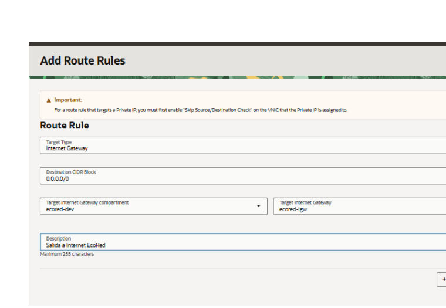

📘 [Ampliar: el error real encontrado en la Route Table y por qué falló el `image pull`](#d-2-4)

---

<a id="paso-25-permitir-el-puerto-10000-y-verificar-el-tráfico-de-salida"></a>
## Paso 2.5. Permitir el puerto `10000` y verificar el tráfico de salida

Desde la subnet abra:

```text
ecored-public-subnet
→ Security
→ Default Security List for ecored-vcn
```

En **Ingress Rules**, agregue:

```text
Stateless: No
Source Type: CIDR
Source CIDR: 0.0.0.0/0
IP Protocol: TCP
Source Port Range: All
Destination Port Range: 10000
Description: EcoRed HTTP laboratorio
```

En **Egress Rules**, verifique que exista una regla equivalente a:

```text
Stateless: No
Destination: 0.0.0.0/0
IP Protocol: All Protocols
```

### Imagen


📘 [Ampliar: Ingress, Egress, Security List y por qué OCI necesita salida a Docker Hub](#d-2-5)

---

<a id="paso-26-verificar-la-red-antes-de-crear-la-container-instance"></a>
## Paso 2.6. Verificar la red antes de crear la Container Instance

Antes de continuar, compruebe:

```text
VCN: ecored-vcn                         ✓
Subnet: ecored-public-subnet            ✓
Subnet Access: Public Subnet             ✓
Route Table asociada a la subnet         ✓
0.0.0.0/0 → ecored-igw                  ✓
Security List Ingress TCP 10000          ✓
Security List Egress 0.0.0.0/0           ✓
Internet Gateway: ecored-igw             ✓
```

### Imagen

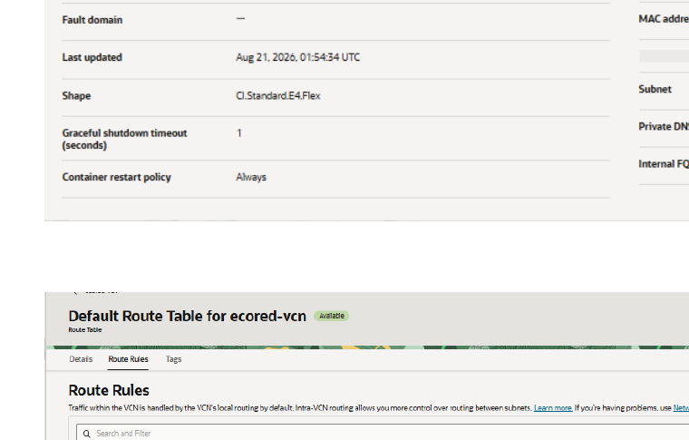

📘 [Ampliar: lista de comprobación de red antes del despliegue](#d-2-6)

---

<a id="fase-3-crear-y-publicar-ecored-en-oci-container-instances"></a>
# Fase 3. Crear y publicar EcoRed en OCI Container Instances

## Introducción

En esta fase se completa **todo el asistente de OCI Container Instances**. El estudiante define el recurso de cómputo, conecta la VNIC a la subnet, selecciona la imagen de Docker Hub, configura las variables de ejecución y publica el contenedor.

## Objetivo de la fase

Crear `ecored-ci`, ejecutar la misma imagen usada en Render y obtener una IPv4 pública con la aplicación en estado `Active`.

## Proceso de la fase

```text
Basic information
      ↓
Networking
      ↓
Storage
      ↓
Containers
      ↓
External registry: Docker Hub
      ↓
Variables + Firebase
      ↓
Startup options
      ↓
Review Details
      ↓
Create
      ↓
State: Active
```

📘 [Ampliar: equivalencia entre el asistente de Render y el asistente de OCI](#d-f3)

---

<a id="paso-31-abrir-el-asistente-de-container-instances"></a>
## Paso 3.1. Abrir el asistente de Container Instances

Abra:

```text
Developer Services
→ Containers & Artifacts
→ Container Instances
```

Seleccione:

```text
Compartment: ecored-dev
→ Create container instance
```

### Imagen

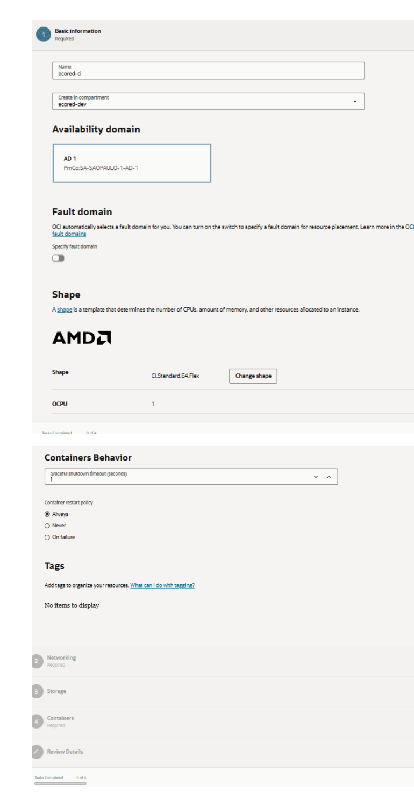

📘 [Ampliar: Container Instance vs. máquina virtual](#d-3-1)

---

<a id="paso-32-configurar-basic-information-y-política-de-reinicio"></a>
## Paso 3.2. Configurar Basic information y política de reinicio

Configure:

```text
Name: ecored-ci
Create in compartment: ecored-dev
Availability domain: AD disponible
Fault domain: automático
Shape: CI.Standard.E4.Flex o shape x86 compatible
Container restart policy: Always
```

Mantenga la shape compatible con la imagen `linux/amd64`.

### Imagen


📘 [Ampliar: shape, OCPU, memoria, AD y restart policy](#d-3-2)

---

<a id="paso-33-configurar-networking-en-el-asistente"></a>
## Paso 3.3. Configurar Networking en el asistente

Seleccione:

```text
Primary network: Select existing virtual cloud network
Virtual cloud network compartment: ecored-dev
Virtual cloud network: ecored-vcn

Subnet: Select existing subnet
Subnet compartment: ecored-dev
Subnet: ecored-public-subnet (regional)

Private IPv4 address: dejar vacío
Public IPv4 address: Assign a public IPv4 address
Network Security / NSG: Off
DNS record: Assign a private DNS record
```

### Imagen

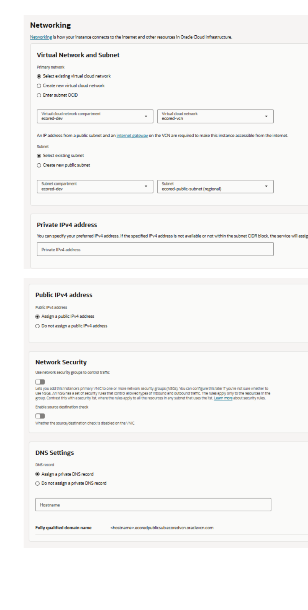

📘 [Ampliar: VNIC, IPv4 privada, IPv4 pública y por qué no aparece una opción “Security List”](#d-3-3)

---

<a id="paso-34-continuar-sin-agregar-storage"></a>
## Paso 3.4. Continuar sin agregar Storage

En **Storage** no agregue recursos.

Mantenga:

```text
No items to display
```

Seleccione **Next**.

### Imagen

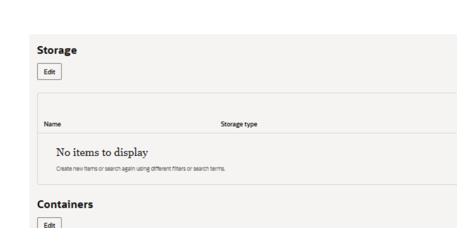

📘 [Ampliar: por qué EcoRed no requiere volumen persistente en este taller](#d-3-4)

---

<a id="paso-35-agregar-el-contenedor-ecored"></a>
## Paso 3.5. Agregar el contenedor `ecored`

En la sección **Containers**, seleccione:

```text
Add container
```

Configure:

```text
Name: ecored
```

### Imagen

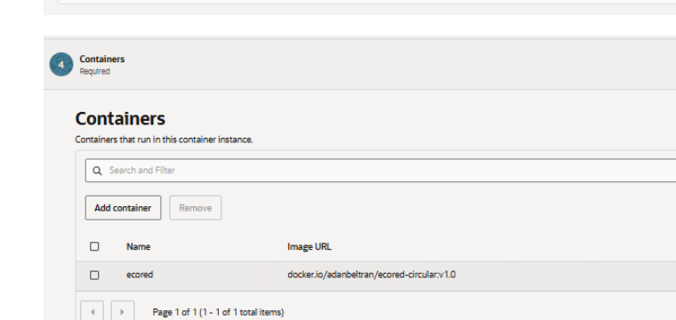

📘 [Ampliar: diferencia entre Container Instance y Container](#d-3-5)

---

<a id="paso-36-seleccionar-la-imagen-pública-de-docker-hub"></a>
## Paso 3.6. Seleccionar la imagen pública de Docker Hub

En **Image → Select image**, seleccione:

```text
External registry
```

Configure:

```text
Registry hostname: docker.io
Repository: TU_USUARIO/ecored-circular
Tag: v1.0
Registry credentials type: None
```

La referencia final corresponde a:

```text
docker.io/TU_USUARIO/ecored-circular:v1.0
```

### Imagen

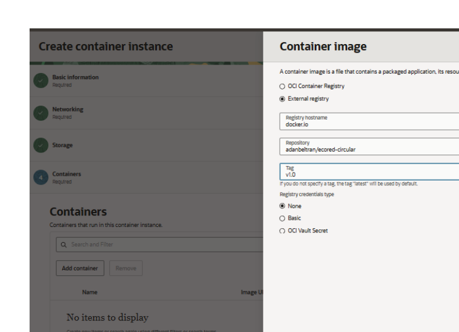

📘 [Ampliar: cómo OCI obtiene la misma imagen que ya funcionó en Render](#d-3-6)

---

<a id="paso-37-configurar-las-variables-de-entorno-de-despliegue"></a>
## Paso 3.7. Configurar las variables de entorno de despliegue

En **Environmental variables**, agregue:

| Variable | Valor para OCI |
|---|---|
| `PORT` | `10000` |
| `DJANGO_DEBUG` | `False` |
| `DJANGO_ALLOWED_HOSTS` | `*` |
| `DJANGO_SECRET_KEY` | `<valor usado en el despliegue>` |
| `MONGODB_URI` | `<valor usado en el despliegue>` |
| `MONGODB_DB_NAME` | `<valor usado en el despliegue>` |
| `FIREBASE_CREDENTIALS_PATH` | `/etc/secrets/firebase-service-account.json` |

No configure en OCI:

```text
APP_ENV=dev
PORT=8000
VITE_*
```

### Imagen

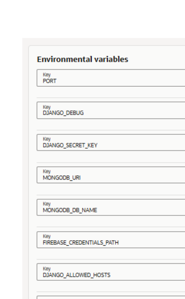

📘 [Ampliar: diferencias entre el `.env` local, Render y OCI](#d-3-7)

---

<a id="paso-38-agregar-la-credencial-firebase-como-variable-temporal"></a>
## Paso 3.8. Agregar la credencial Firebase como variable temporal

Desde PowerShell, en el proyecto EcoRed:

```powershell
(Get-Content .\backend\firebase-service-account.json -Raw |
  ConvertFrom-Json |
  ConvertTo-Json -Compress)
```

Copie el resultado y agregue:

```text
FIREBASE_SERVICE_ACCOUNT_JSON=<JSON completo en una sola línea>
```

Mantenga:

```text
FIREBASE_CREDENTIALS_PATH=/etc/secrets/firebase-service-account.json
```

No incluya valores secretos en capturas ni entregables.

### Imagen


📘 [Ampliar: equivalencia con Secret File de Render y manejo didáctico de Firebase](#d-3-8)

---

<a id="paso-39-configurar-startup-options"></a>
## Paso 3.9. Configurar Startup options

En **Startup options**:

```text
Working directory: dejar vacío
```

En **Command**:

```text
/bin/sh
```

En **Command arguments**, configure dos argumentos:

```text
-c
```

```text
mkdir -p /etc/secrets && printf '%s' "$FIREBASE_SERVICE_ACCOUNT_JSON" > /etc/secrets/firebase-service-account.json && chmod 600 /etc/secrets/firebase-service-account.json && exec /start.sh
```

### Imagen

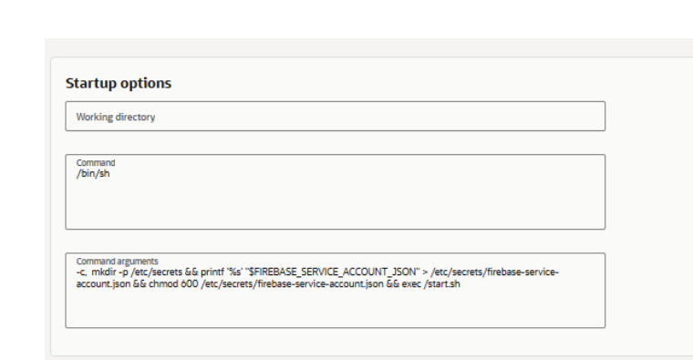

📘 [Ampliar: qué hace `/bin/sh -c`, por qué se crea el archivo y por qué termina en `/start.sh`](#d-3-9)

---

<a id="paso-310-mantener-la-configuración-security-compatible-con-la-imagen"></a>
## Paso 3.10. Mantener la configuración Security compatible con la imagen

Deje:

```text
Enable read-only root filesystem: Off
Run as non-root user: Off
User ID: 0
Group ID: 0
Drop capabilities: sin cambios
Add capabilities: sin cambios
```

### Imagen

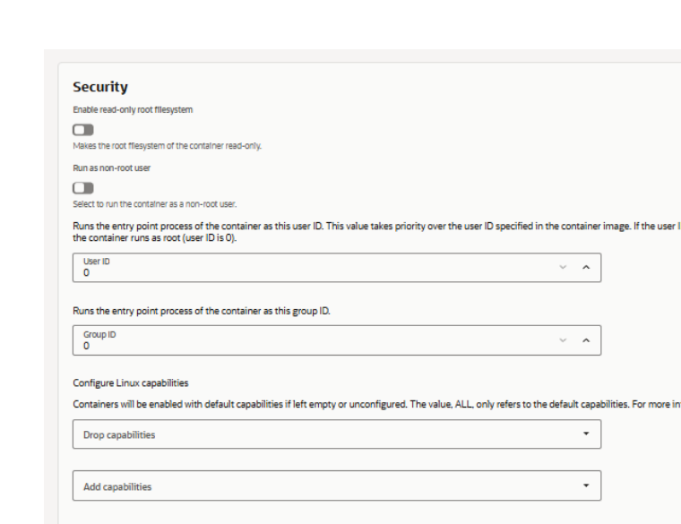

📘 [Ampliar: por qué la imagen actual necesita escribir `/etc/secrets` durante el arranque](#d-3-10)

---

<a id="paso-311-guardar-el-contenedor-en-el-asistente"></a>
## Paso 3.11. Guardar el contenedor en el asistente

Verifique que la sección **Containers** muestre:

```text
Name: ecored
Image URL: docker.io/TU_USUARIO/ecored-circular:v1.0
```

### Imagen


📘 [Ampliar: qué información queda almacenada en la definición del contenedor](#d-3-11)

---

<a id="paso-312-revisar-review-details"></a>
## Paso 3.12. Revisar Review Details

Seleccione **Next** y revise:

```text
Name: ecored-ci
Compartment: ecored-dev
Restart policy: Always

VCN: ecored-vcn
Subnet: ecored-public-subnet
Public IPv4: Yes

Container: ecored
Image: docker.io/TU_USUARIO/ecored-circular:v1.0
```

Confirme que existen las variables privadas, pero no muestre sus valores.

### Imagen

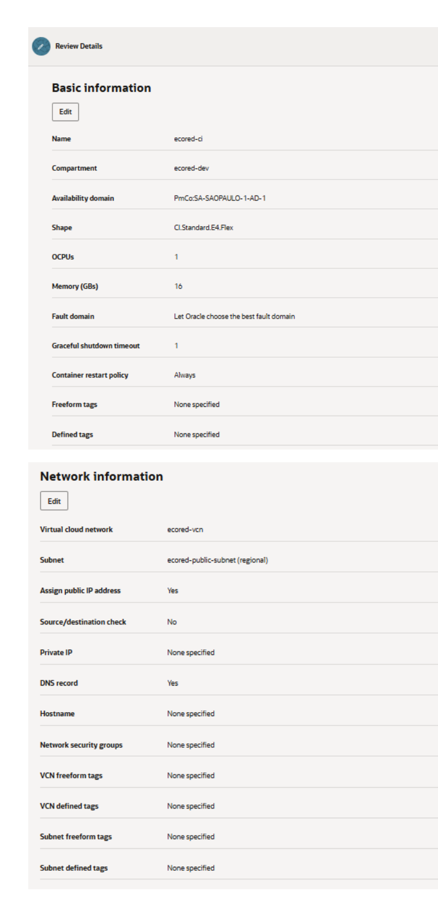

📘 [Ampliar: qué validar antes de presionar Create](#d-3-12)

---

<a id="paso-313-crear-la-container-instance"></a>
## Paso 3.13. Crear la Container Instance

Seleccione:

```text
Create
```

Espere mientras OCI:

```text
crea la VNIC
→ asigna IP
→ alcanza Docker Hub
→ descarga la imagen
→ crea el contenedor
→ ejecuta Startup options
```

### Imagen

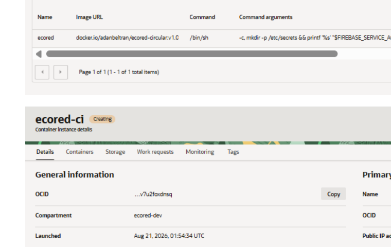

📘 [Ampliar: qué ocurre realmente durante Create y cómo interpretar un Work Request fallido](#d-3-13)

---

<a id="paso-314-confirmar-active-y-registrar-la-ipv4-pública"></a>
## Paso 3.14. Confirmar `Active` y registrar la IPv4 pública

La fase termina cuando observe:

```text
Container Instance: ecored-ci
State: Active
Containers: 1
```

Abra los detalles y registre:

```text
PUBLIC_IP=<IPv4 pública asignada>
PRIVATE_IP=<IPv4 privada asignada>
```

### Imagen

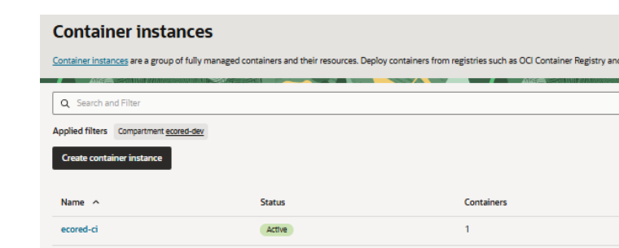

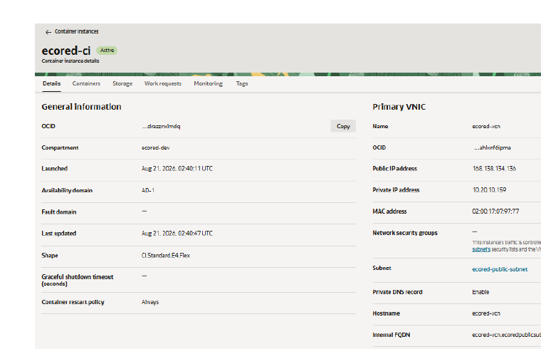

📘 [Ampliar: qué significan las IP pública y privada de la VNIC](#d-3-14)

---

<a id="fase-4-validar-ecored-y-habilitar-autenticación-con-firebase"></a>
# Fase 4. Validar EcoRed y habilitar autenticación con Firebase

## Introducción

La Container Instance ya está publicada. Ahora se comprueba que el tráfico llega al contenedor, que Nginx entrega el frontend y reenvía las peticiones `/api/` al backend, y que Firebase reconoce el nuevo origen OCI.

## Objetivo de la fase

Validar la aplicación completa desde Internet y autorizar la IPv4 pública de OCI para el flujo OAuth de Firebase.

## Proceso de la fase

```text
Browser
   ↓
http://PUBLIC_IP:10000
   ↓
Nginx
   ├── /      → React
   └── /api/  → Gunicorn → Django
                     │
                     ├── MongoDB Atlas
                     └── Firebase
```

📘 [Ampliar: cómo se mueve una petición desde el navegador hasta Django](#d-f4)

---

<a id="paso-41-probar-el-backend-y-el-api"></a>
## Paso 4.1. Probar el backend y el API

Abra:

```text
http://<PUBLIC_IP>:10000/api/
```

y, si está disponible en la versión del proyecto:

```text
http://<PUBLIC_IP>:10000/api/health/
```

Debe obtener una respuesta HTTP del backend.

### Imagen

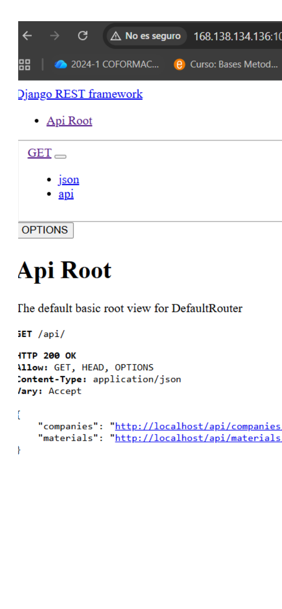

📘 [Ampliar: por qué `/api/` termina en Django aunque el puerto público sea `10000`](#d-4-1)

---

<a id="paso-42-probar-el-frontend"></a>
## Paso 4.2. Probar el frontend

Abra:

```text
http://<PUBLIC_IP>:10000
```

Debe cargar la interfaz de EcoRed.

### Imagen

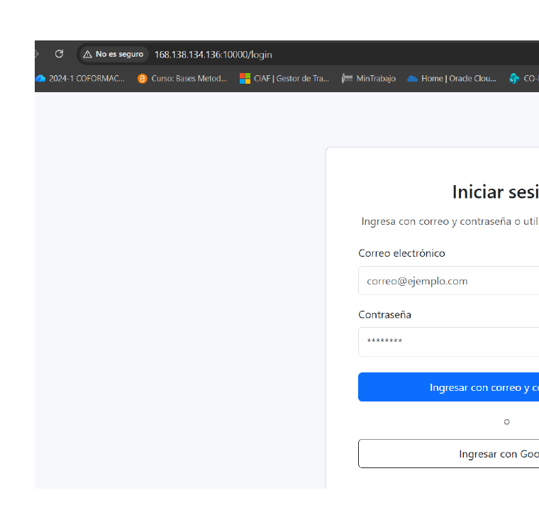

📘 [Ampliar: cómo Nginx entrega React desde el mismo contenedor](#d-4-2)

---

<a id="paso-43-autorizar-la-ipv4-pública-en-firebase-authentication"></a>
## Paso 4.3. Autorizar la IPv4 pública en Firebase Authentication

Abra Firebase Console:

```text
Authentication
→ Settings
→ Authorized domains
→ Add domain
```

Agregue **únicamente la IPv4 pública**, por ejemplo:

```text
168.138.134.136
```

No agregue:

```text
http://168.138.134.136
168.138.134.136:10000
```

Utilice la IPv4 real asignada a su propia Container Instance.

### Imagen

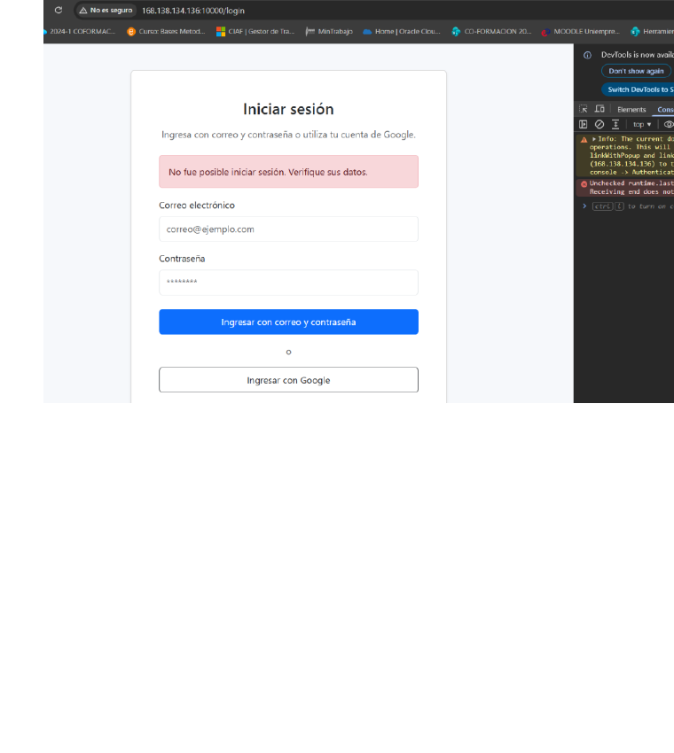

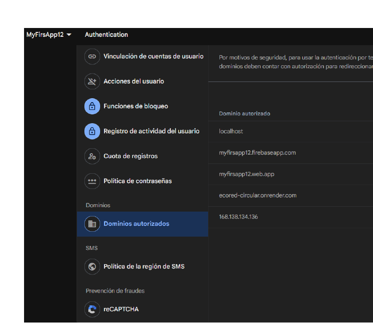

📘 [Ampliar: por qué Firebase valida el hostname y no el puerto](#d-4-3)

---

<a id="paso-44-probar-autenticación-y-una-función-de-negocio"></a>
## Paso 4.4. Probar autenticación y una función de negocio

1. Recargue EcoRed.
2. Pruebe **Ingresar con Google**.
3. Acceda a una pantalla funcional, por ejemplo **Materiales**.

### Imagen

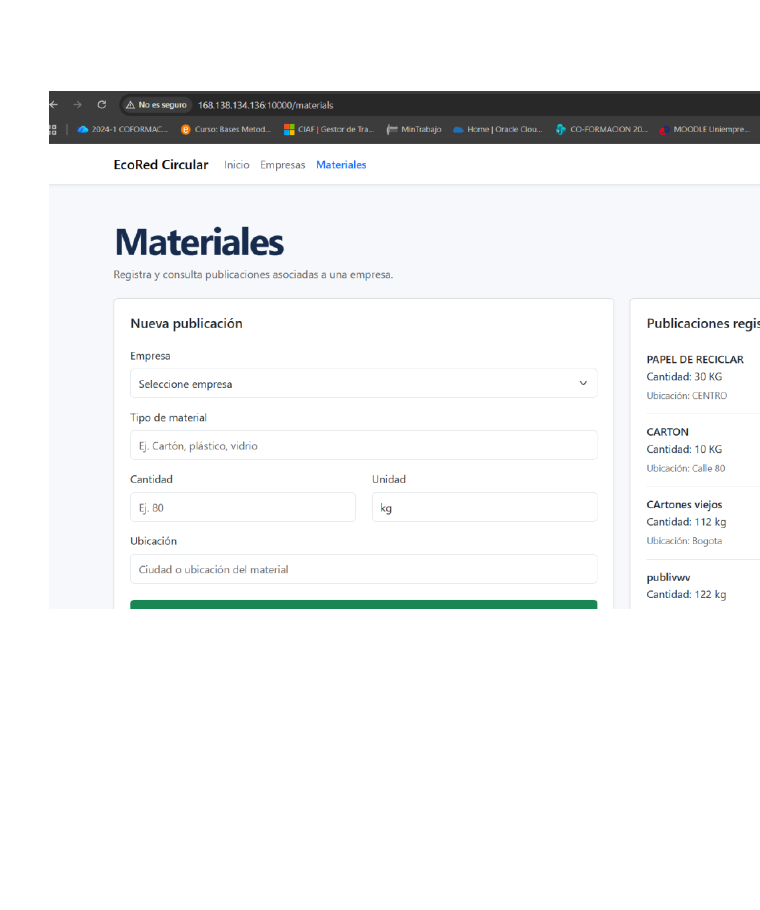

📘 [Ampliar: flujo OAuth y relación con el futuro dominio HTTPS de EcoRed](#d-4-4)

---

<a id="paso-45-consultar-logs-y-work-requests-cuando-exista-un-fallo"></a>
## Paso 4.5. Consultar logs y Work Requests cuando exista un fallo

Para logs del contenedor:

```text
Container Instances
→ ecored-ci
→ Containers
→ ecored
→ Actions
→ View logs
```

Para fallos de creación:

```text
Container Instances
→ ecored-ci
→ Work requests
→ CREATE_CONTAINER_INSTANCE
→ Messages / Errors
```

Si aparece:

```text
A container's image could not be pulled due to inadequate network configuration.
```

revise primero la Route Table asociada a la subnet.

### Imagen


📘 [Ampliar: diagnóstico ordenado de errores de red, imagen y aplicación](#d-4-5)

---

<a id="paso-46-probar-restart-stop-y-start"></a>
## Paso 4.6. Probar Restart, Stop y Start

Pruebe:

```text
Container Instances
→ ecored-ci
→ Actions
→ Restart
```

Después:

```text
Actions → Stop
State: Inactive
```

Finalmente:

```text
Actions → Start
State: Active
```

Vuelva a probar:

```text
http://<PUBLIC_IP>:10000
```

### Imagen


📘 [Ampliar: ciclo de vida de una Container Instance y persistencia de los datos](#d-4-6)

---

<a id="fase-5-experimentación-guiada-entender-el-flujo-completo"></a>
# Fase 5. Experimentación guiada: entender el flujo completo

## Introducción

Esta fase no agrega nuevos servicios. Utiliza la infraestructura ya creada para comprobar, mediante pequeñas pruebas, qué responsabilidad tiene cada componente y cómo una petición entra a OCI, llega a Nginx, pasa al backend y regresa al cliente.

## Objetivo de la fase

Relacionar evidencia observable con los conceptos de red, seguridad y ejecución de contenedores.

## Proceso de experimentación

```text
Cliente
  │
  ▼
Internet
  │
  ▼
Internet Gateway
  │
  ▼
IPv4 pública / VNIC
  │
  ▼
Security List
  │
  ▼
Container Instance
  │
  ▼
Nginx :10000
  ├── React
  └── /api/ → Gunicorn :8000 → Django
  │
  ▼
Respuesta
  │
  ▼
Route Table → Internet Gateway → Cliente
```

📘 [Ampliar: modelo mental completo de entrada y salida](#d-f5)

---

<a id="paso-51-trazar-el-camino-desde-la-subnet-hasta-internet"></a>
## Paso 5.1. Trazar el camino desde la subnet hasta Internet

En OCI abra:

```text
ecored-public-subnet
→ Details
```

Identifique:

```text
Route Table: Default Route Table for ecored-vcn
Security List: Default Security List for ecored-vcn
Subnet Access: Public Subnet
```

Después abra la Route Table y confirme:

```text
0.0.0.0/0 → ecored-igw
```

### Imagen


📘 [Ampliar: por qué una subnet pública sin ruta sigue sin tener conectividad útil](#d-5-1)

---

<a id="paso-52-experimentar-con-la-regla-tcp-10000"></a>
## Paso 5.2. Experimentar con la regla TCP `10000`

1. Registre la regla actual de Ingress TCP `10000`.
2. Elimine temporalmente **solo** esa regla.
3. Intente abrir:

```text
http://<PUBLIC_IP>:10000
```

4. Compruebe que la aplicación deja de ser accesible desde Internet.
5. Cree nuevamente la regla exactamente como estaba:

```text
Source: 0.0.0.0/0
Protocol: TCP
Destination Port: 10000
```

6. Recargue EcoRed y confirme que vuelve a responder.

### Imagen


📘 [Ampliar: diferencia entre “tener ruta” y “tener permiso”](#d-5-2)

---

<a id="paso-53-analizar-el-fallo-real-de-image-pull"></a>
## Paso 5.3. Analizar el fallo real de `image pull`

Compare:

```text
Route Table asociada a la subnet SIN regla
→ OCI no alcanza Docker Hub
→ CREATE_CONTAINER_INSTANCE = Failed
```

con:

```text
Route Table asociada a la subnet CON 0.0.0.0/0 → ecored-igw
→ OCI alcanza Docker Hub
→ descarga ecored-circular:v1.0
→ State = Active
```

### Imagen


📘 [Ampliar: causalidad entre subnet, Route Table, IGW y Docker Hub](#d-5-3)

---

<a id="paso-54-observar-cómo-responde-nginx-por-dentro-del-contenedor"></a>
## Paso 5.4. Observar cómo responde Nginx por dentro del contenedor

Abra dos URLs:

```text
http://<PUBLIC_IP>:10000/
http://<PUBLIC_IP>:10000/api/
```

Interprete el resultado:

```text
/
↓
Nginx :10000
↓
archivos estáticos de React
```

```text
/api/
↓
Nginx :10000
↓ reverse proxy
Gunicorn 127.0.0.1:8000
↓
Django / DRF
```

### Imagen


📘 [Ampliar: Nginx, reverse proxy, Gunicorn y Django dentro de la misma imagen](#d-5-4)

---

<a id="paso-55-observar-la-petición-y-la-respuesta-con-devtools"></a>
## Paso 5.5. Observar la petición y la respuesta con DevTools

1. Abra Chrome DevTools.
2. Seleccione **Network**.
3. Recargue EcoRed.
4. Identifique peticiones hacia:

```text
http://<PUBLIC_IP>:10000/
http://<PUBLIC_IP>:10000/api/...
```

5. Registre `Request URL`, `Status Code` y el recurso solicitado.

### Imagen


📘 [Ampliar: recorrido de la respuesta desde Django/Nginx hasta el navegador](#d-5-5)

---

<a id="paso-56-experimentar-con-firebase-authorized-domains"></a>
## Paso 5.6. Experimentar con Firebase Authorized Domains

Use las evidencias obtenidas durante el despliegue:

```text
IPv4 no autorizada
→ Firebase bloquea OAuth
```

```text
IPv4 agregada a Authorized domains
→ Google Sign-In puede ejecutarse
```

No es necesario volver a eliminar el dominio si la aplicación ya está funcionando; documente la relación causa-efecto.

### Imagen


📘 [Ampliar: identidad de aplicación, dominio, OAuth y futura transición a HTTPS](#d-5-6)

---

<a id="entregables"></a>
# Entregables

- [ ] Tenancy y región identificadas.
- [ ] Compartment `ecored-dev` activo.
- [ ] VCN `ecored-vcn` con CIDR `10.20.0.0/16`.
- [ ] Subnet pública `ecored-public-subnet` con CIDR `10.20.10.0/24`.
- [ ] Internet Gateway `ecored-igw`.
- [ ] Evidencia de que la **Route Table asociada a la subnet** contiene `0.0.0.0/0 → ecored-igw`.
- [ ] Security List con Ingress TCP `10000` y Egress hacia `0.0.0.0/0`.
- [ ] Container Instance `ecored-ci` en estado `Active`.
- [ ] Contenedor `ecored` ejecutando `docker.io/TU_USUARIO/ecored-circular:v1.0`.
- [ ] Variables de entorno configuradas sin exponer secretos.
- [ ] IPv4 pública registrada.
- [ ] API accesible desde `http://<PUBLIC_IP>:10000/api/`.
- [ ] Frontend accesible desde `http://<PUBLIC_IP>:10000`.
- [ ] IPv4 pública registrada en Firebase Authorized Domains.
- [ ] Evidencia de autenticación y una función de negocio de EcoRed.
- [ ] Evidencias de la Fase 5 de experimentación.
- [ ] Explicación de máximo una página del flujo completo de entrada y respuesta.

---

<a id="anexo-didáctico-y-relación-con-la-ruta"></a>
# Anexo didáctico y relación con la ruta

<a id="d-f1"></a>
## Fase 1 - Render vs. OCI y visión general

En el taller anterior, Render recibía una imagen ya construida y ocultaba gran parte del networking y de la infraestructura. En OCI Container Instances la ejecución sigue siendo administrada, pero el estudiante debe elegir explícitamente VCN, subnet y reglas de acceso. La aplicación no cambia; cambia la plataforma que la ejecuta.

```text
Render                         OCI
------                         ---
Existing Image                 External registry
Environment Variables          Environmental variables
Web Service                    Container Instance + Container
URL administrada               IPv4 pública :10000
Networking abstraído           VCN + subnet + IGW + rutas + seguridad
```

**Relación con la ruta:** el [taller base de Render](https://github.com/adanbeltran/Taller12factors/blob/main/docs/F-Contenizacion-Despliegue-web-en-Render.md) demuestra portabilidad de la imagen; este Taller 1 hace visible la red OCI; el [Taller 2](02-OCIR-y-Networking-Privado.md) podrá incorporar recursos nativos adicionales.

[↩ Volver a Fase 1](#fase-1-preparar-el-entorno-oci)

<a id="d-1-1"></a>
## Paso 1.1 - Tenancy

La tenancy es la frontera administrativa principal de la cuenta OCI. El estudiante ya dispone de una tenancy al crear su cuenta; no necesita crear otra. Dentro de esa tenancy se organizan compartments y recursos.

**Relación con otros talleres:** todo recurso OCI posterior -red, registry, OKE, API Gateway- pertenecerá a la misma tenancy.

Fuente oficial: https://docs.oracle.com/en-us/iaas/Content/GSG/Concepts/concepts-account.htm

[↩ Volver al Paso 1.1](#paso-11-identificar-la-tenancy)

<a id="d-1-2"></a>
## Paso 1.2 - Región

Una región es una ubicación geográfica de OCI. Los recursos regionales del taller deben mantenerse en la misma región para evitar confusión y dependencias cruzadas.

**Relación con otros talleres:** OCIR, OKE y otros servicios se diseñarán teniendo en cuenta la región elegida.

[↩ Volver al Paso 1.2](#paso-12-seleccionar-la-región-de-trabajo)

<a id="d-1-3"></a>
## Paso 1.3 - Compartment

`ecored-dev` agrupa los recursos del laboratorio. No es una red ni una región; es una frontera lógica de organización, control y costos.

**Relación con otros talleres:** los talleres siguientes reutilizarán `ecored-dev` para identificar qué recursos pertenecen a EcoRed.

Fuente oficial: https://docs.oracle.com/en-us/iaas/Content/Identity/Tasks/managingcompartments.htm

[↩ Volver al Paso 1.3](#paso-13-crear-el-compartment-ecored-dev)

<a id="d-1-4"></a>
## Paso 1.4 - Créditos y costos

Cloud transforma infraestructura en consumo medible. Registrar el saldo inicial permite comparar el costo antes y después de crear recursos.

**Relación con otros talleres:** servicios posteriores pueden aumentar consumo; la observación de costos debe acompañar la evolución de la arquitectura.

[↩ Volver al Paso 1.4](#paso-14-registrar-créditos-y-costos)

<a id="d-f2"></a>
## Fase 2 - Modelo mental de la red

La VCN es el espacio de red. La subnet segmenta ese espacio. El Internet Gateway conecta la VCN con Internet. La Route Table decide el siguiente salto. La Security List permite o niega tipos de tráfico.

```text
VCN = dónde existe la red
Subnet = qué segmento usa el recurso
Route Table = por dónde sale
IGW = puerta hacia Internet
Security List = qué tráfico está permitido
```

**Relación con otros talleres:** más adelante se podrán introducir subnets privadas, NAT Gateway y controles más específicos cuando exista una necesidad real.

[↩ Volver a Fase 2](#fase-2-construir-la-red-pública-mínima)

<a id="d-2-1"></a>
## Paso 2.1 - VCN, CIDR y DNS

`10.20.0.0/16` reserva un espacio amplio para EcoRed. El `/16` identifica 16 bits de red y deja espacio suficiente para dividir posteriormente en múltiples subnets. En este taller solo se utiliza `10.20.10.0/24`.

**Relación con otros talleres:** la misma VCN podrá segmentarse más adelante sin crear una nueva red para cada componente.

Fuente oficial: https://docs.oracle.com/en-us/iaas/Content/Network/Concepts/overview.htm

[↩ Volver al Paso 2.1](#paso-21-crear-la-vcn-ecored-vcn)

<a id="d-2-2"></a>
## Paso 2.2 - Subnet pública

Una subnet pública permite que una VNIC pueda recibir IPv4 pública. Esto no significa que quede abierta automáticamente: todavía se necesitan gateway, rutas y seguridad.

`10.20.10.0/24` es un subconjunto de `10.20.0.0/16`.

**Relación con otros talleres:** cuando existan componentes internos, se crearán subnets privadas en lugar de exponerlos directamente.

Fuente oficial: https://docs.oracle.com/en-us/iaas/Content/Network/Tasks/scenarioa.htm

[↩ Volver al Paso 2.2](#paso-22-crear-la-subnet-pública-ecored-public-subnet)

<a id="d-2-3"></a>
## Paso 2.3 - Internet Gateway

El IGW es un router virtual en el borde de la VCN. Permite conexiones hacia y desde Internet para recursos públicos, pero solo cuando las rutas y reglas de seguridad lo permiten.

**Relación con otros talleres:** un futuro workload privado usaría NAT Gateway para iniciar conexiones hacia Internet sin recibir conexiones entrantes directas.

Fuente oficial: https://docs.oracle.com/en-us/iaas/Content/Network/Tasks/managingIGs.htm

[↩ Volver al Paso 2.3](#paso-23-crear-el-internet-gateway-ecored-igw)

<a id="d-2-4"></a>
## Paso 2.4 - Route Table y el error encontrado

Durante la validación real del taller existían dos Route Tables. La ruta `0.0.0.0/0 → ecored-igw` fue agregada inicialmente a una tabla distinta de la que usaba `ecored-public-subnet`. El resultado fue:

```text
CREATE_CONTAINER_INSTANCE = Failed
A container's image could not be pulled due to inadequate network configuration.
```

La lección es fundamental: **no basta con que una ruta exista en la VCN; debe existir en la Route Table asociada a la subnet del recurso**.

Por eso el procedimiento corregido parte de:

```text
ecored-public-subnet
→ Details
→ Route Table
```

y desde allí abre la tabla correcta.

Oracle indica que cada subnet pública que utiliza Internet Gateway necesita una regla en su Route Table con el gateway como target.

Fuente oficial: https://docs.oracle.com/en-us/iaas/Content/Network/Tasks/managingIGs.htm

[↩ Volver al Paso 2.4](#paso-24-agregar-la-ruta-a-internet-en-la-route-table-que-usa-la-subnet)

<a id="d-2-5"></a>
## Paso 2.5 - Ingress y Egress

La regla TCP `10000` resuelve el flujo de entrada:

```text
Internet → EcoRed
```

La regla Egress resuelve el flujo iniciado desde OCI:

```text
Container Instance → Docker Hub
Container Instance → MongoDB Atlas / servicios externos
```

La Default Security List suele incluir egress hacia todos los destinos. Debe comprobarse, no asumirse.

Fuente oficial: https://docs.oracle.com/en-us/iaas/Content/Network/Concepts/securitylists.htm

[↩ Volver al Paso 2.5](#paso-25-permitir-el-puerto-10000-y-verificar-el-tráfico-de-salida)

<a id="d-2-6"></a>
## Paso 2.6 - Verificación previa

Una Container Instance que usa Docker Hub depende de varios recursos externos a la propia definición del contenedor. Oracle exige que el registry sea alcanzable desde la subnet. Para un registry público, una opción soportada es una public subnet con Internet Gateway.

La verificación previa reduce el diagnóstico por ensayo y error.

Fuente oficial: https://docs.oracle.com/en-us/iaas/Content/container-instances/creating-a-container-instance.htm

[↩ Volver al Paso 2.6](#paso-26-verificar-la-red-antes-de-crear-la-container-instance)

<a id="d-f3"></a>
## Fase 3 - Render vs. OCI Container Instances

Render y OCI reciben una imagen previamente construida. La diferencia principal es cuánto networking y runtime queda visible para el estudiante.

OCI Container Instances evita administrar una VM y un sistema operativo, pero exige seleccionar la red y definir el contenedor de forma explícita.

Fuente oficial: https://docs.oracle.com/en-us/iaas/Content/container-instances/overview-of-container-instances.htm

[↩ Volver a Fase 3](#fase-3-crear-y-publicar-ecored-en-oci-container-instances)

<a id="d-3-1"></a>
## Paso 3.1 - Container Instance vs. Container

Una **Container Instance** es el recurso de cómputo administrado donde pueden ejecutarse uno o varios contenedores. `ecored` es el contenedor específico que ejecuta la imagen de EcoRed.

**Relación con otros talleres:** cuando la arquitectura evolucione a OKE, Kubernetes asumirá la orquestación de múltiples contenedores y servicios.

[↩ Volver al Paso 3.1](#paso-31-abrir-el-asistente-de-container-instances)

<a id="d-3-2"></a>
## Paso 3.2 - Shape y restart policy

La shape determina OCPU y memoria. La imagen del taller fue construida para `linux/amd64`, por lo que se selecciona una shape x86 compatible. `Always` indica que el contenedor debe reiniciarse si termina; Oracle la recomienda para workloads que deben permanecer ejecutándose, como servidores web.

Fuente oficial: https://docs.oracle.com/en-us/iaas/Content/container-instances/creating-a-container-instance.htm

[↩ Volver al Paso 3.2](#paso-32-configurar-basic-information-y-política-de-reinicio)

<a id="d-3-3"></a>
## Paso 3.3 - VNIC y seguridad

La VNIC es la interfaz de red virtual de `ecored-ci`. Recibe una IP privada de la subnet y, en este taller, también una IP pública.

La pantalla de Container Instances permite asociar NSG, pero no muestra un selector de Security List porque la Security List ya está asociada a la subnet.

```text
Container Instance
→ VNIC
→ ecored-public-subnet
→ Security List de la subnet
```

Fuente oficial: https://docs.oracle.com/en-us/iaas/Content/container-instances/creating-a-container-instance.htm

[↩ Volver al Paso 3.3](#paso-33-configurar-networking-en-el-asistente)

<a id="d-3-4"></a>
## Paso 3.4 - Storage

EcoRed no necesita volumen persistente en esta práctica porque los datos de negocio viven en MongoDB Atlas. El contenedor puede reconstruirse sin perder esos datos.

**Relación con otros talleres:** si un componente futuro necesita archivos persistentes, se evaluará un servicio apropiado de almacenamiento.

[↩ Volver al Paso 3.4](#paso-34-continuar-sin-agregar-storage)

<a id="d-3-5"></a>
## Paso 3.5 - Agregar contenedor

La instancia puede alojar varios contenedores, pero este taller conserva una sola aplicación monolítica contenerizada. Esto permite comparar directamente Render y OCI sin introducir aún microservicios.

[↩ Volver al Paso 3.5](#paso-35-agregar-el-contenedor-ecored)

<a id="d-3-6"></a>
## Paso 3.6 - Docker Hub como external registry

OCI no vuelve a ejecutar `docker build`. Utiliza la URL lógica compuesta por registry, repository y tag. Para un repositorio público, `Credentials type: None` evita introducir Vault o credenciales de registry en esta etapa.

Oracle exige que Docker Hub sea alcanzable desde la subnet, lo que explica la importancia de la Fase 2.

Fuente oficial: https://docs.oracle.com/en-us/iaas/Content/container-instances/creating-a-container-instance.htm

[↩ Volver al Paso 3.6](#paso-36-seleccionar-la-imagen-pública-de-docker-hub)

<a id="d-3-7"></a>
## Paso 3.7 - `.env` local vs. variables de despliegue

No se debe copiar mecánicamente el `.env` de desarrollo.

```text
LOCAL                           OCI
-----                           ---
DJANGO_ALLOWED_HOSTS=127.0.0.1  DJANGO_ALLOWED_HOSTS=*
APP_ENV=dev                     no se configura
PORT=8000                       PORT=10000
```

`DJANGO_ALLOWED_HOSTS=*` se usa únicamente como simplificación de laboratorio porque la IP pública se conoce después de crear la instancia. En una etapa posterior debe reemplazarse por el hostname real de la aplicación.

El `8000` continúa existiendo **dentro del contenedor** para Gunicorn. El punto de entrada público es Nginx en `10000`.

```text
Internet :10000
→ Nginx :10000
→ Gunicorn 127.0.0.1:8000
→ Django
```

[↩ Volver al Paso 3.7](#paso-37-configurar-las-variables-de-entorno-de-despliegue)

<a id="d-3-8"></a>
## Paso 3.8 - Firebase credential

Render ofrecía Secret File directamente. Para no introducir otro servicio OCI en este primer taller, el JSON se transforma en una variable temporal y el contenedor lo reconstruye al iniciar.

Esta es una decisión didáctica, no la arquitectura final de gestión de secretos.

**Relación con otros talleres:** una fase posterior podrá incorporar servicios especializados de secretos.

[↩ Volver al Paso 3.8](#paso-38-agregar-la-credencial-firebase-como-variable-temporal)

<a id="d-3-9"></a>
## Paso 3.9 - Startup options

Oracle permite configurar el working directory y los argumentos del `ENTRYPOINT`. El patrón utilizado es equivalente al ejemplo oficial `bin/sh -c ...`.

El comando hace tres cosas:

```text
1. crea /etc/secrets
2. escribe firebase-service-account.json
3. reemplaza el shell con /start.sh usando exec
```

`/start.sh` es el comando que ya pertenece a la imagen; por eso la aplicación sigue utilizando el mismo artefacto probado en Render.

Fuente oficial: https://docs.oracle.com/en-us/iaas/Content/container-instances/creating-a-container-instance.htm

[↩ Volver al Paso 3.9](#paso-39-configurar-startup-options)

<a id="d-3-10"></a>
## Paso 3.10 - Security del contenedor

El root filesystem debe quedar escribible en este taller porque se crea `/etc/secrets/firebase-service-account.json` durante el arranque. Ejecutar como no-root y endurecer capacidades son objetivos válidos, pero requieren adaptar la imagen y se incorporarán cuando exista un taller específico de hardening.

[↩ Volver al Paso 3.10](#paso-310-mantener-la-configuración-security-compatible-con-la-imagen)

<a id="d-3-11"></a>
## Paso 3.11 - Definición del contenedor

Al guardar el contenedor, OCI conserva la referencia de imagen, variables, comando, argumentos y seguridad como parte de la definición de `ecored-ci`.

[↩ Volver al Paso 3.11](#paso-311-guardar-el-contenedor-en-el-asistente)

<a id="d-3-12"></a>
## Paso 3.12 - Review Details

La revisión final debe comprobar coherencia entre tres capas:

```text
Red      → VCN, subnet, IP
Runtime  → shape, restart policy
App      → image, env vars, startup options
```

[↩ Volver al Paso 3.12](#paso-312-revisar-review-details)

<a id="d-3-13"></a>
## Paso 3.13 - Work Request

`Create` dispara una operación asíncrona. Si falla, Work Requests permite distinguir un error de networking de un error de aplicación.

En el incidente real del taller, el error fue anterior al arranque de Django:

```text
image could not be pulled
```

por lo que no tenía sentido modificar Firebase, `start.sh` o variables hasta corregir la red.

[↩ Volver al Paso 3.13](#paso-313-crear-la-container-instance)

<a id="d-3-14"></a>
## Paso 3.14 - IP pública y privada

La IP privada pertenece al CIDR de la subnet y permite comunicación dentro de la VCN. La IP pública hace alcanzable la VNIC desde Internet cuando las demás condiciones de red se cumplen.

**Relación con otros talleres:** una arquitectura posterior evitará exponer directamente cada workload y utilizará puntos de entrada controlados.

[↩ Volver al Paso 3.14](#paso-314-confirmar-active-y-registrar-la-ipv4-pública)

<a id="d-f4"></a>
## Fase 4 - Flujo de aplicación

El contenedor reúne frontend y backend detrás de Nginx:

```text
Nginx :10000
├── /            → React estático
└── /api/*       → Gunicorn 127.0.0.1:8000 → Django
```

Esto permite que el navegador utilice un único origen público en OCI.

[↩ Volver a Fase 4](#fase-4-validar-ecored-y-habilitar-autenticación-con-firebase)

<a id="d-4-1"></a>
## Paso 4.1 - API y reverse proxy

El navegador llama al puerto `10000`. Nginx decide qué hacer según la ruta. Para `/api/`, actúa como reverse proxy y envía la petición al backend interno. Gunicorn recibe HTTP/Wsgi y ejecuta Django/DRF.

[↩ Volver al Paso 4.1](#paso-41-probar-el-backend-y-el-api)

<a id="d-4-2"></a>
## Paso 4.2 - Frontend React

Para `/`, Nginx entrega los archivos generados por `npm run build`. El navegador ejecuta React localmente y posteriormente realiza llamadas HTTP al API.

[↩ Volver al Paso 4.2](#paso-42-probar-el-frontend)

<a id="d-4-3"></a>
## Paso 4.3 - Firebase Authorized Domains

Firebase Authentication controla desde qué dominios puede iniciarse un flujo OAuth. En este laboratorio el hostname es una IPv4 pública. Firebase solicita agregar el dominio/hostname, no la URL completa ni el puerto.

```text
URL:  http://168.138.134.136:10000/login
Host: 168.138.134.136
```

Por eso se registra solo:

```text
168.138.134.136
```

Fuente oficial: https://firebase.google.com/docs/auth/web/google-signin

[↩ Volver al Paso 4.3](#paso-43-autorizar-la-ipv4-pública-en-firebase-authentication)

<a id="d-4-4"></a>
## Paso 4.4 - OAuth y futuro HTTPS

La IPv4 es suficiente para demostrar el concepto en el laboratorio. En una arquitectura de uso real conviene disponer de un dominio estable y HTTPS; entonces ese hostname reemplazará la IP en Authorized Domains.

**Relación con otros talleres:** el dominio, TLS y un punto de entrada administrado se incorporarán cuando la ruta introduzca publicación productiva.

[↩ Volver al Paso 4.4](#paso-44-probar-autenticación-y-una-función-de-negocio)

<a id="d-4-5"></a>
## Paso 4.5 - Diagnóstico por capas

Use este orden:

```text
1. State de Container Instance
2. Work Request
3. VNIC / IP
4. Route Table
5. Internet Gateway
6. Security List
7. Image pull
8. Startup options
9. Logs de Nginx/Gunicorn/Django
10. Firebase/MongoDB
```

Esto evita modificar la aplicación cuando el fallo está realmente en la red.

[↩ Volver al Paso 4.5](#paso-45-consultar-logs-y-work-requests-cuando-exista-un-fallo)

<a id="d-4-6"></a>
## Paso 4.6 - Ciclo de vida

Stop/Start/Restart permiten separar la ejecución del contenedor del computador del estudiante. Los datos importantes permanecen en servicios externos como MongoDB Atlas, por lo que el contenedor puede recrearse.

Fuente oficial:
- https://docs.oracle.com/en-us/iaas/Content/container-instances/starting-a-container-instance.htm
- https://docs.oracle.com/en-us/iaas/Content/container-instances/stopping-a-container-instance.htm
- https://docs.oracle.com/en-us/iaas/Content/container-instances/restarting-a-container-instance.htm

[↩ Volver al Paso 4.6](#paso-46-probar-restart-stop-y-start)

<a id="d-f5"></a>
## Fase 5 - Modelo mental completo de entrada y salida

### Entrada

```text
Navegador
→ Internet
→ IPv4 pública
→ Internet Gateway
→ VNIC de ecored-ci
→ Security List permite TCP 10000
→ Nginx
```

### Procesamiento interno

```text
Ruta /
→ Nginx
→ React
```

```text
Ruta /api/
→ Nginx
→ Gunicorn :8000
→ Django
→ MongoDB Atlas / Firebase cuando corresponde
```

### Respuesta

```text
Django/Gunicorn o React
→ Nginx
→ VNIC
→ subnet
→ ruta hacia Internet Gateway
→ Internet
→ navegador
```

[↩ Volver a Fase 5](#fase-5-experimentación-guiada-entender-el-flujo-completo)

<a id="d-5-1"></a>
## Paso 5.1 - Subnet y ruta

El objetivo no es memorizar nombres, sino comprobar que el recurso usa una subnet y que esa subnet usa una Route Table concreta. La ruta debe estar en **esa tabla**, no en otra con un nombre parecido.

[↩ Volver al Paso 5.1](#paso-51-trazar-el-camino-desde-la-subnet-hasta-internet)

<a id="d-5-2"></a>
## Paso 5.2 - Ruta vs. permiso

La Route Table puede estar correcta y, aun así, la aplicación ser inaccesible si TCP `10000` no está permitido. El experimento demuestra la separación de responsabilidades:

```text
Route Table = camino
Security List = permiso
```

[↩ Volver al Paso 5.2](#paso-52-experimentar-con-la-regla-tcp-10000)

<a id="d-5-3"></a>
## Paso 5.3 - Causalidad del image pull

La descarga de imagen ocurre **antes de ejecutar el contenedor**. Por ello un fallo de acceso a Docker Hub impide llegar a Startup options, Nginx, Django o Firebase.

```text
Red incorrecta
→ no image pull
→ no container start
→ no Nginx
→ no Django
```

[↩ Volver al Paso 5.3](#paso-53-analizar-el-fallo-real-de-image-pull)

<a id="d-5-4"></a>
## Paso 5.4 - Interior del contenedor

Nginx cumple dos funciones en la imagen de EcoRed:

1. entregar el frontend React compilado;
2. funcionar como reverse proxy para el API.

Gunicorn no se expone directamente a Internet. Escucha internamente en `127.0.0.1:8000`, mientras Nginx es el punto de entrada en `10000`.

Esta separación explica por qué no debe abrirse el puerto `8000` en la Security List.

[↩ Volver al Paso 5.4](#paso-54-observar-cómo-responde-nginx-por-dentro-del-contenedor)

<a id="d-5-5"></a>
## Paso 5.5 - DevTools y respuesta

DevTools permite observar la aplicación desde el punto de vista del cliente. Un `200` confirma que la petición completó el trayecto y regresó al navegador. Un timeout orienta a revisar networking; un `4xx/5xx` indica que la conexión llegó a una aplicación que respondió con error.

[↩ Volver al Paso 5.5](#paso-55-observar-la-petición-y-la-respuesta-con-devtools)

<a id="d-5-6"></a>
## Paso 5.6 - Firebase como dependencia de identidad

El error de Authorized Domains ocurre después de que la aplicación ya es alcanzable. Es un problema de identidad/OAuth, no de VCN ni de Nginx. Esta distinción ayuda a ubicar cada fallo en su capa correcta.

[↩ Volver al Paso 5.6](#paso-56-experimentar-con-firebase-authorized-domains)

---

# Contrato de entrada para el Taller 2

Conserve:

```text
ecored-dev
├── ecored-vcn
│   ├── ecored-public-subnet
│   ├── ecored-igw
│   ├── Default Route Table for ecored-vcn
│   └── Default Security List for ecored-vcn
└── ecored-ci

Docker Hub
└── TU_USUARIO/ecored-circular:v1.0
```

El siguiente taller podrá utilizar estos recursos sin volver a construir desde cero el contexto OCI.

---

<a id="referencias-oficiales"></a>
# Referencias oficiales

## Oracle Cloud Infrastructure

- Account and Access Concepts: https://docs.oracle.com/en-us/iaas/Content/GSG/Concepts/concepts-account.htm
- Creating and Managing Compartments: https://docs.oracle.com/en-us/iaas/Content/Identity/Tasks/managingcompartments.htm
- Overview of Container Instances: https://docs.oracle.com/en-us/iaas/Content/container-instances/overview-of-container-instances.htm
- Creating a Container Instance: https://docs.oracle.com/en-us/iaas/Content/container-instances/creating-a-container-instance.htm
- Starting a Container Instance: https://docs.oracle.com/en-us/iaas/Content/container-instances/starting-a-container-instance.htm
- Stopping a Container Instance: https://docs.oracle.com/en-us/iaas/Content/container-instances/stopping-a-container-instance.htm
- Restarting a Container Instance: https://docs.oracle.com/en-us/iaas/Content/container-instances/restarting-a-container-instance.htm
- Retrieving Logs: https://docs.oracle.com/en-us/iaas/Content/container-instances/retrieve-logs.htm
- Internet Gateway: https://docs.oracle.com/en-us/iaas/Content/Network/Tasks/managingIGs.htm
- VCN Route Tables: https://docs.oracle.com/en-us/iaas/Content/Network/Tasks/managingroutetables.htm
- Security Lists: https://docs.oracle.com/en-us/iaas/Content/Network/Concepts/securitylists.htm
- Scenario A - Public Subnet: https://docs.oracle.com/en-us/iaas/Content/Network/Tasks/scenarioa.htm

## Firebase

- Google Sign-In for Web: https://firebase.google.com/docs/auth/web/google-signin
- Authorized authentication domains / FAQ: https://firebase.google.com/support/faq/

## EcoRed

- Taller base Docker Hub + Render: https://github.com/adanbeltran/Taller12factors/blob/main/docs/F-Contenizacion-Despliegue-web-en-Render.md

---

[← Taller base: Docker Hub + Render](https://github.com/adanbeltran/Taller12factors/blob/main/docs/F-Contenizacion-Despliegue-web-en-Render.md) | [Índice de la ruta](README.md) | [Taller 2 →](02-OCIR-y-Networking-Privado.md)
