# Taller 2. Preparar EcoRed para Kubernetes: OCIR y networking privado

[← Taller 1](./01-De-Render-a-OCI-Container-Instances.md) | [Índice de la ruta](./README.md) | [Taller 3 →](./03-EcoRed-en-OKE-Kubernetes.md)

## Agenda

1. [Fase 1. Publicar la misma imagen EcoRed en OCIR](#fase-1-publicar-la-misma-imagen-ecored-en-ocir)
2. [Fase 2. Ampliar la VCN con networking privado](#fase-2-ampliar-la-vcn-con-networking-privado)
3. [Fase 3. Experimentar y demostrar comprensión](#fase-3-experimentar-y-demostrar-comprensión)
4. [Fase 4. Preparar el contrato de entrada para OKE](#fase-4-preparar-el-contrato-de-entrada-para-oke)
5. [Entregable final](#entregable-final)
6. [Preguntas de comprensión](#preguntas-de-comprensión)
7. [Anexo didáctico y relación con la ruta](#anexo-didáctico-y-relación-con-la-ruta)
8. [Referencias oficiales](#referencias-oficiales)

---


## Punto de partida y relación con la ruta

Este taller es el segundo de la [ruta de aprendizaje **EcoRed Circular — Arquitectura Cloud Native en Oracle Cloud Infrastructure**](https://github.com/adanbeltran/ecored-oci-cloud-native/tree/main), compuesta por diez talleres encadenados. El resultado verificable de cada práctica se convierte en el insumo de la siguiente hasta construir la arquitectura Cloud Native integral de EcoRed en OCI.

Los estudiantes llegan a este punto después de publicar la imagen de EcoRed y comprobar su ejecución en OCI Container Instances. En este taller preparan el registro de la imagen y el networking privado que utilizará OKE; posteriormente, la ruta continúa con resiliencia, microservicios, API Gateway, integración por eventos, persistencia distribuida, seguridad, observabilidad y automatización CI/CD.

La secuencia pedagógica es:

```text
Taller base
Docker + Docker Hub + Render
                │
                ▼
Taller 1
EcoRed en OCI Container Instances
                │
                ▼
Taller 2 — este taller
OCIR + networking privado
                │
                ▼
Taller 3
EcoRed en OKE mediante Pods
                │
                ▼
Talleres 4 al 10
Resiliencia + microservicios + API Gateway
+ eventos + persistencia + seguridad y observabilidad
+ CI/CD e integración de la arquitectura destino
                │
                ▼
Arquitectura Cloud Native integral de EcoRed en OCI
```

### Resultados previos requeridos

Antes de comenzar, verifique que dispone de:

- acceso a la tenancy de OCI utilizada en la ruta;
- Docker instalado y en ejecución en el equipo local;
- la imagen de referencia `adanbeltran/ecored-circular:v1.0` disponible en Docker Hub, o la imagen equivalente publicada por el estudiante;
- la misma imagen disponible localmente o recuperable mediante `docker pull`;
- el compartimento `ecored-dev`;
- la VCN `ecored-vcn` con el bloque `10.20.0.0/16`;
- la subnet pública `ecored-public-subnet` con el bloque `10.20.10.0/24` y salida mediante Internet Gateway.

La Container Instance utilizada para validar la aplicación puede seguir existiendo, pero no será modificada ni incorporada a Kubernetes. Todos los nombres y valores necesarios para esta práctica se resumen en este documento; durante los pasos operativos no es necesario regresar al taller anterior para consultarlos.

El propósito es preparar dos capacidades:

```text
1. Artefacto
Docker Hub
    ↓
misma imagen EcoRed
    ↓
OCIR

2. Networking
MISMA VCN: ecored-vcn
    ├── subnet pública base
    └── nueva subnet privada para workloads
```

> **Importante:** Kubernetes no adopta ni administra la Container Instance existente. En el Taller 3, OKE creará nuevos Pods y contenedores a partir de la imagen almacenada en OCIR.

📘 [Ampliar: por qué es necesario este taller entre Container Instances y OKE](#anexo-vision-general)

---

# Fase 1. Publicar la misma imagen EcoRed en OCIR

## Introducción

La imagen de EcoRed ya fue construida, publicada en Docker Hub y validada en ejecución. En esta fase **no se ejecuta `docker build`**. Se agrega una nueva referencia a la misma imagen y se publica en **OCI Container Registry (OCIR)**, sin cambiar su contenido.

## Objetivo de la fase

Dejar disponible en OCI la imagen que posteriormente utilizará OKE.

## Proceso de la fase

```text
Imagen local ya construida
adanbeltran/ecored-circular:v1.0
          │
          │ docker tag
          ▼
Referencia OCIR
          │
          │ docker push
          ▼
OCIR privado
          │
          ▼
ecored/ecored-circular:v1.0
```

📘 [Ampliar: Docker Hub vs. OCIR y por qué Kubernetes no exige OCIR](#anexo-fase-1)

---

## Paso 1.1. Identificar namespace y endpoint de OCIR

En OCI Console:

1. Mantenga la región donde se encuentran `ecored-vcn`, `ecored-public-subnet` y los recursos de la ruta. Si la tenancy solamente tiene una región habilitada, no debe realizar ningún cambio.
2. Abra **Governance & Administration → Account Management → Tenancy Details**.
3. Localice la fila **Object storage namespace** y copie exactamente el valor que aparece a la derecha. Ese valor se guardará en la variable `TENANCY_NAMESPACE`.
4. Identifique la clave de la región utilizada. En la captura de referencia, el campo **Home region** muestra la clave `GRU`.

Registre:

```text
OCI_REGION_KEY=<region-key>
TENANCY_NAMESPACE=<namespace>
OCIR_ENDPOINT=<endpoint-regional>
```

### Cómo obtener `OCIR_ENDPOINT`

`OCIR_ENDPOINT` no es un campo que deba aparecer literalmente en OCI Console. Es el nombre de una variable utilizada por este taller para guardar el **dominio regional de Container Registry**.

Para utilizar el dominio corto de OCIR en el realm comercial `OC1`, aplique esta regla:

```text
1. Tome la clave de la región.
2. Conviértala a minúsculas.
3. Agregue .ocir.io

<REGION_KEY en minúsculas>.ocir.io
```

Ejemplo de la ejecución en Brazil East (São Paulo):

```text
Clave mostrada por OCI: GRU
Clave en minúsculas:     gru
Endpoint resultante:     gru.ocir.io

OCI_REGION_KEY=gru
TENANCY_NAMESPACE=gr8mdvskiowi
OCIR_ENDPOINT=gru.ocir.io
```

Otro ejemplo, para Colombia Central (Bogotá):

```text
Clave regional:          BOG
OCIR_ENDPOINT=bog.ocir.io
```

> Si la práctica se realiza en una región suscrita diferente de la región de origen, utilice la clave de la región activa y no la que aparece en `Home region`. Los endpoints disponibles deben verificarse en la lista oficial de regiones de Container Registry.

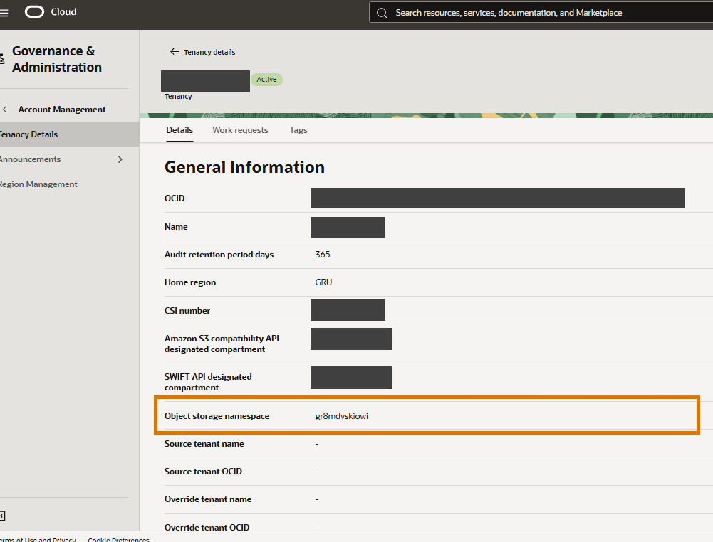

*Figura 1.1.1. La fila resaltada muestra el valor que debe copiarse como `TENANCY_NAMESPACE`. El namespace es diferente para cada estudiante.*

Correspondencia de los datos de la captura:

| Campo de OCI Console | Variable del taller | Valor de referencia |
|---|---|---|
| `Home region` | `OCI_REGION_KEY` | `gru` |
| `Object storage namespace` | `TENANCY_NAMESPACE` | `gr8mdvskiowi` |
| Se construye con la clave regional | `OCIR_ENDPOINT` | `gru.ocir.io` |

> No utilice el campo **Name**, el nombre visible de la tenancy ni el **OCID** como `TENANCY_NAMESPACE`.

> **Aclaración:** la región de origen de una tenancy no se puede cambiar. Algunas cuentas pueden suscribirse a regiones adicionales. Elija una región al iniciar la práctica y utilícela de manera consistente para OCIR y los recursos de red.

### Verificación

El namespace debe ser el valor técnico generado para la tenancy, no su nombre visible ni su OCID. En la ejecución de referencia, la clave regional `GRU` corresponde al endpoint corto `gru.ocir.io`.

📘 [Ampliar: namespace, registry domain y ruta completa de una imagen](#anexo-paso-1-1)

---

## Paso 1.2. Crear el repository privado

Abra:

```text
Developer Services
→ Containers & Artifacts
→ Container Registry
→ Create repository
```

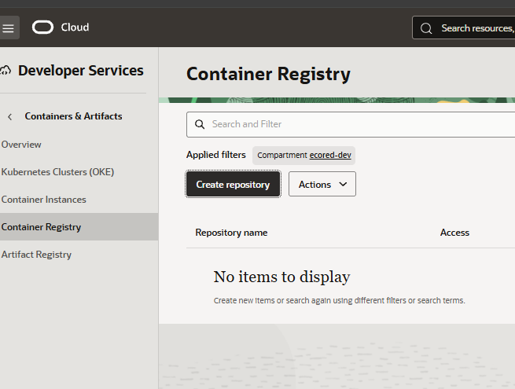

*Figura 1.2.1. Container Registry abierto en el compartimento `ecored-dev` antes de crear el primer repository.*

Seleccione **Create repository**. OCI abrirá un formulario independiente:

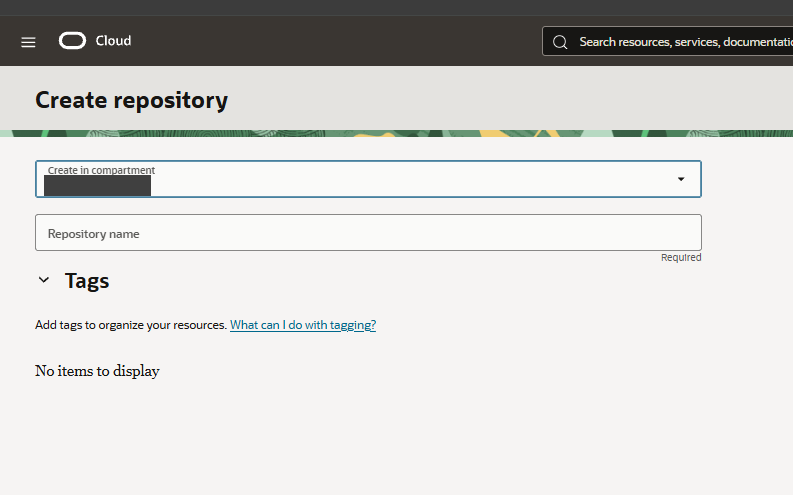

*Figura 1.2.2. Formulario de creación. Inicialmente aparece seleccionado el compartimento raíz; su identificador fue ocultado. Debe cambiarse antes de crear el repository.*

> **Atención:** el filtro `Compartment: ecored-dev` de la página anterior solamente controla qué repositories se muestran en la lista. No garantiza que el formulario cree el nuevo repository en ese compartimento. Verifique nuevamente el campo **Create in compartment**.

Configure:

```text
Name: ecored/ecored-circular
Compartment: ecored-dev
```

Las etiquetas son opcionales.

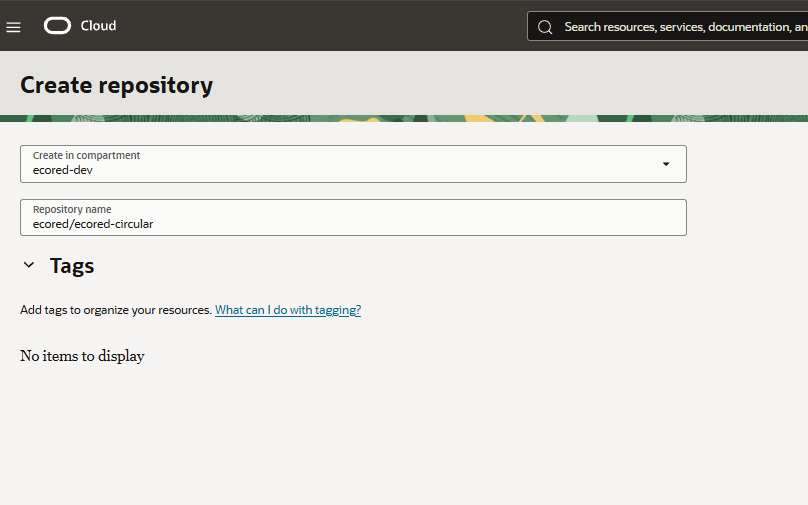

*Figura 1.2.3. Formulario configurado con `ecored-dev` y `ecored/ecored-circular`.*

> **Interfaz verificada:** en la versión de OCI Console utilizada durante esta práctica, el formulario no muestra el campo **Access**. No lo busque dentro de **Tags**. El repository se crea automáticamente con acceso **Private**.

Después de crear el repository:

1. Regrese a la lista de Container Registry.
2. Mantenga seleccionado el compartimento `ecored-dev`.
3. Confirme que `ecored/ecored-circular` aparezca con acceso **Private**.

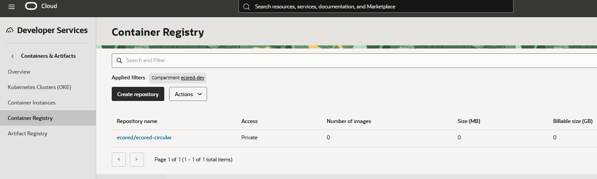

*Figura 1.2.4. Repository `ecored/ecored-circular` creado en `ecored-dev` con acceso `Private`.*

En la cuenta de laboratorio verificada, el campo **Access** de la pestaña **Details** es informativo y no ofrece una opción para modificarlo. No se requiere ninguna acción adicional.

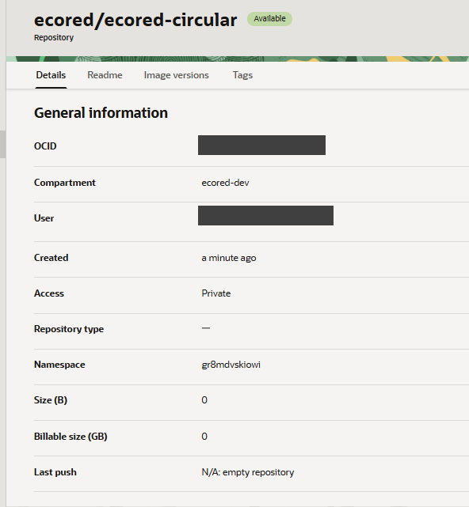

*Figura 1.2.5. Detalles del repository. El OCID y el usuario fueron ocultados; se conservan el compartimento, el acceso, el namespace y el estado vacío necesarios para la verificación.*

### Verificación

Debe existir:

```text
Repository: ecored/ecored-circular
Compartment: ecored-dev
Access: Private
```

📘 [Ampliar: repository, image, tag y digest](#anexo-paso-1-2)

---

## Paso 1.3. Crear un Auth Token para Docker CLI

En OCI Console:

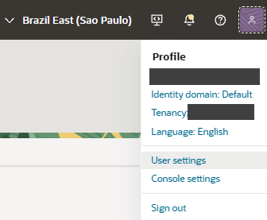

*Figura 1.3.1. Menú de perfil. El correo y el identificador de la tenancy fueron ocultados por seguridad.*

```text
Profile
→ User settings
→ pestaña Tokens and keys
→ sección Auth tokens
→ Generate token
```

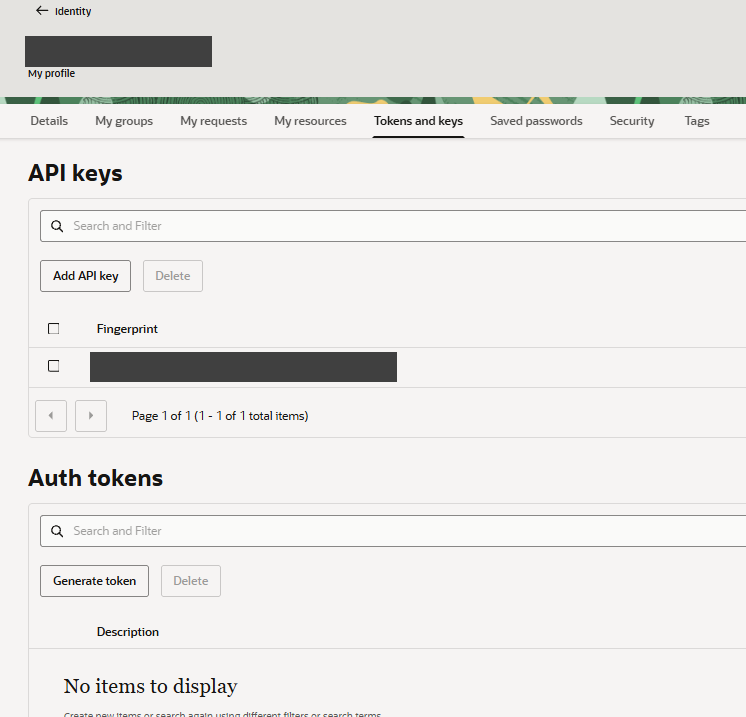

*Figura 1.3.2. Sección `Auth tokens` dentro de `Tokens and keys`. El nombre personal y el fingerprint de la API key fueron ocultados.*

> No confunda **Auth tokens** con **API keys**. Para autenticar Docker se utiliza un Auth Token.

Descripción sugerida:

```text
Docker CLI EcoRed
```

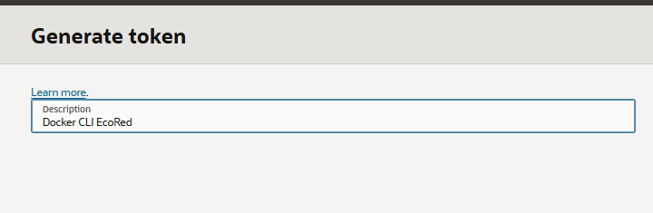

*Figura 1.3.3. Descripción asignada al Auth Token utilizado por Docker CLI.*

Genere el token. OCI lo mostrará una sola vez. Utilice el menú de la derecha para copiarlo y guárdelo temporalmente en un lugar seguro.

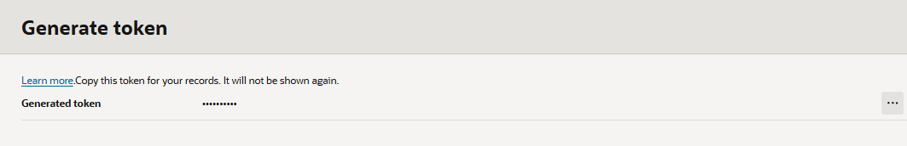

*Figura 1.3.4. Confirmación de generación. El valor del token está oculto deliberadamente y nunca debe aparecer en una evidencia.*

> No agregue el Auth Token al repositorio, capturas, videos ni entregables.

Vuelva a la sección **Auth tokens** y confirme que la descripción registrada aparece en la lista. La consola no volverá a mostrar el valor del token.

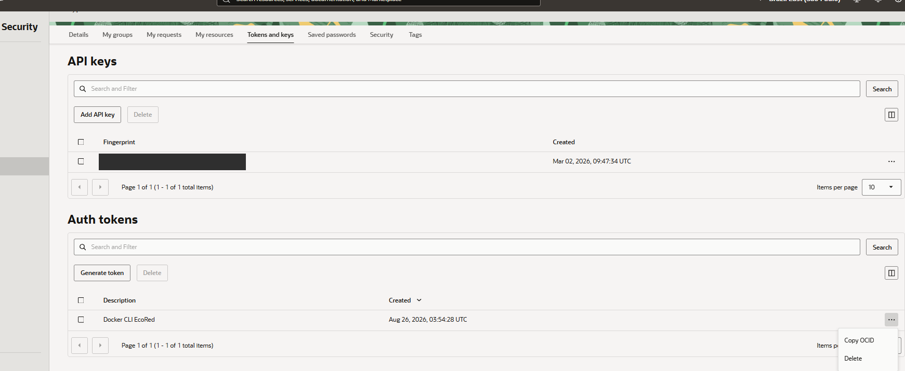

*Figura 1.3.5. El Auth Token `Docker CLI EcoRed` aparece registrado. El fingerprint de la API key fue ocultado porque no es necesario para esta práctica.*

### Verificación

Debe existir una fila con la descripción:

```text
Docker CLI EcoRed
```

📘 [Ampliar: por qué se usa Auth Token y no la contraseña de OCI](#anexo-paso-1-3)

---

## Paso 1.4. Autenticar Docker contra OCIR

Desde el equipo donde ya tiene la imagen EcoRed:

```bash
docker login <OCIR_ENDPOINT>
```

Cuando Docker solicite las credenciales, use:

```text
Username: <TENANCY_NAMESPACE>/<OCI_USERNAME>
Password: <AUTH_TOKEN>
```

- `TENANCY_NAMESPACE`: valor copiado de **Object storage namespace** en el Paso 1.1.
- `OCI_USERNAME`: nombre de usuario mostrado en **Profile**. Cópielo exactamente, incluidos puntos, guiones, mayúsculas o dominio de correo.
- `AUTH_TOKEN`: valor copiado al generarlo en el Paso 1.3. No utilice la contraseña de acceso a OCI.

Para la región de la ejecución de referencia, el comando es:

```powershell
docker login gru.ocir.io
```

En una tenancy que utilice un Identity Domain distinto del dominio predeterminado, OCI puede requerir el formato:

```text
<TENANCY_NAMESPACE>/<IDENTITY_DOMAIN>/<OCI_USERNAME>
```

### Advertencias para evitar errores de autenticación

Antes de continuar, compruebe:

1. El endpoint debe corresponder a la región activa.
2. El namespace y el usuario deben copiarse exactamente; no los escriba de memoria.
3. La contraseña solicitada por Docker es el Auth Token, no la contraseña de la consola OCI.
4. Pegue el Auth Token sin comillas ni espacios adicionales.
5. Si las credenciales son rechazadas y el usuario es correcto, genere un Auth Token nuevo y cópielo antes de cerrar la ventana. OCI no permite consultar nuevamente su valor.
6. No utilice una API key, su fingerprint ni el OCID del token.

### Verificación

```text
Login Succeeded
```

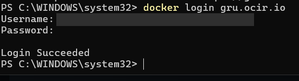

*Figura 1.4.1. Docker autenticado correctamente contra `gru.ocir.io`. El nombre de usuario fue cubierto con un recuadro opaco.*

Si durante la solución de problemas generó tokens adicionales, revoque únicamente los tokens anteriores que ya no utilice y conserve el token válido en un gestor de secretos.

📘 [Ampliar: formato de usuario y autenticación de Docker contra OCIR](#anexo-paso-1-4)

---

## Paso 1.5. Etiquetar la imagen existente

Compruebe primero:

```bash
docker images
```

Si la imagen ya no está disponible localmente, recupérela desde Docker Hub sin reconstruirla:

```bash
docker pull adanbeltran/ecored-circular:v1.0
```

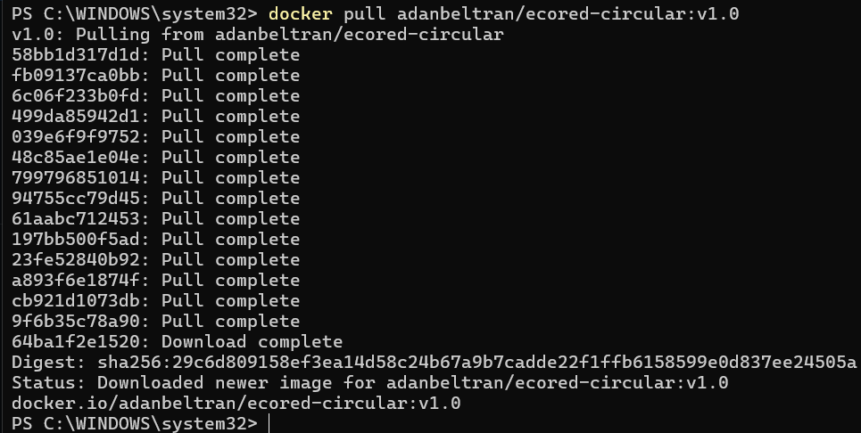

*Figura 1.5.1. Descarga de `adanbeltran/ecored-circular:v1.0`. El estado final confirma que las capas quedaron disponibles en Docker Desktop.*

Vuelva a ejecutar `docker images` y confirme que la referencia `adanbeltran/ecored-circular:v1.0` esté disponible.

Agregue una nueva referencia:

```bash
docker tag adanbeltran/ecored-circular:v1.0 <OCIR_ENDPOINT>/<TENANCY_NAMESPACE>/ecored/ecored-circular:v1.0
```

Comando utilizado en la ejecución de referencia:

```powershell
docker tag adanbeltran/ecored-circular:v1.0 gru.ocir.io/gr8mdvskiowi/ecored/ecored-circular:v1.0
```

> **Advertencia:** copie `TENANCY_NAMESPACE` desde **Object storage namespace**. Un solo carácter incorrecto hará que OCIR busque una tenancy inexistente o no autorizada.

Compruebe nuevamente:

```bash
docker images
```

### Verificación

Deben aparecer dos referencias a la imagen:

```text
Docker Hub → adanbeltran/ecored-circular:v1.0
OCIR       → <OCIR_ENDPOINT>/<TENANCY_NAMESPACE>/ecored/ecored-circular:v1.0
```

No ejecute `docker build`.

📘 [Ampliar: diferencia entre `docker build` y `docker tag`](#anexo-paso-1-5)

---

## Paso 1.6. Publicar y validar la imagen en OCIR

Publique:

```bash
docker push <OCIR_ENDPOINT>/<TENANCY_NAMESPACE>/ecored/ecored-circular:v1.0
```

Comando utilizado en la ejecución de referencia:

```powershell
docker push gru.ocir.io/gr8mdvskiowi/ecored/ecored-circular:v1.0
```

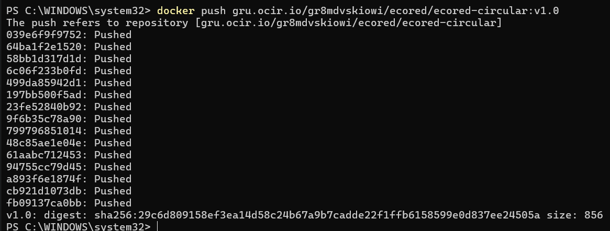

*Figura 1.6.1. Las capas fueron publicadas en OCIR. La última línea muestra el tag `v1.0`, el digest y el tamaño del manifiesto.*

> **Advertencia:** antes de ejecutar `docker push`, compare el namespace de la etiqueta con el valor registrado en el Paso 1.1. No continúe si existe alguna diferencia.

En OCI Console:

1. Abra **Developer Services → Containers & Artifacts → Container Registry**.

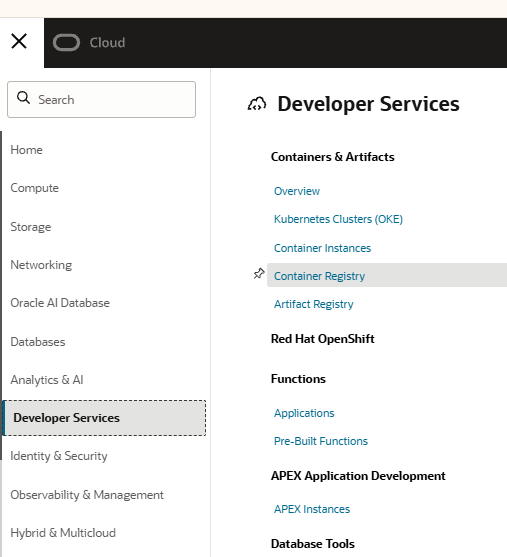

*Figura 1.6.2. Acceso a `Container Registry` desde el menú de Developer Services.*

2. Seleccione el compartimento `ecored-dev` y abra el repository `ecored/ecored-circular`.

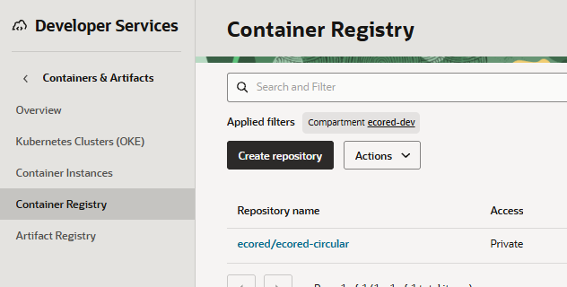

*Figura 1.6.3. Repository privado `ecored/ecored-circular` disponible en el compartimento `ecored-dev`.*

3. Abra la pestaña **Image versions** y verifique que el repository muestre el tag:

```text
v1.0
```

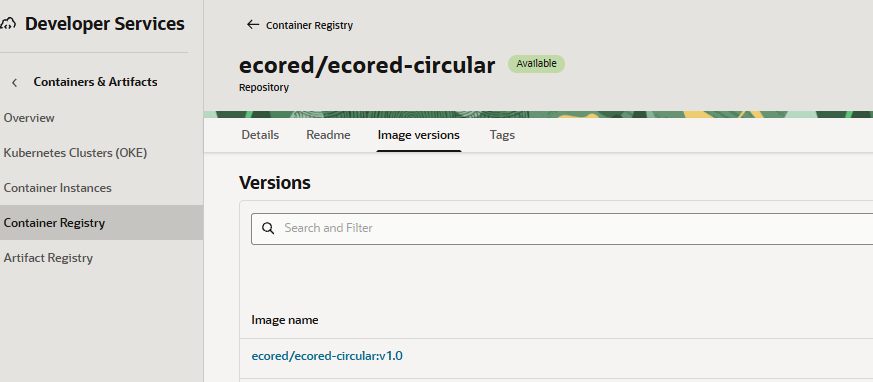

*Figura 1.6.4. La versión `ecored/ecored-circular:v1.0` confirma que la imagen quedó almacenada en OCIR. La captura fue recortada para conservar únicamente la evidencia requerida.*

La recuperación desde OCIR se comprobará como experimento en la Fase 3 con el siguiente comando:

```bash
docker pull <OCIR_ENDPOINT>/<TENANCY_NAMESPACE>/ecored/ecored-circular:v1.0
```

### Verificación

La imagen está almacenada en OCIR. Su recuperación sin reconstruirla se validará en el Experimento 3.1.

📘 [Ampliar: qué se transfiere realmente durante `push` y `pull`](#anexo-paso-1-6)

---

# Fase 2. Ampliar la VCN con networking privado

## Introducción

Como resultado de la práctica anterior, ya existe una red mínima orientada a publicar directamente una aplicación en Internet:

```text
ecored-vcn 10.20.0.0/16
    │
    └── ecored-public-subnet 10.20.10.0/24
             │
             └── 0.0.0.0/0 → Internet Gateway
```

En esta fase no se crea otra VCN. Se amplía `ecored-vcn` agregando una zona privada para workloads posteriores:

```text
ecored-vcn 10.20.0.0/16
│
├── ecored-public-subnet
│   10.20.10.0/24
│        └── Internet Gateway
│
└── ecored-workloads-private
    10.20.20.0/24
         ├── NAT Gateway
         └── Service Gateway
```

## Objetivo de la fase

Preparar una subnet sin IPv4 pública directa para workloads que posteriormente serán administrados por OKE.

📘 [Ampliar: por qué un diseño para Kubernetes separa redes públicas y privadas](#anexo-fase-2)

---

## Paso 2.1. Crear el NAT Gateway `ecored-nat`

Dentro de `ecored-vcn` abra:

```text
Pestaña Gateways
→ sección NAT Gateways
→ Create NAT Gateway
```

> En la interfaz actual de OCI, `NAT Gateways` no aparece como opción independiente en el menú principal de Networking. Primero debe abrir la VCN y seleccionar la pestaña **Gateways**.

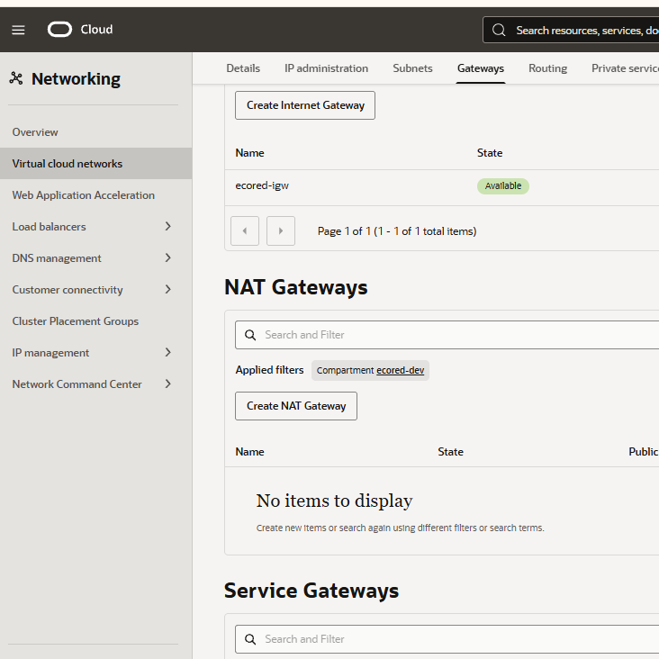

*Figura 2.1.1. La pestaña `Gateways` agrupa Internet Gateways, NAT Gateways y Service Gateways asociados a `ecored-vcn`.*

Configure:

```text
Name: ecored-nat
Compartment: ecored-dev
Public IP address: Ephemeral Public IP Address
Route Table Association: sin seleccionar
```

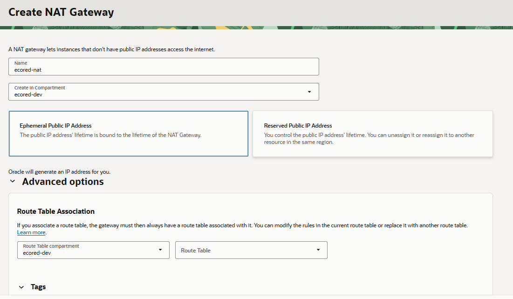

*Figura 2.1.2. Configuración de `ecored-nat` con una dirección pública efímera. La asociación avanzada de Route Table se deja vacía porque la ruta de la subnet privada se configurará posteriormente.*

Una dirección efímera es suficiente para el taller: OCI la mantiene mientras exista el NAT Gateway. Utilice una dirección reservada únicamente cuando sea necesario conservar una IP de salida fija después de reemplazar el gateway.

### Verificación

```text
ecored-nat → Available
```

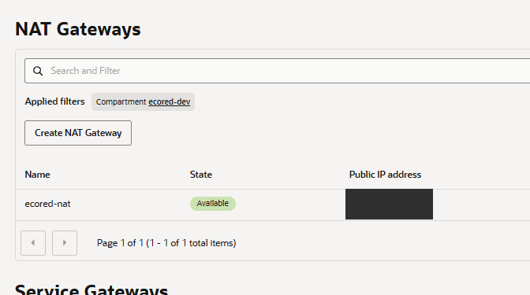

*Figura 2.1.3. `ecored-nat` en estado `Available`. La dirección IPv4 pública fue cubierta porque no es necesaria para reproducir la práctica.*

📘 [Ampliar: Internet Gateway vs. NAT Gateway](#anexo-paso-2-1)

---

## Paso 2.2. Crear el Service Gateway `ecored-sgw`

Dentro de `ecored-vcn` abra:

```text
Pestaña Gateways
→ sección Service Gateways
→ Create Service Gateway
```

Configure:

```text
Name: ecored-sgw
Compartment: ecored-dev
Service: All GRU Services in Oracle Services Network
Route Table Association: sin seleccionar
```

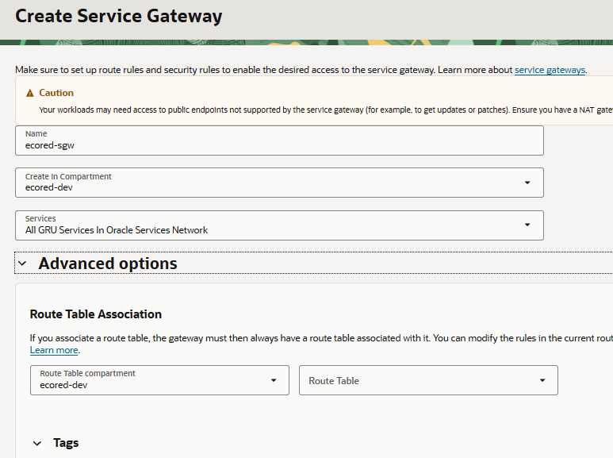

*Figura 2.2.1. Configuración de `ecored-sgw` para acceder a todos los servicios regionales disponibles mediante Oracle Services Network. La asociación avanzada de Route Table se deja vacía.*

> Seleccione **All GRU Services in Oracle Services Network**, no solamente **OCI GRU Object Storage**. De esta manera, los workloads privados podrán acceder a los servicios regionales compatibles sin limitar el gateway exclusivamente a Object Storage.

El Service Gateway no reemplaza al NAT Gateway: `ecored-sgw` proporciona acceso privado a servicios compatibles de OCI, mientras que `ecored-nat` permite la salida hacia endpoints públicos de Internet.

### Verificación

```text
ecored-sgw → Available
```

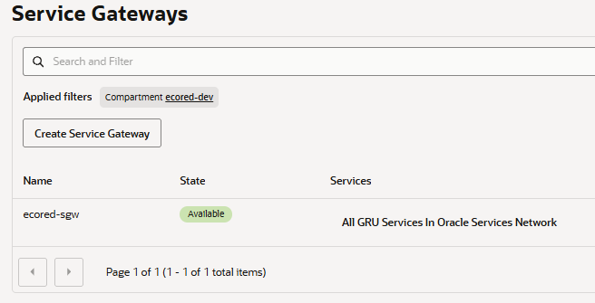

*Figura 2.2.2. `ecored-sgw` en estado `Available` y asociado a todos los servicios GRU de Oracle Services Network.*

📘 [Ampliar: Service Gateway y Oracle Services Network](#anexo-paso-2-2)

---

## Paso 2.3. Crear la Route Table privada

Dentro de `ecored-vcn` abra:

```text
Pestaña Routing
→ sección Route Tables
→ Create Route Table
```

Configure:

```text
Name: ecored-private-rt
Compartment: ecored-dev
```

Agregue las rutas:

```text
0.0.0.0/0
    → NAT Gateway
    → ecored-nat

All GRU Services in Oracle Services Network
    → Service Gateway
    → ecored-sgw
```

> **Advertencia:** antes de crear la Route Table, confirme que se hayan agregado las dos Route Rules. Si posteriormente necesita agregar otra regla, abra `ecored-private-rt`, seleccione la pestaña **Route Rules** y pulse **Add Route Rules**. No es necesario eliminar ni recrear la tabla.

### Verificación

La tabla debe mostrar las dos reglas estáticas y **no utilizar `ecored-igw` como ruta por defecto**.

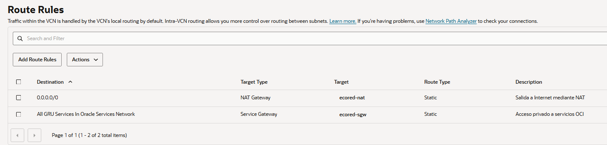

*Figura 2.3.1. `ecored-private-rt` contiene una ruta de salida a Internet mediante `ecored-nat` y una ruta privada hacia Oracle Services Network mediante `ecored-sgw`.*

📘 [Ampliar: cómo decide una Route Table y qué significa `0.0.0.0/0`](#anexo-paso-2-3)

---

## Paso 2.4. Crear la subnet privada `ecored-workloads-private`

Dentro de `ecored-vcn` abra:

```text
Pestaña Subnets
→ Create Subnet
```

Configure:

```text
Name: ecored-workloads-private
Compartment: ecored-dev
Subnet Type: Regional
IPv4 CIDR Block: 10.20.20.0/24
```

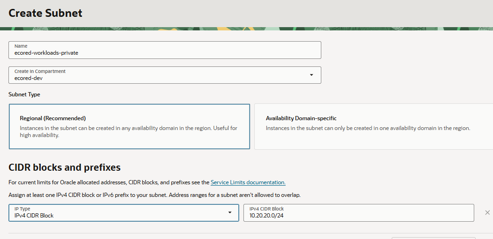

*Figura 2.4.1. Configuración regional de `ecored-workloads-private` con el bloque `10.20.20.0/24`, que no se superpone con `ecored-public-subnet` (`10.20.10.0/24`).*

Continúe con:

```text
Route Table: ecored-private-rt
Subnet Access: Private Subnet
DNS Resolution: Enabled
DNS Label: ecoredworkloads
DHCP Options: Default DHCP Options for ecored-vcn
```

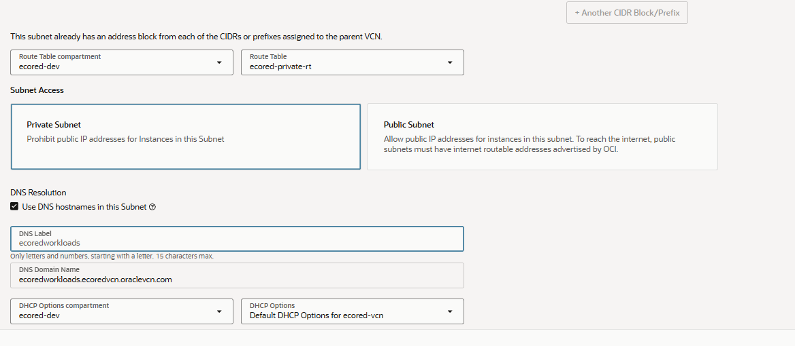

*Figura 2.4.2. La subnet utiliza `ecored-private-rt`, prohíbe direcciones IPv4 públicas y habilita nombres DNS internos.*

Finalmente configure:

```text
Security List: Default Security List for ecored-vcn
Resource logging: Disabled
Tags: sin agregar
```

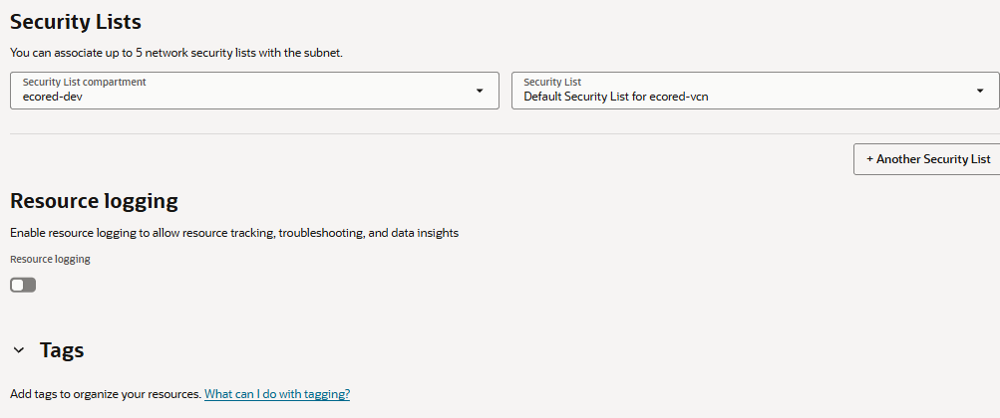

*Figura 2.4.3. Asociación con la Security List predeterminada. El NSG específico para los workloads se crea en el paso siguiente.*

### Verificación

```text
Subnet: ecored-workloads-private
CIDR: 10.20.20.0/24
Access: Private
Route Table: ecored-private-rt
```

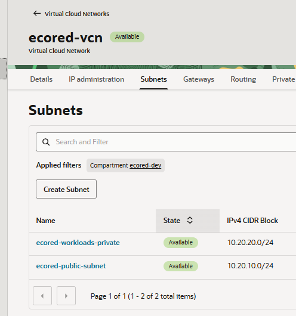

*Figura 2.4.4. `ecored-workloads-private` y `ecored-public-subnet` aparecen en estado `Available` con bloques CIDR independientes.*

📘 [Ampliar: subnet pública vs. subnet privada](#anexo-paso-2-4)

---

## Paso 2.5. Crear el NSG base `ecored-workloads-nsg`

Dentro de `ecored-vcn` abra:

```text
Pestaña Security
→ sección Network Security Groups
→ Create Network Security Group
```

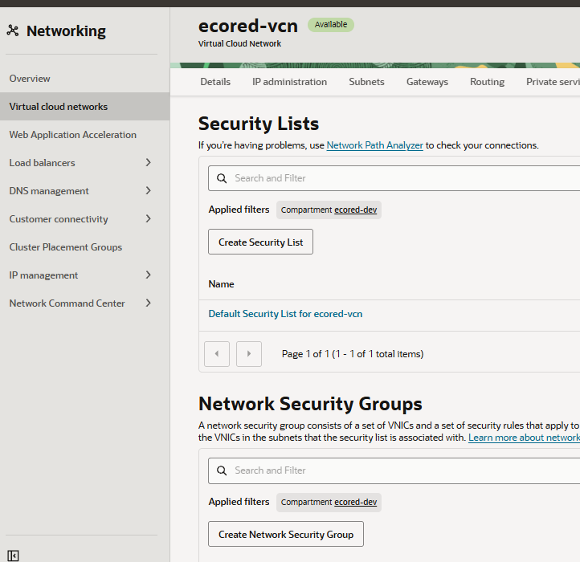

*Figura 2.5.1. La pestaña `Security` separa las Security Lists de los Network Security Groups. En este paso se crea un NSG.*

Configure:

```text
Name: ecored-workloads-nsg
Compartment: ecored-dev
Tags: ninguna
Security Rules: ninguna
```

> **Advertencia:** OCI puede mostrar inicialmente un bloque vacío en **Add Security Rules**. Pulse la `X` situada a la derecha del encabezado **Rule** para eliminarlo antes de crear el NSG. No complete esa regla con un origen amplio como `0.0.0.0/0`; las reglas se definirán cuando se conozcan los flujos requeridos por OKE.

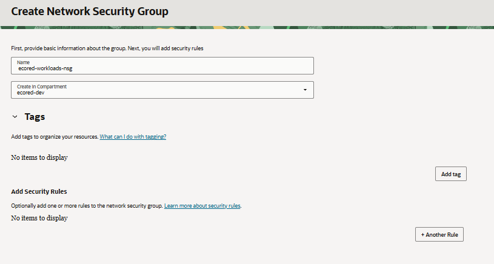

*Figura 2.5.2. `ecored-workloads-nsg` preparado sin reglas. La indicación `No items to display` confirma que el bloque inicial fue eliminado.*

En este taller **no abra puertos de aplicación desde `0.0.0.0/0`**.

Las reglas específicas necesarias para los componentes de OKE se definirán cuando exista el cluster y se conozca qué recurso debe comunicarse con cuál.

### Verificación

Existe el NSG y no contiene una regla pública indiscriminada hacia EcoRed.

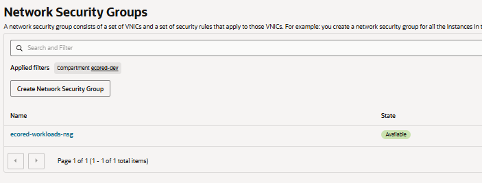

*Figura 2.5.3. `ecored-workloads-nsg` creado y en estado `Available`.*

📘 [Ampliar: Security List vs. NSG y por qué aplazamos las reglas de OKE](#anexo-paso-2-5)

---

## Paso 2.6. Verificar la topología en Network Visualizer

Abra:

```text
Networking
→ Network Command Center
→ Network Visualizer
```

Confirme que estén seleccionados la región y el compartment utilizados en el taller. Cuando aparezca el **Regional routing map**:

1. En **Find resource on map...**, escriba `ecored-vcn`.
2. Seleccione la VCN en el resultado de búsqueda.
3. En el panel **Resource summary**, confirme que el campo **Name** muestre `ecored-vcn`.
4. En **Resource maps**, pulse **View VCN routing map**.

> **Importante:** utilice el buscador para seleccionar la VCN. En la interfaz actual, pulsar el espacio vacío dentro del hexágono puede no seleccionar ningún recurso; si se selecciona un círculo como `IGW`, `NAT` o `SGW`, el panel mostrará los datos de ese gateway y no ofrecerá la opción **View VCN routing map**.

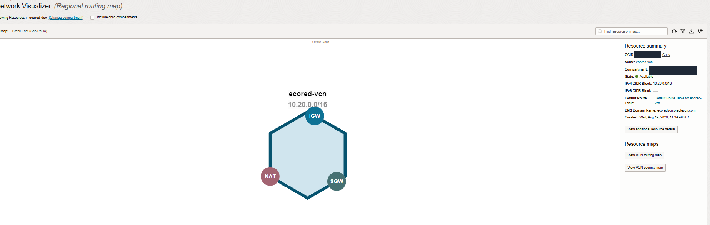

En el **Virtual cloud network routing map**, compruebe visualmente:

```text
ecored-vcn
│
├── ecored-public-subnet (10.20.10.0/24)
│      └── ecored-igw
│
└── ecored-workloads-private (10.20.20.0/24)
       ├── ecored-nat
       └── ecored-sgw
```

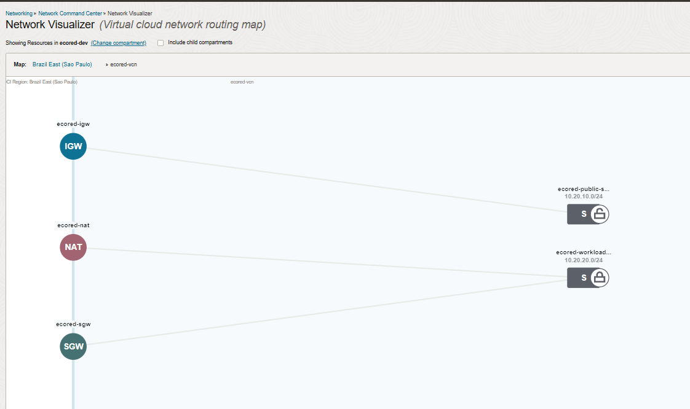

La primera conexión representa la salida directa de la subnet pública mediante el Internet Gateway. Las otras dos muestran que la subnet privada utiliza el NAT Gateway para destinos de Internet y el Service Gateway para los servicios de OCI.

Capture el mapa de enrutamiento como evidencia.

📘 [Ampliar: qué demuestra y qué no demuestra Network Visualizer](#anexo-paso-2-6)

---

# Fase 3. Experimentar y demostrar comprensión

## Introducción

Esta es la fase práctica autónoma del estudiante. Los recursos ya están configurados; ahora debe utilizarlos para comprobar la recuperación de la imagen, interpretar las rutas y predecir el comportamiento de la red ante distintos destinos y fallos hipotéticos.

Los experimentos son de observación, consulta y análisis. **No elimine gateways, no cambie las Route Tables y no modifique la asociación de las subnets**, porque esta infraestructura será utilizada por OKE.

## Objetivo de la fase

Demostrar, mediante evidencias y respuestas argumentadas, que el estudiante comprende cómo se recupera la imagen desde OCIR y cómo OCI selecciona las rutas de las subnets pública y privada.

📘 [Ampliar: por qué no se despliega EcoRed en Container Instances](#anexo-fase-3)

---

## Experimento 3.1. Recuperar la imagen desde OCIR

Ejecute un `pull` utilizando la referencia de OCIR creada durante el taller:

```powershell
docker pull <OCIR_ENDPOINT>/<TENANCY_NAMESPACE>/ecored/ecored-circular:v1.0
```

Registre:

- la referencia completa solicitada;
- el resultado del comando;
- una captura sin credenciales ni Auth Tokens;
- una explicación de por qué `Image is up to date` también demuestra que Docker consultó el registry y encontró localmente la misma versión.

📘 [Ampliar: recuperación y portabilidad de la imagen](#anexo-paso-3-1)

---

## Experimento 3.2. Determinar la ruta seleccionada

Abra la Route Table asociada a cada subnet y complete la matriz. No modifique las reglas.

| Caso | Origen | Destino | Regla que coincide | Target o mecanismo | Justificación |
|---|---|---|---|---|---|
| A | `ecored-public-subnet` | una dirección de Internet | | | |
| B | `ecored-workloads-private` | una dirección de Internet | | | |
| C | `ecored-workloads-private` | un servicio incluido en **All GRU Services in Oracle Services Network** | | | |
| D | `ecored-workloads-private` | una dirección de `ecored-public-subnet` | | | |

Para cada caso:

1. identifique la Route Table asociada a la subnet de origen;
2. escriba la regla exacta que coincide con el destino;
3. identifique el siguiente salto o el mecanismo de enrutamiento local;
4. explique por qué no se selecciona otra salida.

> **Criterio de revisión:** la tabla pública debe dirigir el tráfico de Internet al Internet Gateway. La tabla privada debe dirigir el tráfico general de Internet al NAT Gateway y el tráfico hacia los servicios de OCI de la región al Service Gateway. El tráfico entre subnets de la misma VCN utiliza las rutas locales implícitas de OCI.

📘 [Ampliar: ruta por defecto, siguiente salto y analogía del “comodín”](#anexo-paso-3-2)

---

## Experimento 3.3. Analizar fallos hipotéticos

Sin realizar cambios en OCI, responda qué ocurriría en cada situación:

1. Se elimina de `ecored-private-rt` la ruta `0.0.0.0/0 → ecored-nat`.
2. Se elimina la ruta hacia **All GRU Services in Oracle Services Network**, pero permanece la ruta hacia el NAT Gateway.
3. Un destino de OCI coincide con la ruta de servicios y también con `0.0.0.0/0`. ¿Cuál debe utilizar OCI y por qué?
4. Las rutas son correctas, pero el NSG o la Security List bloquean el tráfico. ¿La Route Table puede resolver por sí sola el problema?

Para cada hipótesis indique:

- qué flujo se afecta;
- qué componente deja de participar;
- si se pierde salida a Internet, acceso privado a servicios OCI o conectividad por reglas de seguridad;
- qué evidencia de la consola utilizaría para diagnosticarlo.

📘 [Ampliar: rutas correctas no sustituyen las reglas de seguridad](#anexo-paso-3-3)

---

## Experimento 3.4. Elaborar la síntesis técnica

Construya un diagrama propio que represente como mínimo:

```text
                         OCI
                          │
              ┌───────────┴───────────┐
              │                       │
             OCIR                 ecored-vcn
              │                   10.20.0.0/16
              │                       │
              │          ┌────────────┴────────────┐
              │          │                         │
              │      subnet pública           subnet privada
              │      10.20.10.0/24            10.20.20.0/24
              │          │                         │
              │         IGW                   NAT + SGW
              │
              └── ecored/ecored-circular:v1.0
```

Sobre el diagrama, marque con flechas diferentes los siguientes flujos:

1. descarga de la imagen desde OCIR;
2. salida de la subnet pública hacia Internet;
3. salida de la subnet privada hacia Internet;
4. acceso privado desde la subnet privada a servicios de OCI.

Finalmente, responda las [preguntas de comprensión](#preguntas-de-comprensión) utilizando los resultados observados en los experimentos. No basta con copiar definiciones: cada respuesta debe relacionarse con los recursos creados en el taller.

📘 [Ampliar: relación entre el artefacto OCIR y la red que utilizará OKE](#anexo-paso-3-4)

---

# Fase 4. Preparar el contrato de entrada para OKE

## Introducción

Esta fase prepara el contrato de entrada del Taller 3. Se deja un conjunto mínimo de nombres, identificadores, redes y rutas para que la creación de OKE reutilice explícitamente los resultados de esta práctica.

## Objetivo de la fase

Entregar a OKE una VCN preparada para workloads privados y una imagen disponible en OCIR.

📘 [Ampliar: qué podrá reutilizar OKE y qué tendrá que crear todavía](#anexo-fase-4)

---

## Paso 4.1. Registrar parámetros reutilizables

Cree o actualice:

```text
oci-lab-params.example
```

Contenido mínimo:

```text
OCI_REGION=<region>
COMPARTMENT_OCID=<ocid>
VCN_OCID=<ocid>
PUBLIC_SUBNET_OCID=<ocid>
PRIVATE_WORKLOADS_SUBNET_OCID=<ocid>
WORKLOADS_NSG_OCID=<ocid>
OCIR_ENDPOINT=<endpoint>
TENANCY_NAMESPACE=<namespace>
OCIR_REPOSITORY=ecored/ecored-circular
IMAGE_TAG=v1.0
```

> No incluya Auth Tokens, contraseñas, claves privadas ni secretos de EcoRed.

📘 [Ampliar: parámetros de infraestructura vs. secretos](#anexo-paso-4-1)

---

## Paso 4.2. Revisar recursos y costos

Al finalizar:

1. Mantenga VCN, gateways, Route Tables, subnets, NSG y repository OCIR.
2. La Container Instance utilizada para validar EcoRed puede detenerse si ya no se utilizará durante la sesión.
3. No elimine la infraestructura preparada, porque será reutilizada durante la creación de OKE en el Taller 3.
4. Revise Cost Analysis o el saldo de créditos de la cuenta.

📘 [Ampliar: qué conservar, qué detener y por qué](#anexo-paso-4-2)

---

# Entregable final

Entregue un informe breve en Markdown o PDF que reúna la ejecución y la experimentación. Debe contener:

## 1. Evidencias de la infraestructura

- [ ] Repository privado `ecored/ecored-circular` y tag `v1.0` visibles en OCIR.
- [ ] Evidencia de `docker login`, `tag`, `push` y `pull` desde OCIR, sin mostrar el Auth Token.
- [ ] NAT Gateway `ecored-nat` y Service Gateway `ecored-sgw` en estado **Available**.
- [ ] Evidencia de la Route Table pública con `0.0.0.0/0 → ecored-igw`.
- [ ] Evidencia de `ecored-private-rt` con `0.0.0.0/0 → ecored-nat` y **All GRU Services in Oracle Services Network → ecored-sgw**.
- [ ] Subnet privada `ecored-workloads-private` — `10.20.20.0/24` — asociada a `ecored-private-rt`.
- [ ] NSG `ecored-workloads-nsg` en estado **Available**.
- [ ] Mapa de Network Visualizer con las subnets pública y privada y sus gateways.

## 2. Resultados de la experimentación

- [ ] Resultado del `docker pull` desde OCIR.
- [ ] Matriz de selección de rutas del Experimento 3.2 completa y justificada.
- [ ] Respuestas a los cuatro fallos hipotéticos del Experimento 3.3.
- [ ] Diagrama final con los cuatro flujos solicitados.
- [ ] Respuestas argumentadas a las diez preguntas de comprensión.

## 3. Contrato para la siguiente práctica

- [ ] Archivo `oci-lab-params.example` actualizado y sin tokens, contraseñas ni claves privadas.

> **No es entregable crear otra Container Instance desde OCIR.** Tampoco se deben eliminar o alterar los recursos para provocar fallos reales. Los escenarios de falla se analizan de forma hipotética para conservar la infraestructura que utilizará OKE.

---

# Preguntas de comprensión

1. ¿Qué evidencia permite afirmar que `docker tag` agregó otra referencia a la imagen y no reconstruyó EcoRed?
2. Si Kubernetes puede descargar imágenes desde Docker Hub, ¿qué ventajas aporta almacenar esta imagen también en OCIR dentro de la ruta hacia OKE?
3. Explique la diferencia entre registry, repository, image, tag y digest utilizando `ecored/ecored-circular:v1.0` como ejemplo.
4. ¿Por qué dos subnets de la misma VCN pueden necesitar Route Tables diferentes?
5. ¿Por qué `0.0.0.0/0` apunta al Internet Gateway en la subnet pública y al NAT Gateway en la subnet privada?
6. Si `ecored-private-rt` contiene una ruta de servicios OCI y otra `0.0.0.0/0`, ¿cuál se selecciona para un servicio incluido en **All GRU Services in Oracle Services Network** y por qué?
7. ¿Cómo se enruta el tráfico entre `ecored-workloads-private` y `ecored-public-subnet` si no aparece una regla explícita para ese tráfico en la tabla?
8. ¿Por qué un NAT Gateway permite iniciar conexiones hacia Internet, pero no convierte el workload privado en un destino accesible directamente desde Internet?
9. ¿Por qué una Route Table correcta no garantiza por sí sola la conectividad? Relacione su respuesta con Security Lists y NSG.
10. ¿Por qué OKE debe crear Pods nuevos desde la imagen de OCIR en lugar de adoptar la Container Instance utilizada previamente?

---

# Contrato de entrada para el Taller 3

El Taller 3 reutilizará:

```text
ecored-dev
│
├── ecored-vcn
│   ├── ecored-public-subnet
│   └── ecored-workloads-private
│
├── ecored-nat
├── ecored-sgw
├── ecored-private-rt
├── ecored-workloads-nsg
│
└── OCIR
    └── ecored/ecored-circular:v1.0
```

> Esta infraestructura es una **base de preparación**, no toda la topología definitiva de OKE. Durante la creación del cluster, OCI puede requerir subnets o reglas adicionales para el Kubernetes API endpoint, workers, Pods o futuros Load Balancers. Esos elementos se definirán cuando exista la necesidad concreta en el Taller 3.

---

# Anexo didáctico y relación con la ruta

<a id="anexo-vision-general"></a>
## Visión general - ¿Por qué existe el Taller 2 si EcoRed ya funciona?

Dentro de la ruta completa de diez talleres, el Taller 2 funciona como puente inmediato entre la ejecución inicial en OCI y la adopción de Kubernetes. El Taller 1 comprobó que la imagen de EcoRed puede construirse, publicarse en Docker Hub y ejecutarse en OCI Container Instances. El Taller 2 no reemplaza ese resultado: prepara el artefacto y la red para que OKE pueda utilizarlos en el Taller 3 y para que los talleres posteriores continúen evolucionando la arquitectura.

Ejecutar un contenedor, almacenar una imagen y orquestar workloads son responsabilidades diferentes:

```text
Taller 1: Container Instance
= ejecutar un contenedor

Taller 2: OCIR + networking privado
= preparar artefacto + infraestructura

Taller 3: OKE / Kubernetes
= orquestar Pods y contenedores
```

Kubernetes no adopta la Container Instance existente. OKE creará Pods nuevos a partir de la imagen publicada en OCIR. Por eso este taller funciona como puente entre una ejecución aislada y una plataforma de orquestación.

[↩ Volver al punto de partida](#punto-de-partida-y-relación-con-la-ruta)

---

<a id="anexo-fase-1"></a>
## Fase 1 - Docker Hub vs. OCIR

Docker Hub y OCIR son registries de contenedores. Ambos pueden almacenar imágenes que Kubernetes puede descargar. La imagen ya publicada en Docker Hub se conserva; OCIR se agrega como una segunda ubicación para el mismo artefacto.

OCIR se introduce porque permite que el artefacto quede integrado en OCI y posteriormente pueda relacionarse con IAM, OKE y automatización de entrega. **No es un requisito universal de Kubernetes.**

```text
Docker Hub                         OCIR
----------                         ----
Registry externo                  Registry de OCI
Imagen pública o privada          Repository público o privado
Credenciales Docker Hub           IAM/Auth Token OCI
Puede ser usado por Kubernetes    Puede ser usado por OKE
```

[↩ Volver a Fase 1](#fase-1-publicar-la-misma-imagen-ecored-en-ocir)

---

<a id="anexo-paso-1-1"></a>
## Paso 1.1 - Namespace y registry domain

El **tenancy namespace** es un identificador técnico usado en las rutas de OCIR. No debe confundirse con el nombre visible de la tenancy.

Una referencia completa sigue la forma:

```text
<registry-domain>/<tenancy-namespace>/<repository>:<tag>
```

Ejemplo conceptual:

```text
<OCIR_ENDPOINT>/<TENANCY_NAMESPACE>/ecored/ecored-circular:v1.0
```

Oracle documenta como formato recomendado del registry domain:

```text
ocir.<region-identifier>.oci.oraclecloud.com
```

En el realm comercial `OC1` también puede utilizarse el formato corto `<region-key>.ocir.io`. En este laboratorio el endpoint se obtiene convirtiendo la clave regional a minúsculas y agregando `.ocir.io`; por ejemplo, `GRU → gru.ocir.io`.

[↩ Volver al Paso 1.1](#paso-11-identificar-namespace-y-endpoint-de-ocir)

---

<a id="anexo-paso-1-2"></a>
## Paso 1.2 - Repository, image, tag y digest

```text
Registry
└── Repository: ecored/ecored-circular
    ├── Image :v1.0
    └── Image :v1.1
```

- **Registry:** servicio que almacena artefactos.
- **Repository:** agrupación lógica de versiones relacionadas.
- **Image:** plantilla inmutable usada para crear contenedores.
- **Tag:** etiqueta legible asociada a una versión.
- **Digest:** hash que identifica exactamente el contenido de una imagen.

Un tag puede reutilizarse; un digest representa contenido específico.

[↩ Volver al Paso 1.2](#paso-12-crear-el-repository-privado)

---

<a id="anexo-paso-1-3"></a>
## Paso 1.3 - Auth Token

Docker necesita autenticarse contra un registry privado. En OCIR el Auth Token se utiliza como contraseña de Docker CLI.

```text
OCI Console password ≠ Docker registry password
                         │
                         ▼
                    Auth Token
```

El token debe tratarse como un secreto. Si se expone, debe revocarse y generar uno nuevo.

[↩ Volver al Paso 1.3](#paso-13-crear-un-auth-token-para-docker-cli)

---

<a id="anexo-paso-1-4"></a>
## Paso 1.4 - Login contra OCIR

El username depende de la configuración de identidad de la tenancy. Conceptualmente:

```text
<TENANCY_NAMESPACE>/<usuario>
```

Con Identity Domains puede incluir también el dominio. Por esta razón el procedimiento principal no fija un único formato y recomienda utilizar el valor indicado por OCI para la identidad del estudiante.

El Auth Token se usa como password.

[↩ Volver al Paso 1.4](#paso-14-autenticar-docker-contra-ocir)

---

<a id="anexo-paso-1-5"></a>
## Paso 1.5 - `docker build` vs. `docker tag`

```text
docker build
Código + Dockerfile
       ↓
crea una imagen


docker tag
Imagen existente
       ↓
agrega otra referencia
```

Por eso no se reconstruye EcoRed: la imagen ya fue construida y publicada en Docker Hub. `docker tag` agrega una referencia compatible con OCIR sin cambiar sus capas.

[↩ Volver al Paso 1.5](#paso-15-etiquetar-la-imagen-existente)

---

<a id="anexo-paso-1-6"></a>
## Paso 1.6 - Push y pull

`docker push` transfiere al registry las capas que todavía no estén disponibles allí. `docker pull` recupera las capas necesarias para disponer localmente de la imagen.

```text
Local ── push ──► OCIR
Local ◄─ pull ─── OCIR
```

La aplicación no está ejecutándose en OCIR. **OCIR almacena el artefacto; un runtime como Container Instances u OKE es quien lo ejecuta.**

[↩ Volver al Paso 1.6](#paso-16-publicar-y-validar-la-imagen-en-ocir)

---

<a id="anexo-fase-2"></a>
## Fase 2 - Modelo mental de la red privada

La topología inicial incluye una subnet pública porque la Container Instance debía recibir tráfico directo desde Internet. En este taller se agrega una subnet privada porque los workloads internos de Kubernetes no necesitan una IPv4 pública individual.

```text
PUBLICA
recurso ↔ Internet
mediante IGW + IP pública + reglas

PRIVADA
recurso → Internet
mediante NAT

recurso → servicios OCI
mediante Service Gateway
```

Oracle recomienda el uso de subnets privadas para componentes de OKE cuando el diseño requiere evitar exposición pública directa.

[↩ Volver a Fase 2](#fase-2-ampliar-la-vcn-con-networking-privado)

---

<a id="anexo-paso-2-1"></a>
## Paso 2.1 - Internet Gateway vs. NAT Gateway

| Característica | Internet Gateway | NAT Gateway |
|---|---|---|
| Uso típico | Recursos públicos | Recursos privados |
| Salida a Internet | Sí | Sí |
| Entrada iniciada desde Internet | Puede ser posible con IP pública, rutas y reglas | No habilita entrada directa al recurso privado |
| IPv4 pública en workload | Puede existir | No es necesaria |

Modelo mental:

```text
IGW = puerta pública de la VCN
NAT = salida controlada para quien no tiene puerta pública propia
```

[↩ Volver al Paso 2.1](#paso-21-crear-el-nat-gateway-ecored-nat)

---

<a id="anexo-paso-2-2"></a>
## Paso 2.2 - Service Gateway

Service Gateway permite que una subnet acceda de forma privada a servicios OCI compatibles a través de **Oracle Services Network**, sin utilizar Internet como camino lógico de acceso al servicio.

```text
Subnet privada
      │
      ▼
Service Gateway
      │
      ▼
Oracle Services Network
      │
      ▼
Servicios OCI compatibles
```

NAT y Service Gateway no son equivalentes: NAT resuelve salida general a Internet; Service Gateway crea una ruta específica hacia servicios OCI.

[↩ Volver al Paso 2.2](#paso-22-crear-el-service-gateway-ecored-sgw)

---

<a id="anexo-paso-2-3"></a>
## Paso 2.3 - Route Table y `0.0.0.0/0`

Una Route Table responde:

> **¿Cuál es el siguiente salto para llegar al destino?**

`0.0.0.0/0` representa la ruta IPv4 por defecto: cualquier destino IPv4 para el que no exista una ruta más específica.

Como analogía didáctica, puede pensarse de manera similar a un comodín como `*.*`: representa el caso general. Técnicamente no es un comodín de texto; es un prefijo CIDR `/0`.

En este proyecto:

```text
Subnet pública
0.0.0.0/0 → ecored-igw

Subnet privada
0.0.0.0/0 → ecored-nat
```

La misma dirección de destino puede tomar caminos distintos porque cada subnet utiliza su propia Route Table asociada.

[↩ Volver al Paso 2.3](#paso-23-crear-la-route-table-privada)

---

<a id="anexo-paso-2-4"></a>
## Paso 2.4 - Subnet pública vs. privada

La diferencia principal en OCI no es que una subnet privada “no tenga Internet”. La diferencia clave es que **prohíbe IPv4 públicas en las VNIC de sus recursos**.

```text
ecored-public-subnet
10.20.10.0/24
→ puede asignar IPv4 pública


ecored-workloads-private
10.20.20.0/24
→ IPv4 pública en VNIC: prohibited
```

Una subnet privada todavía puede iniciar tráfico hacia Internet mediante NAT si las rutas y reglas de seguridad lo permiten.

[↩ Volver al Paso 2.4](#paso-24-crear-la-subnet-privada-ecored-workloads-private)

---

<a id="anexo-paso-2-5"></a>
## Paso 2.5 - Security List vs. NSG

Ambos controlan tráfico, pero se asocian de manera diferente:

```text
Security List
      ↓
Subnet
      ↓
reglas aplicadas a las VNIC de la subnet

NSG
      ↓
VNIC / recurso seleccionado
      ↓
reglas por responsabilidad
```

En una arquitectura sencilla puede ser suficiente una Security List de subnet. En una arquitectura con múltiples responsabilidades resulta útil aplicar NSG específicos a componentes concretos.

No se agregan todavía todas las reglas de OKE porque aún no existen el cluster, sus endpoints, workers o Pods. Esas reglas deben responder a una comunicación real y no anticiparse sin contexto.

[↩ Volver al Paso 2.5](#paso-25-crear-el-nsg-base-ecored-workloads-nsg)

---

<a id="anexo-paso-2-6"></a>
## Paso 2.6 - Network Visualizer

Network Visualizer ofrece dos niveles útiles para este taller:

- **Regional routing map:** presenta la VCN y sus gateways de forma general.
- **Virtual cloud network routing map:** muestra las subnets y sus relaciones de enrutamiento con los gateways.

Para pasar de la vista regional a la vista de la VCN, busque `ecored-vcn`, selecciónela y pulse **View VCN routing map**. La búsqueda evita seleccionar por error un gateway o el espacio vacío del diagrama.

No sustituye una prueba de conectividad real. Una topología visualmente correcta todavía puede contener reglas de seguridad o rutas incorrectas.

[↩ Volver al Paso 2.6](#paso-26-verificar-la-topología-en-network-visualizer)

---

<a id="anexo-fase-3"></a>
## Fase 3 - ¿Por qué no desplegamos otra Container Instance?

La Container Instance existente ya demostró que EcoRed puede ejecutarse en OCI. Crear `ecored-ci-ocir` repetiría esa validación y no agregaría evidencia necesaria sobre OCIR o la red privada.

El objetivo de esta práctica es preparar:

```text
OCIR
+ subnet privada
+ NAT Gateway
+ Service Gateway
+ Route Table privada
+ NSG base
```

La prueba de OCIR se realiza con `push` y `pull`. La siguiente ejecución relevante de la imagen será en OKE, donde Kubernetes sí agrega un concepto nuevo: orquestación.

[↩ Volver a Fase 3](#fase-3-experimentar-y-demostrar-comprensión)

---

<a id="anexo-paso-3-1"></a>
## Experimento 3.1 - Recuperación y portabilidad de la imagen

La misma imagen puede almacenarse en más de un registry. Agregar una etiqueta no modifica sus capas ni ejecuta nuevamente el Dockerfile:

```text
                ┌── Docker Hub
Imagen EcoRed ──┤
                └── OCIR
```

El `pull` desde OCIR comprueba que la referencia publicada puede ser consultada y recuperada con las credenciales configuradas. Si Docker ya conserva las capas localmente, puede informar que la imagen está actualizada sin descargarlas otra vez.

[↩ Volver al Experimento 3.1](#experimento-31-recuperar-la-imagen-desde-ocir)

---

<a id="anexo-paso-3-2"></a>
## Experimento 3.2 - Selección de rutas y siguiente salto

Una ruta puede imaginarse como la instrucción de una oficina de correspondencia:

```text
Si el destino coincide con una regla específica
→ use esa salida

Si no existe una regla más específica
→ use 0.0.0.0/0
```

La Route Table pública entrega el tráfico general de Internet al Internet Gateway. La privada entrega ese tráfico al NAT Gateway, pero utiliza una regla más específica para enviar los destinos de servicios OCI al Service Gateway. Cuando varias reglas coinciden, OCI elige la más específica.

La comunicación entre subnets de la misma VCN utiliza las rutas locales implícitas; por eso no es necesario agregar una regla estática para `10.20.0.0/16` en este taller.

[↩ Volver al Experimento 3.2](#experimento-32-determinar-la-ruta-seleccionada)

---

<a id="anexo-paso-3-3"></a>
## Experimento 3.3 - Enrutamiento y seguridad son controles complementarios

La Route Table decide el siguiente salto para un destino, pero no autoriza por sí sola el tráfico. Una Security List o un NSG todavía puede permitir o bloquear la comunicación.

```text
Route Table
= determina por dónde sale el tráfico

Security List / NSG
= determina qué tráfico está permitido
```

Por esa razón, un fallo de conectividad se diagnostica revisando tanto el enrutamiento como las reglas de seguridad aplicables al recurso.

[↩ Volver al Experimento 3.3](#experimento-33-analizar-fallos-hipotéticos)

---

<a id="anexo-paso-3-4"></a>
## Paso 3.4 - OCIR y networking son responsabilidades distintas

OCIR almacena la imagen. La VCN, subnets, gateways y Route Tables determinan cómo se comunicarán los recursos que ejecuten esa imagen.

```text
OCIR
= ¿de dónde obtengo el software contenerizado?

VCN / subnet / gateways
= ¿cómo se comunica el runtime que lo ejecuta?
```

[↩ Volver al Experimento 3.4](#experimento-34-elaborar-la-síntesis-técnica)

---

<a id="anexo-fase-4"></a>
## Fase 4 - Qué reutilizará OKE

OKE podrá reutilizar la VCN y recursos de conectividad ya construidos, pero el cluster introducirá nuevas necesidades de red.

Según la configuración elegida, OKE puede requerir redes o reglas para:

```text
Kubernetes API endpoint
Worker nodes
Pods
Load Balancers
```

Por eso este taller prepara una **base**, no intenta anticipar toda la topología de Kubernetes antes de crear el cluster.

[↩ Volver a Fase 4](#fase-4-preparar-el-contrato-de-entrada-para-oke)

---

<a id="anexo-paso-4-1"></a>
## Paso 4.1 - Parámetros vs. secretos

Un OCID o nombre de subnet identifica infraestructura y normalmente puede registrarse en un archivo de parámetros de laboratorio.

Un Auth Token, contraseña, clave privada o credencial de Firebase permite autenticarse y debe permanecer fuera del repositorio.

```text
Parámetro de infraestructura → registrar
Secreto de autenticación     → proteger
```

[↩ Volver al Paso 4.1](#paso-41-registrar-parámetros-reutilizables)

---

<a id="anexo-paso-4-2"></a>
## Paso 4.2 - Conservación de recursos

El objetivo es minimizar costos sin destruir los recursos que serán necesarios en el Taller 3.

Conserve:

```text
VCN
subnets
gateways
Route Tables
NSG
OCIR repository
```

Detenga la Container Instance u otros recursos de cómputo que ya no necesite durante la práctica, siempre que no sean necesarios para una evidencia pendiente. Conserve la red y el repository que serán reutilizados por OKE.

[↩ Volver al Paso 4.2](#paso-42-revisar-recursos-y-costos)

---

# Referencias oficiales

- OCI Container Registry concepts: https://docs.oracle.com/en-us/iaas/Content/Registry/Concepts/registryconcepts.htm
- Generating an Auth Token: https://docs.oracle.com/en-us/iaas/Content/Functions/Tasks/functionsgenerateauthtokens.htm
- Logging in to OCIR: https://docs.oracle.com/en-us/iaas/Content/Functions/Tasks/functionslogintoocir.htm
- VCN Route Tables: https://docs.oracle.com/en-us/iaas/Content/Network/Tasks/managingroutetables.htm
- Creating a NAT Gateway: https://docs.oracle.com/en-us/iaas/Content/Network/Tasks/nat-create.htm
- Service Gateway: https://docs.oracle.com/en-us/iaas/Content/Network/Tasks/servicegateway.htm
- OKE network resource configuration: https://docs.oracle.com/en-us/iaas/Content/ContEng/Concepts/contengnetworkconfig.htm
- OKE example network configurations: https://docs.oracle.com/en-us/iaas/Content/ContEng/Concepts/contengnetworkconfigexample.htm

---

[← Taller 1](./01-De-Render-a-OCI-Container-Instances.md) | [Índice de la ruta](./README.md) | [Taller 3 →](./03-EcoRed-en-OKE-Kubernetes.md)
