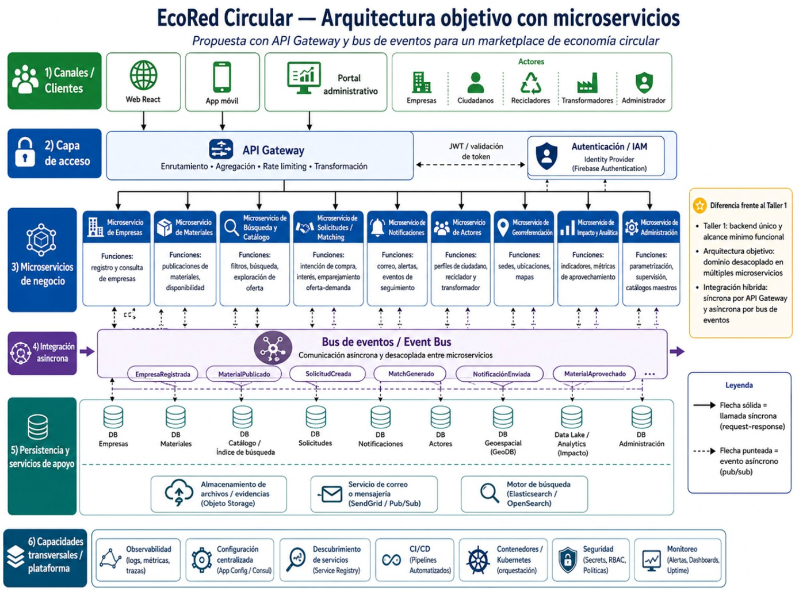

# EcoRed Circular —  Arquitectura Cloud Native en Oracle Cloud Infrastructure

## Introducción

EcoRed Circular es el proyecto conductor de esta ruta de aprendizaje. El punto de partida es una aplicación web funcional basada en React y Django, contenerizada con Docker, publicada en Docker Hub y desplegada en Render. A partir de ese sistema funcional, los talleres construyen progresivamente la infraestructura y la arquitectura necesarias para llevar EcoRed a una solución Cloud Native desplegada en Oracle Cloud Infrastructure.

La ruta está organizada como una cadena de dependencias: **el resultado verificable de cada taller es el insumo del siguiente**. De esta forma, los estudiantes no crean componentes aislados; construyen una única solución que evoluciona desde un contenedor hasta una arquitectura de microservicios operable en OCI.

## Siglas generales de la ruta

- **OCI — Oracle Cloud Infrastructure:** Infraestructura de Nube de Oracle.
- **VCN — Virtual Cloud Network:** Red Virtual en la Nube.
- **NAT — Network Address Translation:** Traducción de Direcciones de Red.
- **NSG — Network Security Group:** Grupo de Seguridad de Red.
- **OKE — Oracle Kubernetes Engine:** Motor Kubernetes de Oracle.
- **OCIR — Oracle Cloud Infrastructure Registry / OCI Container Registry:** Registro de Contenedores de Oracle Cloud Infrastructure.
- **API — Application Programming Interface:** Interfaz de Programación de Aplicaciones.
- **REST — Representational State Transfer:** Transferencia de Estado Representacional.
- **CORS — Cross-Origin Resource Sharing:** Intercambio de Recursos entre Orígenes.
- **IAM — Identity and Access Management:** Gestión de Identidad y Acceso.
- **RBAC — Role-Based Access Control:** Control de Acceso Basado en Roles.
- **APM — Application Performance Monitoring:** Monitoreo del Rendimiento de Aplicaciones.
- **CI/CD — Continuous Integration / Continuous Delivery or Deployment:** Integración Continua / Entrega o Despliegue Continuo.

## Objetivo de la arquitectura

Construir y desplegar en OCI una arquitectura Cloud Native para EcoRed Circular que permita:

- exponer canales web, móviles y administrativos mediante un punto de entrada controlado;
- separar los dominios de negocio en microservicios desplegados y orquestados en Kubernetes;
- combinar comunicación síncrona por servicios HTTP con integración asíncrona por eventos;
- desacoplar la persistencia de los dominios y utilizar servicios administrados para archivos, búsqueda y analítica;
- aplicar seguridad de identidad, red y secretos;
- disponer de logs, métricas, trazas, dashboards y alarmas;
- automatizar construcción, publicación y despliegue mediante pipelines.

## Arquitectura destino de EcoRed



La arquitectura se organiza en seis bloques funcionales que se construyen durante los talleres:

1. **Canales y clientes:** Web React, aplicación móvil y portal administrativo.
2. **Capa de acceso:** API Gateway y autenticación.
3. **Microservicios de negocio:** Empresas, Materiales, Búsqueda/Catálogo, Solicitudes/Matching, Notificaciones, Actores, Georreferenciación, Impacto/Analítica y Administración.
4. **Integración asíncrona:** bus de eventos y eventos de dominio.
5. **Persistencia y servicios de apoyo:** bases de datos por dominio, almacenamiento de objetos, búsqueda y analítica.
6. **Capacidades transversales:** contenedores/Kubernetes, seguridad, observabilidad, monitoreo y automatización de entrega.

## Punto de partida

Antes de iniciar la ruta debe haberse completado el taller base:

[**Contenerización y despliegue web de EcoRed en Render**](https://github.com/adanbeltran/Taller12factors/blob/main/docs/F-Contenizacion-Despliegue-web-en-Render.md)

El punto de partida es:

```text
Código EcoRed
   ↓
Dockerfile
   ↓
Imagen Docker
   ↓
Docker Hub
   ↓
Render
```

## Ruta de los 10 talleres

| # | Taller | Bloque de la arquitectura destino que construye | Entregable encadenado |
|---:|---|---|---|
| 1 | [De Render a Oracle Cloud Infrastructure Container Instances](01-De-Render-a-OCI-Container-Instances.md) | Base OCI, ejecución del contenedor y networking público inicial | EcoRed ejecutándose en OCI desde la misma imagen Docker |
| 2 | [Registro de contenedores y networking privado](02-OCIR-y-Networking-Privado.md) | Registro de imágenes, segmentación de red y conectividad privada | Imagen en registro OCI y VCN preparada para workloads privados |
| 3 | [EcoRed en Oracle Kubernetes Engine](03-EcoRed-en-OKE-Kubernetes.md) | Contenedores/Kubernetes y descubrimiento de servicios | EcoRed desplegado declarativamente en Kubernetes |
| 4 | [Resiliencia, escalabilidad y entrada controlada](04-Resiliencia-Escalabilidad-y-Entrada-OKE.md) | Alta disponibilidad, escalamiento y balanceo | Plataforma Kubernetes resiliente y accesible mediante balanceo |
| 5 | [Descomposición de EcoRed en microservicios](05-Descomposicion-EcoRed-en-Microservicios.md) | Microservicios de negocio | Primeros dominios separados, contenerizados y desplegados |
| 6 | [Puerta de enlace, autenticación y comunicación síncrona](06-API-Gateway-Autenticacion-Comunicacion-Sincrona.md) | Capa de acceso | Acceso único y gobernado a los microservicios |
| 7 | [Arquitectura dirigida por eventos](07-Arquitectura-Event-Driven-OCI-Streaming.md) | Integración asíncrona | Productores, consumidores y eventos de dominio |
| 8 | [Persistencia distribuida y servicios administrados](08-Persistencia-Distribuida-y-Servicios-Administrados.md) | Persistencia y servicios de apoyo | Datos por dominio, objetos, búsqueda y analítica |
| 9 | [Seguridad, observabilidad y monitoreo](09-Seguridad-Observabilidad-y-Monitoreo.md) | Capacidades transversales de operación | Identidades, secretos, logs, métricas, trazas y alarmas |
| 10 | [Automatización e integración de la arquitectura destino](10-CICD-e-Integracion-Arquitectura-Destino.md) | Automatización y arquitectura integrada | Pipeline completo y EcoRed validado de extremo a extremo |

## Encadenamiento de la ruta

```text
Taller base
Docker + Docker Hub + Render
        │
        ▼
1. EcoRed en OCI Container Instances
        │
        ▼
2. Registro OCI + networking privado
        │
        ▼
3. Kubernetes administrado en OCI
        │
        ▼
4. Resiliencia + escalabilidad + balanceo
        │
        ▼
5. Microservicios EcoRed
        │
        ▼
6. API Gateway + autenticación + REST
        │
        ▼
7. Event Bus + eventos de dominio
        │
        ▼
8. Persistencia distribuida + servicios administrados
        │
        ▼
9. Seguridad + observabilidad + monitoreo
        │
        ▼
10. Automatización + integración final
        │
        ▼
ARQUITECTURA DESTINO ECORED EN OCI
```

## Correspondencia entre talleres y arquitectura destino

| Componente de la arquitectura destino | Taller principal |
|---|---:|
| Ejecución inicial en OCI | 1 |
| VCN, subnet pública, Internet Gateway y reglas de acceso | 1 |
| Registro de imágenes OCI | 2 |
| Subnet privada, NAT Gateway, Service Gateway y NSG | 2 |
| Kubernetes administrado | 3 |
| Deployment, Pod, Service, ConfigMap y Secret | 3 |
| Réplicas, health checks, self-healing, autoscaling y Load Balancer | 4 |
| Microservicios de Empresas, Materiales y Actores | 5 |
| Evolución de los demás dominios de EcoRed | 5 |
| API Gateway, autenticación, CORS y rate limiting | 6 |
| Comunicación síncrona entre clientes y servicios | 6 |
| Bus de eventos | 7 |
| Eventos `EmpresaRegistrada`, `MaterialPublicado`, `SolicitudCreada`, `MatchGenerado`, `NotificacionEnviada` y `MaterialAprovechado` | 7 |
| Persistencia por dominio | 8 |
| Object Storage | 8 |
| OpenSearch | 8 |
| Georreferenciación e Impacto/Analítica | 8 |
| IAM, RBAC y gestión de secretos | 9 |
| Logging, Monitoring y APM | 9 |
| Pipelines de construcción y despliegue | 10 |
| Validación integral de la arquitectura | 10 |

## Recomendaciones para todos los talleres

- Utilice EcoRed como proyecto conductor y conserve los nombres de recursos definidos en cada taller.
- Trabaje dentro del compartment `ecored-dev`, salvo que el procedimiento especifique explícitamente otro alcance.
- Mantenga una misma región de OCI a lo largo de la ruta para conservar coherencia entre recursos.
- Use tags explícitos para versionar imágenes de contenedores.
- Mantenga contraseñas, tokens, claves y credenciales fuera de Git.
- Antes de iniciar un taller, verifique el entregable indicado como contrato de entrada.
- Al terminar un taller, conserve los recursos especificados como insumo del siguiente.
- Revise costos, cuotas y límites antes de aprovisionar recursos.
- Use la documentación oficial enlazada en cada taller como referencia operativa.

## Navegación

**Inicio:** [Taller 1 — De Render a Oracle Cloud Infrastructure Container Instances](01-De-Render-a-OCI-Container-Instances.md)
