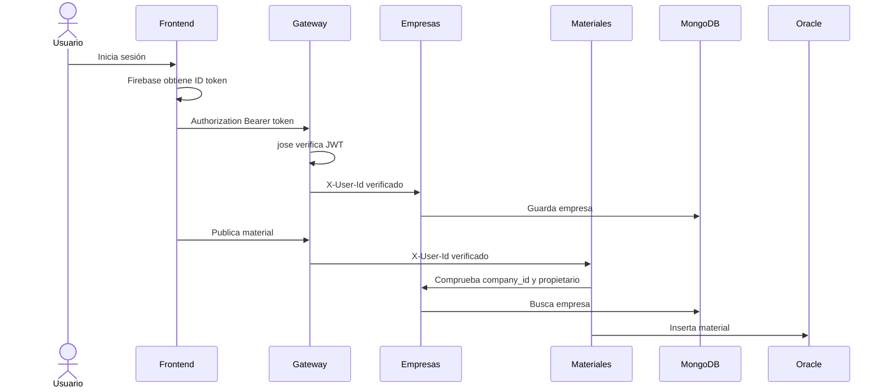

# Guía del código de EcoRed

Esta guía permite estudiar el proyecto sin llenar el código con comentarios
que repitan literalmente su sintaxis. Los archivos fuente conservan nombres
claros, funciones pequeñas y comentarios sobre decisiones no evidentes. Los
documentos siguientes explican cada importación, configuración, función y flujo.

## Orden recomendado

1. [Frontend React y Firebase](docs/01-FRONTEND-LINEA-A-LINEA.md)
2. [Gateway local y validación JWT](docs/02-GATEWAY-LINEA-A-LINEA.md)
3. [Microservicio de Empresas](docs/03-EMPRESAS-LINEA-A-LINEA.md)
4. [Microservicio de Materiales](docs/04-MATERIALES-LINEA-A-LINEA.md)
5. [Docker, Oracle y OCI API Gateway](docs/05-CONTENEDORES-Y-OCI.md)

## Recorrido completo

## Decisiones de diseño

| Decisión | Razón |
|---|---|
| Una base por microservicio | Evita que un servicio modifique datos propiedad de otro |
| Bases reales obligatorias | Toda ejecución funcional demuestra conexión y persistencia |
| Firebase solo en el frontend | El navegador obtiene el ID token mediante el SDK oficial |
| `jose` solo en el gateway local | Centraliza la validación criptográfica durante el desarrollo |
| OCI API Gateway en producción | Sustituye el gateway local mediante una política administrada |
| `X-User-Id` interno | Proporciona a tecnologías distintas un contrato de identidad sencillo |
| Materiales llama a Empresas por HTTP | Evita que Node consulte directamente MongoDB |
| Variables de entorno | Separa configuración y credenciales del código y de las imágenes |
| Fallo temprano de las bases | Evita declarar sano un servicio sin persistencia disponible |
| Repositorios | Aíslan SQL/BSON de controladores y reglas del dominio |

## Qué significa “línea por línea”

Las llaves, cierres de paréntesis y etiquetas JSX no se comentan individualmente
porque eso reduce legibilidad. Cada documento explica las sentencias ejecutables
y las relaciones entre ellas. Dentro del código se comentan especialmente:

- Límites de confianza.
- Validación de entrada.
- Conexión y liberación de recursos.
- Comunicación entre microservicios.
- Variables de compilación y ejecución.
- Manejo de errores.

## Archivos generados

`package-lock.json` se conserva para obtener instalaciones reproducibles. No
se comenta internamente porque JSON no admite comentarios y npm regenera ese
archivo. `node_modules`, `.env`, entornos virtuales y credenciales no forman
parte del ZIP.
