# Taller 6. EcoRed en OKE con OCI API Gateway, resiliencia y telemetría

[← Taller 5: Microservicios y API Gateway local](https://github.com/adanbeltran/ecored-oci-cloud-native/blob/main/taller05/05-Taller-CreacionMicroservicios-ApiGateway.md) | [Taller 2: OCIR y red privada](https://github.com/adanbeltran/ecored-oci-cloud-native/blob/main/02-OCIR-y-Networking-Privado.md)

<a id="indice"></a>

## Índice del taller

- [Propósito y resultado esperado](#proposito)
- [Arquitectura objetivo](#arquitectura)
- [Prerrequisitos reutilizados](#prerrequisitos)
- [Fase 0. Preparar los archivos de configuración](#fase-0)
  - [F0-0.1. Revisar los archivos incluidos](#f0-01)
  - [F0-0.2. Crear los archivos de trabajo](#f0-02)
  - [F0-0.3. Migrar la configuración del Taller 5](#f0-03)
  - [F0-0.4. Validar OKE antes del despliegue](#f0-04)
- [Fase 1. Publicar las imágenes en OCIR](#fase-1)
  - [F1-1.1. Cargar la configuración de OCI](#f1-11)
  - [F1-1.2. Descargar, etiquetar y publicar](#f1-12)
  - [F1-1.3. Verificar las imágenes](#f1-13)
- [Fase 2. Preparar el clúster y la red](#fase-2)
  - [F2-2.1. Retirar el workload anterior](#f2-21)
  - [F2-2.2. Resolver, validar y guardar los recursos de red](#f2-22)
  - [F2-2.3. Autorizar las bases de datos y habilitar los NSG](#f2-23)
    - [F2-2.3.1. Cargar los resultados de red](#f2-231)
    - [F2-2.3.2. Autorizar MongoDB Atlas](#f2-232)
    - [F2-2.3.3. Autorizar Oracle Autonomous Database](#f2-233)
    - [F2-2.3.4. Validar el NSG de los nodos](#f2-234)
    - [F2-2.3.5. Preparar y verificar las políticas IAM](#f2-235)
- [Fase 3. Desplegar EcoRed en OKE](#fase-3)
  - [F3-3.1. Crear ConfigMaps y Secrets desde archivos](#f3-31)
  - [F3-3.2. Renderizar y aplicar el manifiesto](#f3-32)
  - [F3-3.3. Verificar Pods, Services y comunicación interna](#f3-33)
- [Fase 4. Crear OCI API Gateway y activar el frontend](#fase-4)
  - [F4-4.1. Obtener las direcciones y ajustar Django](#f4-41)
  - [F4-4.2. Crear el NSG y OCI API Gateway](#f4-42)
  - [F4-4.3. Crear el deployment del gateway](#f4-43)
  - [F4-4.4. Inyectar la URL del gateway en el frontend](#f4-44)
- [Fase 5. Probar desde el navegador](#fase-5)
  - [F5-5.1. Validar frontend, Firebase y API Gateway](#f5-51)
  - [F5-5.2. Probar Empresas y Materiales](#f5-52)
  - [F5-5.3. Verificar aislamiento y acceso privado](#f5-53)
- [Fase 6. Probar resiliencia, balanceo y telemetría](#fase-6)
  - [F6-6.1. Verificar el balanceador y sus destinos](#f6-61)
  - [F6-6.2. Generar tráfico y comprobar la distribución](#f6-62)
  - [F6-6.3. Probar continuidad y autorrecuperación](#f6-63)
  - [F6-6.4. Consultar logs, eventos y métricas](#f6-64)
- [Relación con los 12 factores](#factores)
- [Evidencias y criterios de aceptación](#evidencias)
- [Limpieza opcional](#limpieza)
- [Referencias oficiales](#referencias)

---

<a id="proposito"></a>

## Propósito y resultado esperado

Desplegar en **Oracle Kubernetes Engine (OKE)** la arquitectura de microservicios construida en el Taller 5 y reemplazar el contenedor `ecored-local-gateway` por **OCI API Gateway**.

Al finalizar estarán funcionando en OCI:

- dos Pods de Companies, conectados con MongoDB Atlas;
- dos Pods de Materials, conectados con Oracle Autonomous Database;
- dos Pods del frontend React servido por Nginx;
- un Load Balancer público para el frontend;
- dos Load Balancers privados para los microservicios;
- OCI API Gateway validando tokens Firebase y generando `X-User-Id`;
- pruebas básicas de autorrecuperación, balanceo, logs y métricas.

Este taller **reutiliza** la VCN, las subredes, el clúster OKE, el namespace `ecored`, el token de OCIR y `ocir-secret` creados en talleres anteriores.

Duración estimada: entre 3 y 4 horas, sin incluir el tiempo de aprovisionamiento de los Load Balancers.

<a id="arquitectura"></a>

## Arquitectura objetivo

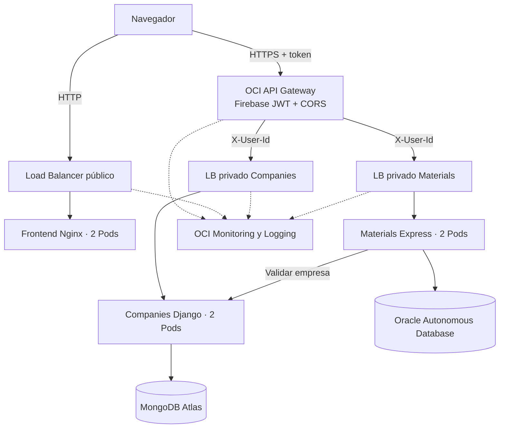
```mermaid
flowchart TB
    U["Navegador"]
    FLB["Load Balancer público"]
    FE["Frontend Nginx · 2 Pods"]
    GW["OCI API Gateway<br/>Firebase JWT + CORS"]
    CLB["LB privado Companies"]
    MLB["LB privado Materials"]
    C["Companies Django · 2 Pods"]
    M["Materials Express · 2 Pods"]
    MDB[("MongoDB Atlas")]
    ODB[("Oracle Autonomous Database")]
    OBS["OCI Monitoring y Logging"]

    U -->|HTTP| FLB --> FE
    U -->|HTTPS + token| GW
    GW -->|X-User-Id| CLB --> C --> MDB
    GW -->|X-User-Id| MLB --> M --> ODB
    M -->|Validar empresa| C
    GW -.-> OBS
    FLB -.-> OBS
    CLB -.-> OBS
    MLB -.-> OBS
```

| Componente | Responsabilidad |
|---|---|
| Navegador | Ejecuta React, autentica con Firebase y consume la URL pública del gateway. |
| Nginx | Sirve el frontend y genera `runtime-config.js` al iniciar el contenedor. |
| OCI API Gateway | Valida el token, sobrescribe `X-User-Id`, aplica CORS y enruta las API. |
| Companies | Administra empresas por usuario y persiste en MongoDB. |
| Materials | Administra materiales en Oracle y valida la empresa mediante Companies. |
| Services y Load Balancers | Mantienen puntos de acceso estables y distribuyen solicitudes entre Pods `Ready`. |

> **12 factores — IV y VI.** MongoDB y Oracle son backing services externos. Los Pods se ejecutan como procesos sin estado y pueden ser reemplazados sin perder datos.

<a id="prerrequisitos"></a>

## Prerrequisitos reutilizados

| Recurso | Valor esperado |
|---|---|
| Compartimento | `ecored-dev` |
| VCN | `ecored-vcn` |
| Subred pública | `ecored-public-subnet` |
| Subred privada | `ecored-workloads-private` |
| NAT Gateway | `ecored-nat` |
| Clúster y node pool | `ecored-oke` y `ecored-pool` |
| NSG de workloads | `ecored-workloads-nsg` |
| Namespace | `ecored` |
| Secret de OCIR | `ocir-secret` |

También se necesita:

- usuario de prueba en Firebase Authentication;
- URI funcional de MongoDB Atlas;
- esquema `ECORED` y descriptor TLS de Oracle Autonomous Database;
- acceso a `adanbeltran/ecored-companies:1.0`, `adanbeltran/ecored-materials:1.0` y `adanbeltran/ecored-frontend:1.0`.

La imagen `ecored-local-gateway` no se despliega: OCI API Gateway asume esa responsabilidad.

[↑ Volver al índice](#indice)

---

<a id="fase-0"></a>

# Fase 0. Preparar los archivos de configuración

<a id="f0-01"></a>

## F0-0.1. Revisar los archivos incluidos

Trabaje desde la carpeta `taller-06`. El paquete incluye:

| Ruta | Función |
|---|---|
| `config/*.env.example` | Plantillas derivadas de los `.docker.env` del Taller 5. |
| `k8s/ecored-oke.template.yaml` | Deployments, Services, probes, recursos y PDB. |
| `oci/ecored-api-deployment.template.json` | Autenticación Firebase, CORS, transformación de encabezados y rutas. |
| `oci/api-gateway-nsg-rules.template.json` | Reglas reproducibles del NSG de OCI API Gateway. |
| `oci/oke-nsg-policy.template.txt` | Políticas IAM requeridas para los NSG administrados por OKE. |
| `recursos/` | Capturas e infografía interactiva. |
| `.gitignore` | Evita publicar configuración privada y archivos renderizados. |

No copie al repositorio los `.env` reales del Taller 5. Las plantillas incluidas no contienen credenciales.

<a id="f0-02"></a>

## F0-0.2. Crear los archivos de trabajo

Ejecute una sola vez:

```bash
cp config/oci.oke.env.example config/oci.oke.env
cp config/companies-config.oke.env.example config/companies-config.oke.env
cp config/companies-secrets.oke.env.example config/companies-secrets.oke.env
cp config/materials-config.oke.env.example config/materials-config.oke.env
cp config/materials-secrets.oke.env.example config/materials-secrets.oke.env
cp config/frontend-config.oke.env.example config/frontend-config.oke.env
```


Los archivos sin `.example` están excluidos por `.gitignore`.

Durante el taller se generarán cuatro archivos de estado. Cada uno tiene un único propósito:

| Archivo | Quién lo genera | Dónde se utiliza después |
|---|---|---|
| `config/oci.oke.env` | estudiante, en F0-0.2 | nombres y datos base usados en F1, F2 y F4; |
| `config/ocir-resolved.oke.env` | comando de F1-1.1 | etiquetado de imágenes y renderizado del manifiesto en F3-3.2; |
| `config/network-resolved.oke.env` | comando de F2-2.2 | bases de datos y NSG en F2-2.3, manifiesto en F3-3.2 y API Gateway en F4-4.2; |
| `config/runtime-resolved.oke.env` | comandos de F4-4.1 a F4-4.3 | frontend, pruebas, telemetría y limpieza. |

### como funciona

`source archivo.env` carga las variables en la terminal actual. Los comandos de este taller reciben esos valores mediante expresiones como `"$COMPARTMENT_OCID"`.OKE las inyecta las variables  desde ConfigMaps y Secrets.

Los archivos `.env` son la fuente de configuración y los valores calculados se guardan inmediatamente. Si se abre otra terminal, se vuelve a ejecutar `source` sobre el archivo correspondiente.


<a id="f0-03"></a>

## F0-0.3. Migrar la configuración del Taller 5


| Archivo del Taller 5 | Archivo del Taller 6 | Ajuste requerido |
|---|---|---|
| `companies.docker.env` | `companies-config.oke.env` | Conservar puerto, base, debug y hosts no sensibles. |
| `companies.docker.env` | `companies-secrets.oke.env` | Copiar `MONGODB_URI`; conservar la nueva `DJANGO_SECRET_KEY`. |
| `materials.docker.env` | `materials-config.oke.env` | Cambiar Companies a `http://ecored-companies:8001/api`. |
| `materials.docker.env` | `materials-secrets.oke.env` | Copiar usuario, contraseña y descriptor TLS de Oracle. |
| `frontend.docker.env` | `frontend-config.oke.env` | Copiar Firebase; dejar temporalmente `VITE_API_URL=https://pending.invalid/api`. |
| `apigateway.docker.env` | Deployment de OCI API Gateway | Reutilizar únicamente el Project ID. El contenedor local no se despliega. |

Complete también `config/oci.oke.env` con el namespace de tenancy y el OCID del compartimento.
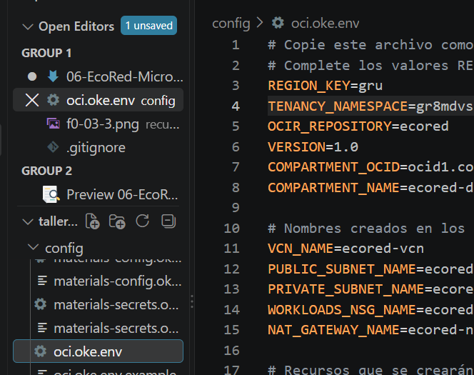

Compruebe el namespace de la tenancy:

```bash
oci os ns get
```

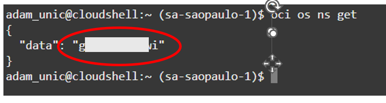

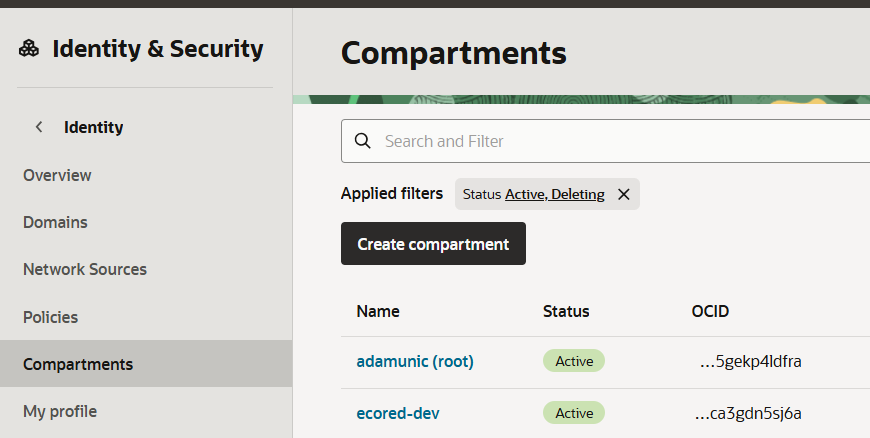

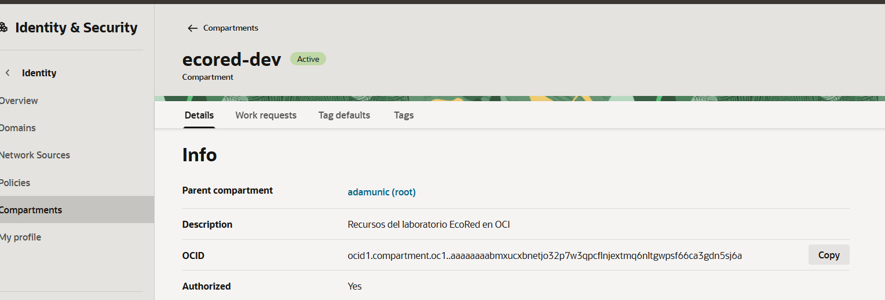


Abra en VS Code las plantillas .env y complete los valores con los utilizados en el Taller 5. 


Cargue los archivos .oke.env en Cloud Shell - ubíquelos en la carpeta taller-06/config.


Verifique en oracle shell con 
```bash
ls *.env
```
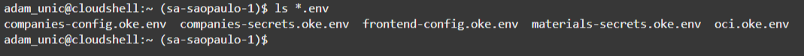


Reglas de los archivos:

- use una sola variable `CLAVE=valor` por línea;
- no use `export` ni espacios alrededor de `=`;
- no encierre los valores entre comillas;
- mantenga `ORACLE_CONNECT_STRING` en una sola línea;
- no tome capturas ni publique archivos con credenciales.


> **12 factores — III. Configuración.** Las variables cambian entre Docker y OKE, pero permanecen fuera de la imagen. Los datos públicos se convertirán en ConfigMaps y las credenciales en Secrets.

<a id="f0-04"></a>

## F0-0.4. Validar OKE antes del despliegue

```bash
kubectl get nodes
```

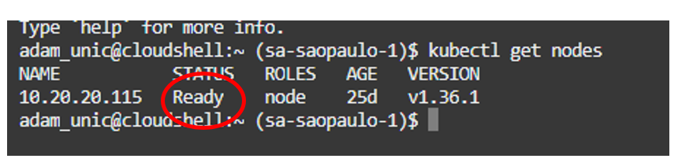

```bash
kubectl get namespace ecored
```

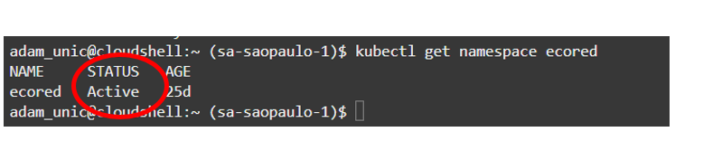

```bash
kubectl get secret ocir-secret -n ecored
```

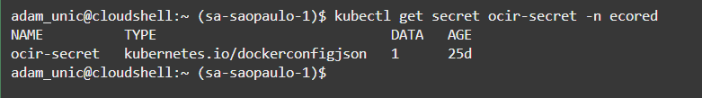

No cree otra VCN, otro clúster ni otro namespace si una validación falla. Corrija primero el recurso construido en los talleres anteriores.

[↑ Volver al índice](#indice)

---

<a id="fase-1"></a>

# Fase 1. Publicar las imágenes en OCIR

<a id="f1-11"></a>

## F1-1.1. Cargar la configuración de OCI


Cargue el archivo preparado:

```bash
source oci.oke.env

OCIR_HOST="${REGION_KEY}.ocir.io"
OCIR_PREFIX="${OCIR_HOST}/${TENANCY_NAMESPACE}/${OCIR_REPOSITORY}"

printf '%s\n' \
  "OCIR_HOST=${OCIR_HOST}" \
  "OCIR_PREFIX=${OCIR_PREFIX}" \
  > ocir-resolved.oke.env

printf 'Destino OCIR: %s\nVersión: %s\n' "$OCIR_PREFIX" "$VERSION"
```
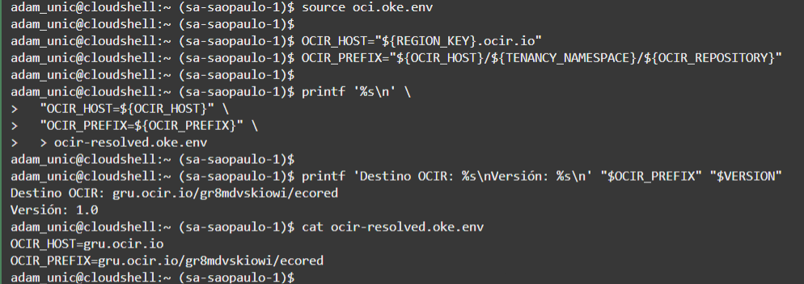


Si la autenticación de Docker expiró, repita el inicio de sesión explicado en el Taller 2 utilizando su Auth Token de OCIR. No guarde ese token en el taller.
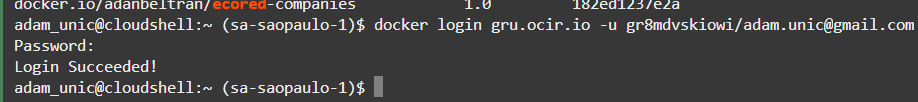


<a id="f1-12"></a>

## F1-1.2. Descargar, etiquetar y publicar

Cargue los valores del archivo antes de ejecutar este paso. Así funciona incluso si abrió una terminal nueva:

```bash
source oci.oke.env
source ocir-resolved.oke.env
```

```bash
docker pull --platform linux/amd64 adanbeltran/ecored-companies:1.0
docker pull --platform linux/amd64 adanbeltran/ecored-materials:1.0
docker pull --platform linux/amd64 adanbeltran/ecored-frontend:1.0
```

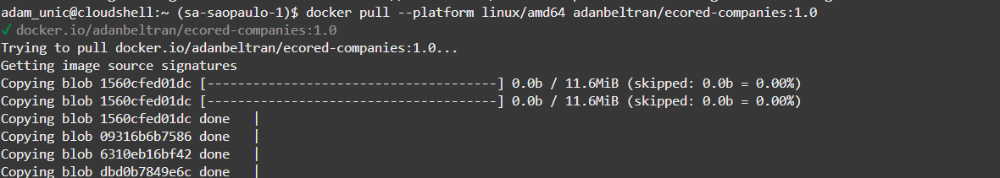

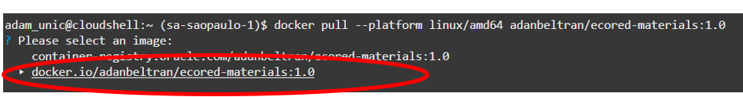

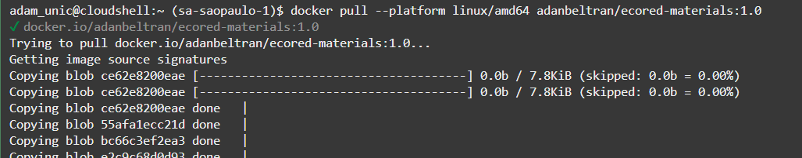

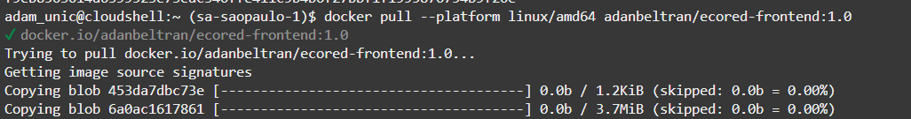

```bash
docker tag adanbeltran/ecored-companies:1.0 \
  "${OCIR_PREFIX}/ecored-companies:${VERSION}"
docker tag adanbeltran/ecored-materials:1.0 \
  "${OCIR_PREFIX}/ecored-materials:${VERSION}"
docker tag adanbeltran/ecored-frontend:1.0 \
  "${OCIR_PREFIX}/ecored-frontend:${VERSION}"

docker push "${OCIR_PREFIX}/ecored-companies:${VERSION}"
docker push "${OCIR_PREFIX}/ecored-materials:${VERSION}"
docker push "${OCIR_PREFIX}/ecored-frontend:${VERSION}"
```

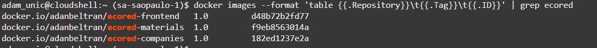

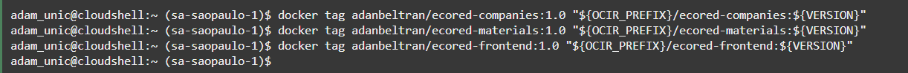

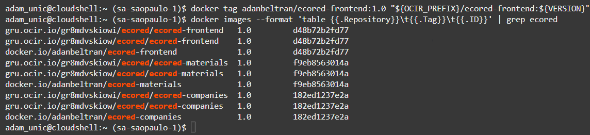


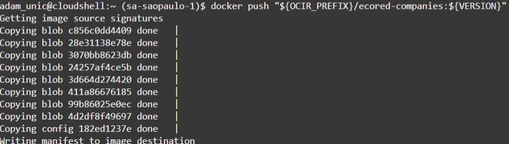

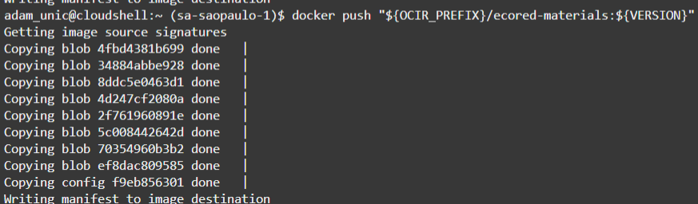

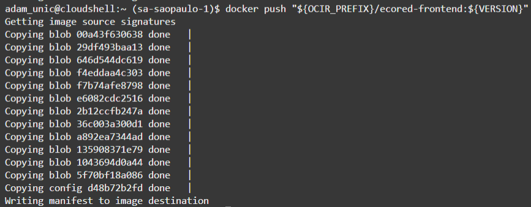

> **12 factores — II, V y X.** Cada imagen contiene sus dependencias; la construcción ya publicada se promueve a OCIR y se ejecutará sin recompilarla para OKE.

<a id="f1-13"></a>

## F1-1.3. Verificar las imágenes

```bash
docker images --format 'table {{.Repository}}\t{{.Tag}}\t{{.ID}}' | grep ecored
```

En **Developer Services → Container Registry** confirme:

```text
ecored/ecored-companies:1.0
ecored/ecored-materials:1.0
ecored/ecored-frontend:1.0
```

Mueva los repositorios que hayan quedado en el compartimento raíz hacia `ecored-dev`.

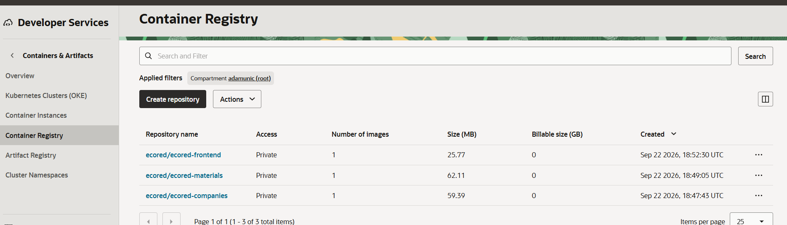

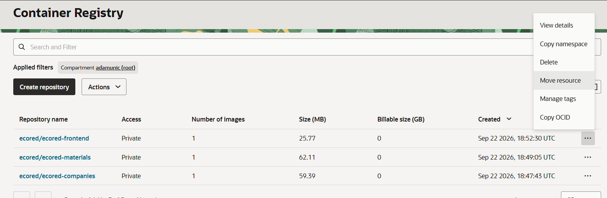

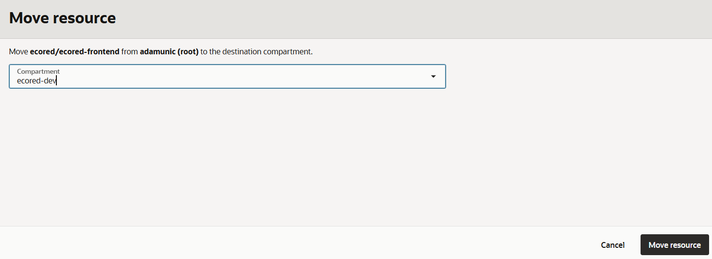

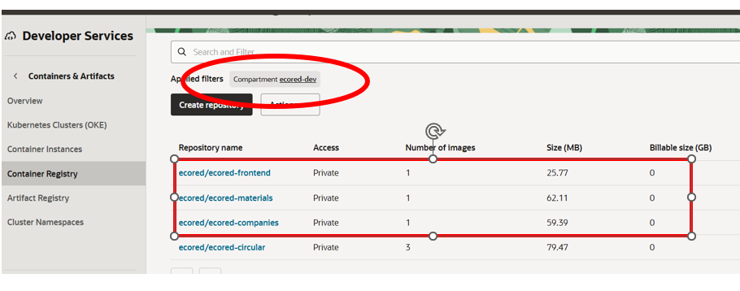

[↑ Volver al índice](#indice)

---

<a id="fase-2"></a>

# Fase 2. Preparar el clúster y la red

<a id="f2-21"></a>

## F2-2.1. Retirar el workload anterior

```bash
kubectl get deployments,services,hpa,pdb,pods -n ecored
```

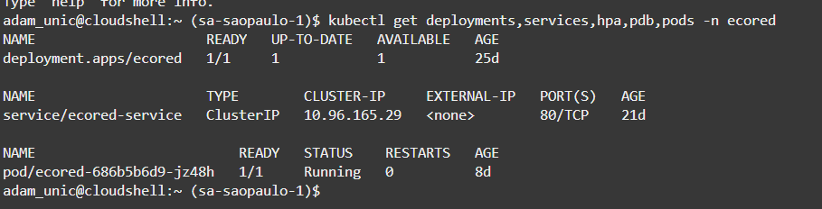

Elimine únicamente el despliegue monolítico. Si los nombres son diferentes, use los mostrados por el comando anterior.

```bash
kubectl delete deployment ecored -n ecored --ignore-not-found
kubectl delete service ecored-service -n ecored --ignore-not-found
kubectl delete hpa ecored -n ecored --ignore-not-found
kubectl delete pdb ecored-pdb -n ecored --ignore-not-found
```

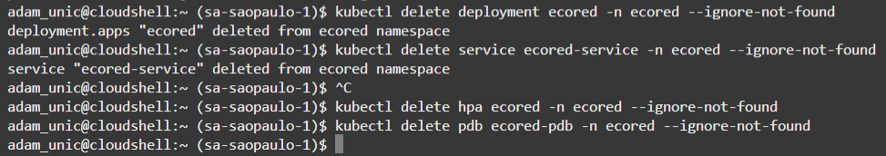

```bash
kubectl get deployments,services,hpa,pdb,pods -n ecored
```

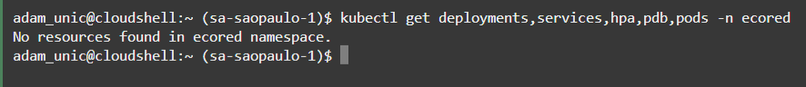

No elimine el clúster, el node pool, el namespace, `ocir-secret`, la VCN ni sus subredes.

> **12 factores — IX. Desechabilidad.** Se reemplazan controladores y Pods sin depender de discos locales. El estado deseado se administra mediante Deployments.

<a id="f2-22"></a>

## F2-2.2. Resolver, validar y guardar los recursos de red

[▶ Abrir infografía interactiva sobre NSG](./recursos/infografia-oke-nsg-interactiva.html)


Este paso convierte los nombres conocidos de los recursos del Taller 2 en OCID, CIDR e IP que los comandos posteriores necesitan. Los nombres se leen desde `config/oci.oke.env`; no se vuelven a escribir de forma interactiva.

```bash
source oci.oke.env

VCN_OCID=$(oci network vcn list \
  --compartment-id "$COMPARTMENT_OCID" \
  --display-name "$VCN_NAME" \
  --query 'data[0].id' --raw-output)

PUBLIC_SUBNET_OCID=$(oci network subnet list \
  --compartment-id "$COMPARTMENT_OCID" \
  --vcn-id "$VCN_OCID" \
  --display-name "$PUBLIC_SUBNET_NAME" \
  --query 'data[0].id' --raw-output)

PRIVATE_SUBNET_OCID=$(oci network subnet list \
  --compartment-id "$COMPARTMENT_OCID" \
  --vcn-id "$VCN_OCID" \
  --display-name "$PRIVATE_SUBNET_NAME" \
  --query 'data[0].id' --raw-output)

WORKLOADS_NSG_OCID=$(oci network nsg list \
  --compartment-id "$COMPARTMENT_OCID" \
  --vcn-id "$VCN_OCID" \
  --display-name "$WORKLOADS_NSG_NAME" \
  --query 'data[0].id' --raw-output)

PUBLIC_SUBNET_CIDR=$(oci network subnet get \
  --subnet-id "$PUBLIC_SUBNET_OCID" \
  --query 'data."cidr-block"' --raw-output)

PRIVATE_SUBNET_CIDR=$(oci network subnet get \
  --subnet-id "$PRIVATE_SUBNET_OCID" \
  --query 'data."cidr-block"' --raw-output)

NAT_IP=$(oci network nat-gateway list \
  --compartment-id "$COMPARTMENT_OCID" \
  --vcn-id "$VCN_OCID" \
  --display-name "$NAT_GATEWAY_NAME" \
  --query 'data[0]."nat-ip"' --raw-output)
```

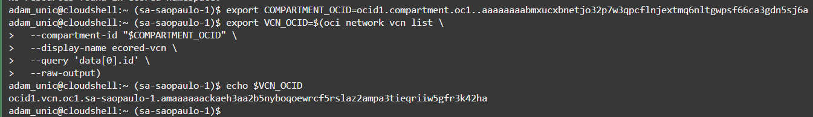

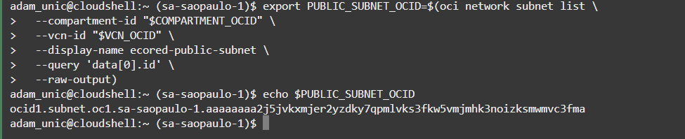

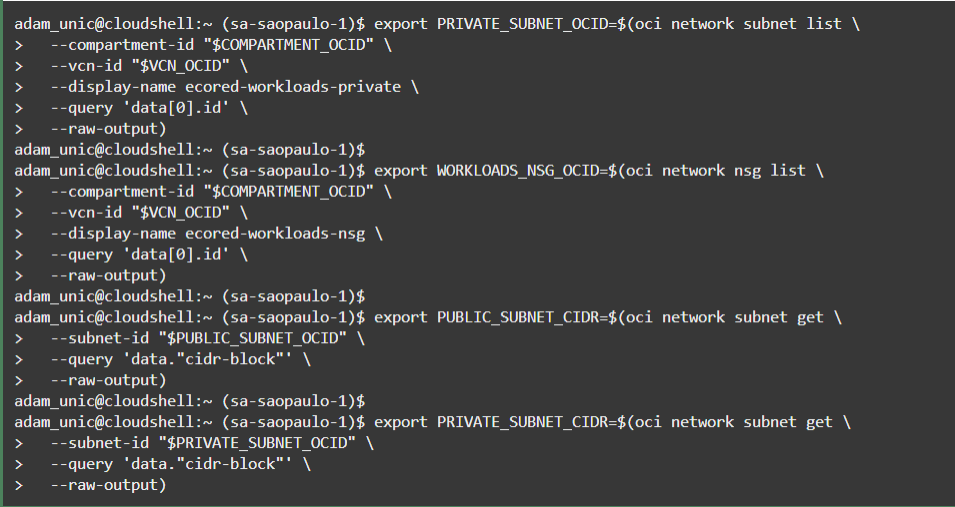

Valide todos los resultados antes de guardarlos:

```bash
NETWORK_ERRORS=0

for VARIABLE in \
  VCN_OCID \
  PUBLIC_SUBNET_OCID \
  PRIVATE_SUBNET_OCID \
  WORKLOADS_NSG_OCID \
  PUBLIC_SUBNET_CIDR \
  PRIVATE_SUBNET_CIDR \
  NAT_IP; do

  VALUE="${!VARIABLE}"

  if [ -z "$VALUE" ] || [ "$VALUE" = "null" ]; then
    printf 'ERROR: %s no fue resuelta.\n' "$VARIABLE"
    NETWORK_ERRORS=$((NETWORK_ERRORS + 1))
  else
    printf 'OK: %-25s %s\n' "$VARIABLE" "$VALUE"
  fi
done

if [ "$NETWORK_ERRORS" -eq 0 ]; then
  echo 'Todos los recursos de red fueron resueltos.'
else
  echo 'Deténgase y corrija los nombres de config/oci.oke.env.'
  false
fi
```

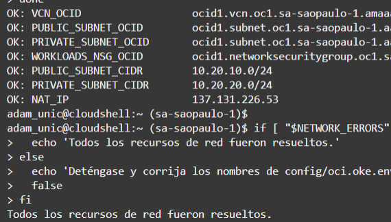

Ningún resultado puede estar vacío ni ser `null`. Solamente cuando el resultado indique cero errores, guarde los valores:

```bash
printf '%s\n' \
  "VCN_OCID=${VCN_OCID}" \
  "PUBLIC_SUBNET_OCID=${PUBLIC_SUBNET_OCID}" \
  "PRIVATE_SUBNET_OCID=${PRIVATE_SUBNET_OCID}" \
  "WORKLOADS_NSG_OCID=${WORKLOADS_NSG_OCID}" \
  "PUBLIC_SUBNET_CIDR=${PUBLIC_SUBNET_CIDR}" \
  "PRIVATE_SUBNET_CIDR=${PRIVATE_SUBNET_CIDR}" \
  "NAT_IP=${NAT_IP}" \
  > network-resolved.oke.env

chmod 600 network-resolved.oke.env
cat network-resolved.oke.env
```
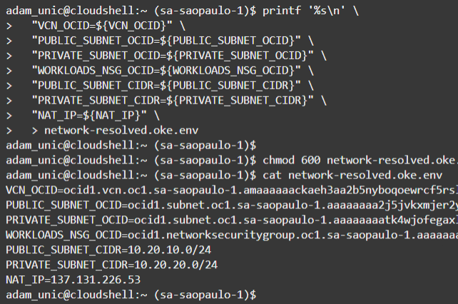

### Descripción de los recursos de red

- **`VCN_OCID`**: identifica la VCN donde se encuentran OKE, las subredes, los balanceadores y API Gateway. Se utiliza para localizar o crear recursos de red.

- **`PUBLIC_SUBNET_OCID`**: identifica la subred pública. Se utiliza para desplegar el Load Balancer del frontend y OCI API Gateway.

- **`PRIVATE_SUBNET_OCID`**: identifica la subred privada. Se utiliza para desplegar los Load Balancers internos de Companies y Materials.

- **`WORKLOADS_NSG_OCID`**: identifica el NSG asociado con los nodos de OKE. Permite que los balanceadores se comuniquen de forma controlada con los Pods.

- **`PUBLIC_SUBNET_CIDR`**: contiene el rango de direcciones de la subred pública. Se utiliza para permitir que API Gateway acceda a los Load Balancers privados.

- **`PRIVATE_SUBNET_CIDR`**: contiene el rango de direcciones de la subred privada. Se utiliza en las reglas del NSG de API Gateway para permitir conexiones hacia Companies por el puerto `8001` y Materials por el puerto `8002`.

- **`NAT_IP`**: contiene la dirección IP pública del NAT Gateway. Se autoriza en MongoDB Atlas y Oracle Autonomous Database para permitir las conexiones salientes de los microservicios.

### Dónde se utilizará cada valor


| Valor guardado | Uso posterior exacto |
|---|---|
| `VCN_OCID` | localizar o crear el NSG de API Gateway en F4-4.2; |
| `PUBLIC_SUBNET_OCID` | ubicar el Load Balancer público del frontend en F3-3.2 y OCI API Gateway en F4-4.2; |
| `PRIVATE_SUBNET_OCID` | ubicar los Load Balancers privados de Companies y Materials en F3-3.2; |
| `WORKLOADS_NSG_OCID` | validar las VNIC de los nodos en F2-2.3 y permitir que OKE administre las reglas hacia los backends en F3-3.2; |
| `PUBLIC_SUBNET_CIDR` | limitar con `loadBalancerSourceRanges` el origen admitido por los Load Balancers privados en F3-3.2; |
| `PRIVATE_SUBNET_CIDR` | construir las reglas de salida de API Gateway hacia los puertos `8001` y `8002` en F4-4.2; |
| `NAT_IP` | autorizar en MongoDB Atlas y Oracle Autonomous Database la salida pública de los Pods en F2-2.3. |

Este paso solamente consulta OCI y genera `config/network-resolved.oke.env`. No crea reglas ni modifica recursos.

<a id="f2-23"></a>

## F2-2.3. Autorizar las bases de datos y habilitar los NSG

Ejecute los cinco subpasos en orden. Esta tarea prepara tres controles diferentes; ninguno sustituye a los otros:

| Control | Protege | Acción de esta tarea |
|---|---|---|
| ACL de MongoDB y Oracle | acceso a las bases de datos externas | autorizar la IP pública del NAT Gateway; |
| `ecored-workloads-nsg` | VNIC de los nodos trabajadores | comprobar que los nodos pertenecen al NSG; |
| política IAM | acciones de `oci-cloud-controller-manager` | permitir que OKE cree el NSG frontal y administre sus reglas. |

<a id="f2-231"></a>

### F2-2.3.1. Cargar los resultados de red

```bash
source oci.oke.env
source network-resolved.oke.env

printf 'NAT público para las bases de datos: %s\n' "$NAT_IP"
printf 'NSG de los nodos: %s\n' "$WORKLOADS_NSG_NAME"
```
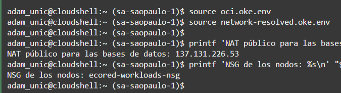
En esta arquitectura, la salida es:

```text
Pod → nodo en subred privada → NAT Gateway → MongoDB Atlas u Oracle público
```

Por esa razón las bases de datos observan `NAT_IP`, no la IP del portátil, del Pod ni del Load Balancer. Esta indicación supone que MongoDB y Oracle conservan endpoints públicos protegidos con ACL; una base de datos con endpoint privado requiere una ruta diferente.

<a id="f2-232"></a>

### F2-2.3.2. Autorizar MongoDB Atlas

1. Ejecute el siguiente comando y copie el valor mostrado:

```bash
   printf '%s/32\n' "$NAT_IP"
```
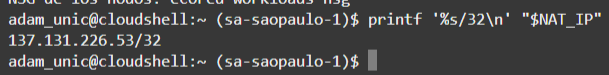  

2. Entre en **MongoDB Atlas → Security → Network Access**.
3. Seleccione **Add IP Address**.
4. Pegue el valor `${NAT_IP}/32` mostrado por el comando.
5. Escriba como comentario `OKE ecored-nat`.
6. Guarde y espere a que la regla aparezca en estado activo.
7. No elimine todavía las reglas anteriores; primero complete la prueba interna de F3-3.3.

No deje `0.0.0.0/0` como autorización permanente.

<a id="f2-233"></a>

### F2-2.3.3. Autorizar Oracle Autonomous Database

1. Ejecute y copie la IP sin `/32`:

   ```bash
   printf '%s\n' "$NAT_IP"
   ```

2. En OCI abra **Oracle Database → Autonomous Database** y seleccione la base utilizada por Materials.
3. En **Network**, junto a **Access control list**, seleccione **Edit**.
4. Confirme **Secure access from allowed IPs and VCNs only**.
5. Seleccione **Add access control rule**.
6. En **IP notation type** elija **IP address**.
7. Pegue `NAT_IP` en **Values**.
8. Seleccione **Update** y espere a que la base vuelva al estado `Available`.
9. Conserve temporalmente la IP del portátil si todavía necesita conectarse desde él; retire cualquier regla `0.0.0.0/0` después de validar F3-3.3.

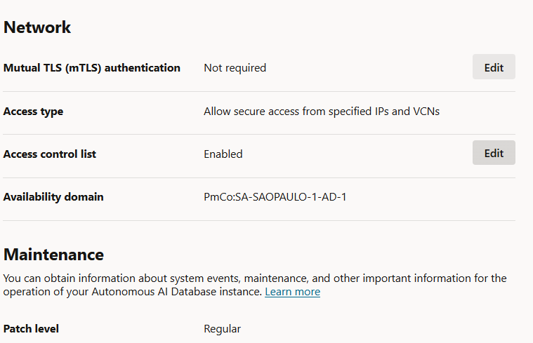

No cambie `ORACLE_CONNECT_STRING`: el descriptor TLS continúa siendo el mismo.

<a id="f2-234"></a>

### F2-2.3.4. Validar el NSG de los nodos

Cuente los nodos y las VNIC asociadas al NSG existente:
```bash
NODE_COUNT=$(kubectl get nodes --no-headers | wc -l | tr -d ' ')

NSG_VNIC_COUNT=$(oci network nsg vnics list \
  --nsg-id "$WORKLOADS_NSG_OCID" \
  --all \
  --query 'length(data)' \
  --raw-output)

printf 'Nodos Ready: %s\nVNIC asociadas al NSG: %s\n' \
  "$NODE_COUNT" "$NSG_VNIC_COUNT"

oci network nsg vnics list \
  --nsg-id "$WORKLOADS_NSG_OCID" \
  --all \
  --output table
```

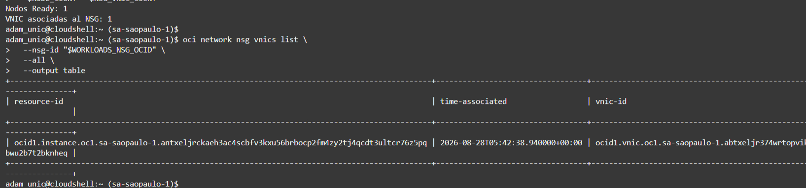


Liste las asociaciones para la evidencia:

```bash
oci network nsg vnics list \
  --nsg-id "$WORKLOADS_NSG_OCID" \
  --all \
  --output table
```

El resultado no puede ser cero. Las VNIC principales de los nodos trabajadores deben pertenecer a `ecored-workloads-nsg`, creado en el taller de red.

Si el resultado es cero, deténgase y corrija la asociación:

1. abra **Compute → Instances**;
2. seleccione cada nodo trabajador del node pool;
3. abra **Attached VNICs** y seleccione la VNIC principal;
4. junto a **Network security groups**, seleccione **Edit**;
5. agregue `ecored-workloads-nsg` y guarde;
6. repita el comando de validación.

No agregue manualmente reglas de NodePort. En F3-3.2, `oci-cloud-controller-manager` las administrará a partir de las anotaciones del Service.

<a id="f2-235"></a>

### F2-2.3.5. Preparar y verificar las políticas IAM

Genere el archivo de política utilizando el nombre de compartimento definido en `oci.oke.env`:

```bash
sed \
  "s|__COMPARTMENT_NAME__|${COMPARTMENT_NAME}|g" \
  oke-nsg-policy.template.txt \
  > oke-nsg-policy.txt

sed -n '1,2p' oke-nsg-policy.txt
```

Un administrador de la tenancy debe realizar esta comprobación:

1. abra **Identity & Security → Policies**;
2. seleccione la tenancy o el compartimento padre donde están las políticas de OKE;
3. busque una política que ya contenga las dos sentencias generadas;
4. si existen, no las duplique;
5. si no existen, cree una política llamada `ecored-oke-nsg-policy` y copie las dos líneas de `oci/oke-nsg-policy.txt`;
6. espere la propagación de IAM antes de desplegar los Services.
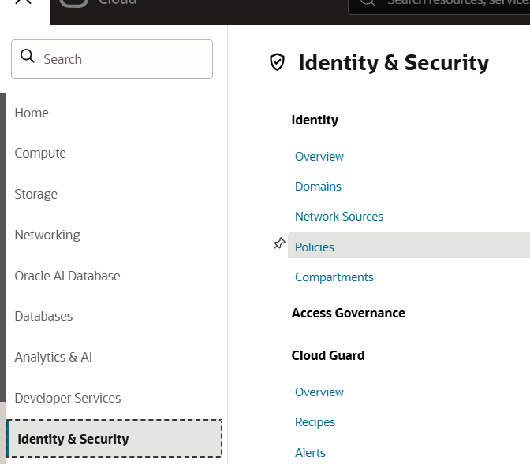
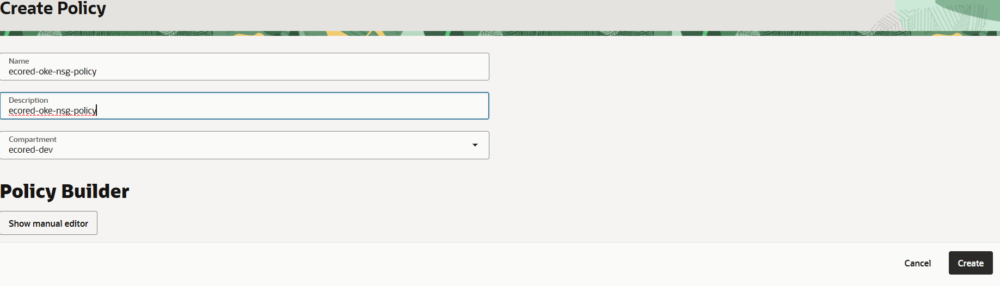
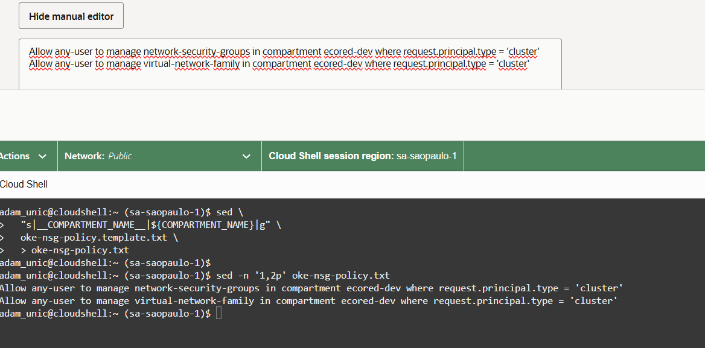
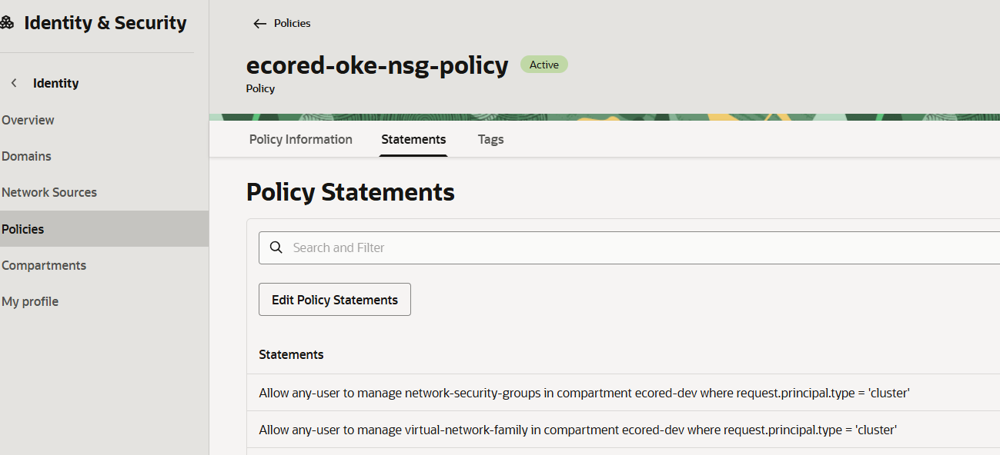

Estas sentencias autorizan al principal de recurso de tipo `cluster`, no a los Pods:

- administrar los NSG del compartimento;
- crear el NSG frontal que requiere cada Service `LoadBalancer`.

La plantilla de Kubernetes usará posteriormente:

- `oci.oraclecloud.com/security-rule-management-mode: "NSG"` para solicitar un NSG frontal administrado;
- `oci.oraclecloud.com/oci-backend-network-security-group` para indicar el NSG existente de los nodos;
- `loadBalancerSourceRanges` para limitar los balanceadores privados al CIDR de la subred de API Gateway.

Lista de control antes de continuar:

- [ ] `NAT_IP/32` está autorizado en MongoDB Atlas.
- [ ] `NAT_IP` está autorizado en Oracle Autonomous Database.
- [ ] `NSG_VNIC_COUNT` es mayor que cero.
- [ ] un administrador confirmó las dos políticas IAM.
- [ ] no se creó una segunda VCN, subred, NAT Gateway ni NSG de workloads.

> **12 factores — IV. Backing services.** El cambio de Docker a OKE modifica configuración y reglas de acceso, no el código de los repositorios de MongoDB y Oracle.

[↑ Volver al índice](#indice)
<a id="fase-3"></a>

# Fase 3. Desplegar EcoRed en OKE

<a id="f3-31"></a>

## F3-3.1. Crear ConfigMaps y Secrets desde archivos

Los comandos leen directamente los archivos preparados oke.env; :

```bash
kubectl create configmap companies-config \
  --namespace ecored \
  --from-env-file=companies-config.oke.env \
  --dry-run=client -o yaml | kubectl apply -f -

kubectl create secret generic companies-secrets \
  --namespace ecored \
  --from-env-file=companies-secrets.oke.env \
  --dry-run=client -o yaml | kubectl apply -f -

kubectl create configmap materials-config \
  --namespace ecored \
  --from-env-file=materials-config.oke.env \
  --dry-run=client -o yaml | kubectl apply -f -

kubectl create secret generic materials-secrets \
  --namespace ecored \
  --from-env-file=materials-secrets.oke.env \
  --dry-run=client -o yaml | kubectl apply -f -

kubectl create configmap frontend-config \
  --namespace ecored \
  --from-env-file=frontend-config.oke.env \
  --dry-run=client -o yaml | kubectl apply -f -
```
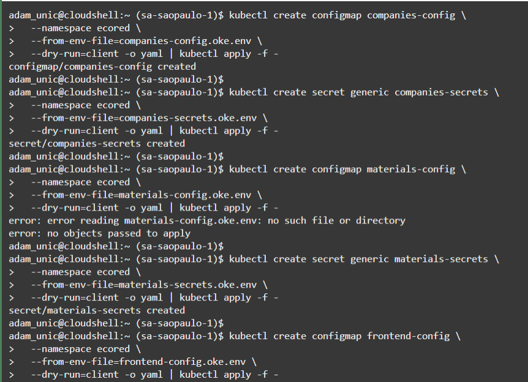
Verifique solamente nombres y tipos:

```bash
kubectl get configmap,secret -n ecored
```
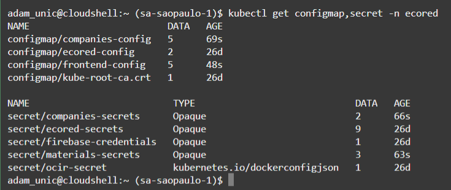

No use `kubectl get secret ... -o yaml` como evidencia.

> **12 factores — III. Configuración.** ConfigMaps y Secrets mantienen la configuración fuera de las imágenes y permiten promoverlas sin reconstrucción.

<a id="f3-32"></a>

## F3-3.2. Renderizar y aplicar el manifiesto

Recargue los archivos para que el paso sea reproducible aunque haya cambiado de terminal:

```bash
source oci.oke.env
source ocir-resolved.oke.env
source network-resolved.oke.env
```

Renderice la plantilla incluida:

```bash
sed \
  -e "s|__OCIR_PREFIX__|${OCIR_PREFIX}|g" \
  -e "s|__VERSION__|${VERSION}|g" \
  -e "s|__PUBLIC_SUBNET_OCID__|${PUBLIC_SUBNET_OCID}|g" \
  -e "s|__PRIVATE_SUBNET_OCID__|${PRIVATE_SUBNET_OCID}|g" \
  -e "s|__PUBLIC_SUBNET_CIDR__|${PUBLIC_SUBNET_CIDR}|g" \
  -e "s|__WORKLOADS_NSG_OCID__|${WORKLOADS_NSG_OCID}|g" \
  ecored-oke.template.yaml > ecored-oke.yaml
  cat ecored-oke.yaml
```

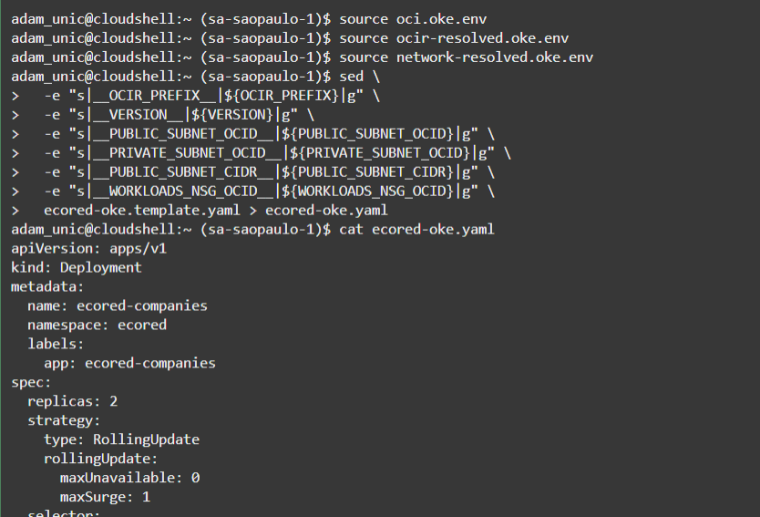

Valide que no queden marcadores y aplique:

```bash
if grep -n '__[A-Z_]*__' ecored-oke.yaml; then
  echo 'ERROR: existen marcadores sin reemplazar.'
else
  kubectl apply --dry-run=client -f ecored-oke.yaml
  kubectl apply -f ecored-oke.yaml
fi
```
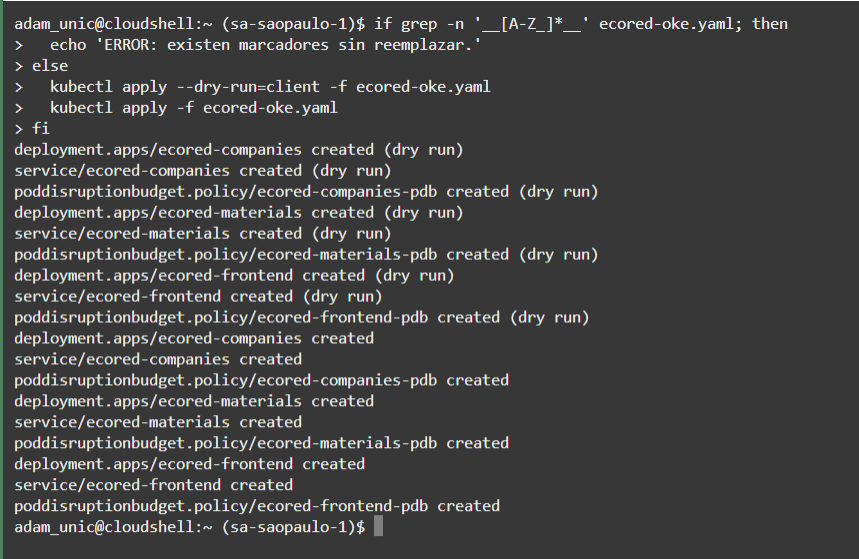

```bash
kubectl rollout status deployment/ecored-companies -n ecored
kubectl rollout status deployment/ecored-materials -n ecored
kubectl rollout status deployment/ecored-frontend -n ecored
```
Si sale error verificar:
```bash
kubectl get pods -n ecored -o wide

kubectl logs -n ecored \
  -l app=ecored-materials \
  --previous \
  --tail=100 \
  --prefix=true

kubectl logs -n ecored \
  -l app=ecored-companies \
  --previous \
  --tail=100 \
  --prefix=true

kubectl rollout restart deployment/ecored-materials -n ecored

kubectl rollout status deployment/ecored-materials \
  -n ecored --timeout=5m

kubectl describe deployment/ecored-companies -n ecored

kubectl get events -n ecored \
  --sort-by=.lastTimestamp | tail -n 30


```


La plantilla ya incluye dos réplicas, probes, recursos, actualización gradual, PDB y Services `LoadBalancer`.

> **12 factores — V, VII y VIII.** OKE combina imágenes publicadas con configuración externa; cada contenedor vincula un puerto explícito y escala mediante réplicas independientes.

<a id="f3-33"></a>

## F3-3.3. Verificar Pods, Services y comunicación interna

```bash
kubectl get deployments,pods,services,pdb -n ecored -o wide
```
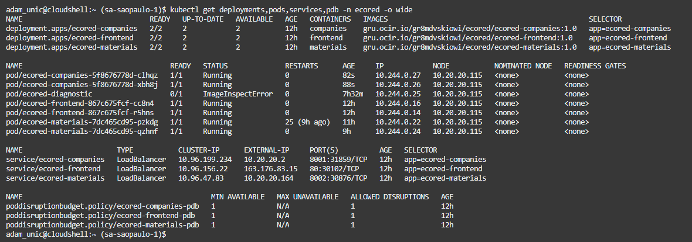

Resultado esperado:

- tres Deployments con `2/2` réplicas;
- Companies y Materials con direcciones privadas en `EXTERNAL-IP`;
- frontend con una dirección pública;
- tres PDB con `minAvailable: 1`.

### Comprobar la comunicación interna entre los Services

Utilice un Pod del frontend para comprobar el DNS y la comunicación interna de Kubernetes.

**Compruebe Companies:**

```bash
kubectl exec -n ecored deployment/ecored-frontend -- \
  sh -c 'wget -S -O- http://ecored-companies:8001/api/health 2>&1'
```
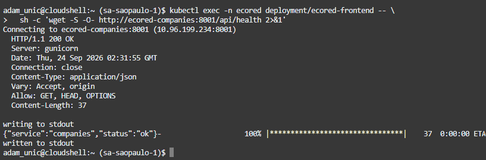

**Compruebe Materials:**

```bash
kubectl exec -n ecored deployment/ecored-frontend -- \
  sh -c 'wget -S -O- http://ecored-materials:8002/api/health 2>&1'
```
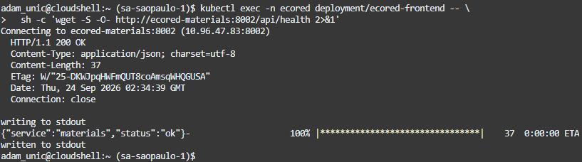

En ambos casos debe aparecer:

```text
HTTP/1.1 200 OK
```

Esta prueba verifica el siguiente recorrido:

```text
Pod frontend → DNS de Kubernetes → Service → Pod del microservicio
```

> Esta comprobación valida la comunicación interna del clúster. No prueba todavía API Gateway ni los Load Balancers de OCI.


[↑ Volver al índice](#indice)

---
<a id="fase-4"></a>

# Fase 4. Crear OCI API Gateway y activar el frontend

Esta fase continúa con la misma convención utilizada correctamente hasta la Fase 3: los archivos de trabajo están en la carpeta actual de Cloud Shell. Por tanto, se utilizarán rutas como `oci.oke.env`, `network-resolved.oke.env` y `frontend-config.oke.env`, sin mezclar posteriormente rutas `config/` u `oci/`.

El orden de ejecución será:

1. obtener las IP de los tres Load Balancers;
2. ajustar Django y Firebase;
3. crear o reutilizar el NSG de API Gateway;
4. configurar y verificar las cuatro reglas del NSG;
5. crear o reutilizar OCI API Gateway;
6. comprobar o corregir la asociación del NSG;
7. crear o actualizar el deployment de la API;
8. inyectar la URL pública del gateway en el frontend.

Antes de continuar, confirme que la Fase 3 sigue saludable:

```bash
kubectl get deployments,pods,services,pdb \
  -n ecored \
  -o wide
```


El resultado esperado es:

- tres Deployments con `2/2` réplicas disponibles;
- seis Pods con `1/1 Running`;
- Companies y Materials con IP privadas;
- frontend con IP pública;
- ningún Service con `EXTERNAL-IP` en `<pending>`.

Compruebe también que están disponibles los archivos que utilizará la fase:

```bash
PHASE4_FILE_ERRORS=0

for FILE in \
  oci.oke.env \
  network-resolved.oke.env \
  companies-config.oke.env \
  frontend-config.oke.env \
  api-gateway-nsg-rules.template.json \
  ecored-api-deployment.template.json; do

  if [ -f "$FILE" ]; then
    printf 'OK: %s\n' "$FILE"
  else
    printf 'ERROR: no se encontró %s\n' "$FILE"
    PHASE4_FILE_ERRORS=$((PHASE4_FILE_ERRORS + 1))
  fi
done

printf 'Archivos faltantes: %s\n' "$PHASE4_FILE_ERRORS"
```


El resultado debe finalizar con:

```text
Archivos faltantes: 0
```

No continúe si falta algún archivo.

<a id="f4-41"></a>

## F4-4.1. Obtener las direcciones y ajustar Django

### Obtener las IP de los Load Balancers

Ejecute:

```bash
COMPANIES_LB_IP=$(kubectl get service ecored-companies \
  -n ecored \
  -o jsonpath='{.status.loadBalancer.ingress[0].ip}')

MATERIALS_LB_IP=$(kubectl get service ecored-materials \
  -n ecored \
  -o jsonpath='{.status.loadBalancer.ingress[0].ip}')

FRONTEND_LB_IP=$(kubectl get service ecored-frontend \
  -n ecored \
  -o jsonpath='{.status.loadBalancer.ingress[0].ip}')

printf 'Companies privado: %s\nMaterials privado: %s\nFrontend público: %s\n' \
  "$COMPANIES_LB_IP" \
  "$MATERIALS_LB_IP" \
  "$FRONTEND_LB_IP"
```


Companies y Materials deben mostrar direcciones privadas; el frontend debe mostrar una dirección pública. Si alguna dirección está vacía, espere el aprovisionamiento y vuelva a consultar:

```bash
kubectl get services -n ecored -o wide
```


### Guardar las IP resueltas

Guarde inmediatamente los resultados. El archivo se ampliará en los pasos siguientes:

```bash
printf '%s\n' \
  "COMPANIES_LB_IP=${COMPANIES_LB_IP}" \
  "MATERIALS_LB_IP=${MATERIALS_LB_IP}" \
  "FRONTEND_LB_IP=${FRONTEND_LB_IP}" \
  > runtime-resolved.oke.env

chmod 600 runtime-resolved.oke.env
cat runtime-resolved.oke.env
```


### Ajustar `DJANGO_ALLOWED_HOSTS` y CORS

API Gateway llegará a Companies mediante la IP privada del Load Balancer. Django debe reconocer esa IP como host permitido.

El navegador, en cambio, se ejecutará desde el origen público del frontend. En esta etapa el frontend utiliza HTTP:

```bash
FRONTEND_ORIGIN="http://${FRONTEND_LB_IP}"

sed -i \
  -e "s|^DJANGO_ALLOWED_HOSTS=.*|DJANGO_ALLOWED_HOSTS=ecored-companies,${COMPANIES_LB_IP},localhost,127.0.0.1|" \
  -e "s|^CORS_ALLOWED_ORIGINS=.*|CORS_ALLOWED_ORIGINS=${FRONTEND_ORIGIN},http://127.0.0.1:8088,http://localhost:8088|" \
  companies-config.oke.env

grep -E '^(DJANGO_ALLOWED_HOSTS|CORS_ALLOWED_ORIGINS)=' \
  companies-config.oke.env
```


La salida debe mostrar los valores actualizados. Por ejemplo:

```text
DJANGO_ALLOWED_HOSTS=ecored-companies,10.x.x.x,localhost,127.0.0.1
CORS_ALLOWED_ORIGINS=http://<FRONTEND_LB_IP>,http://127.0.0.1:8088,http://localhost:8088
```

No utilice `DJANGO_ALLOWED_HOSTS=*`.

Si posteriormente publica el frontend con HTTPS o con un dominio propio, reemplace `FRONTEND_ORIGIN` por el origen real, incluyendo `https://` y sin una `/` al final.

### Aplicar el ConfigMap actualizado

```bash
kubectl create configmap companies-config \
  --namespace ecored \
  --from-env-file=companies-config.oke.env \
  --dry-run=client \
  -o yaml | kubectl apply -f -

kubectl rollout restart deployment/ecored-companies \
  -n ecored

kubectl rollout status deployment/ecored-companies \
  -n ecored \
  --timeout=5m
```


Compruebe el resultado:

```bash
kubectl get deployment,pods \
  -n ecored \
  -l app=ecored-companies \
  -o wide
```


El Deployment debe mostrar `2/2` réplicas disponibles y los dos Pods deben aparecer `1/1 Running`.

Vuelva a comprobar la comunicación interna:

```bash
kubectl exec -n ecored deployment/ecored-frontend -- \
  sh -c 'wget -qO- http://ecored-companies:8001/api/health; printf "\n"'
```


El resultado esperado es:

```json
{"service":"companies","status":"ok"}
```

### Autorizar el frontend en Firebase

Muestre el valor que debe registrar:

```bash
printf 'Dominio autorizado en Firebase: %s\n' "$FRONTEND_LB_IP"
```


En **Firebase Authentication → Configuración → Dominios autorizados**, agregue la IP o el dominio público utilizado para abrir el frontend.


<a id="f4-42"></a>

## F4-4.2. Crear el NSG y OCI API Gateway

### Función del NSG de API Gateway

Un Network Security Group (NSG) funciona como un firewall virtual aplicado a las VNIC de los recursos asociados. El NSG de esta fase protege específicamente a OCI API Gateway y no reemplaza los controles creados para OKE.

| Control de red | Recurso protegido | Función |
|---|---|---|
| NSG del endpoint de OKE | API de Kubernetes | Controlar el acceso administrativo al clúster. |
| `ecored-workloads-nsg` | VNIC de los worker nodes | Permitir la comunicación necesaria entre los balanceadores, nodos y Pods. |
| NSG frontal administrado por OKE | Cada Load Balancer creado por un Service | Controlar el tráfico que entra al balanceador y llega a sus backends. |
| `ecored-api-gateway-nsg` | VNIC de OCI API Gateway | Recibir HTTPS y permitir salidas hacia Companies, Materials y Firebase. |

Aunque los recursos se encuentren en la misma VCN, cada NSG tiene un alcance distinto. Crear un NSG tampoco lo asocia automáticamente con API Gateway: la asociación debe declararse al crear o actualizar el gateway.

Las reglas de salida del NSG de API Gateway no sustituyen las reglas de entrada de los Load Balancers privados. Estas ya se prepararon en las fases 2 y 3 mediante los NSG administrados por OKE y `loadBalancerSourceRanges`.

### Cargar y validar las variables

```bash
source oci.oke.env
source network-resolved.oke.env
source runtime-resolved.oke.env

PHASE4_VARIABLE_ERRORS=0

for VARIABLE in \
  COMPARTMENT_OCID \
  VCN_OCID \
  PUBLIC_SUBNET_OCID \
  PRIVATE_SUBNET_CIDR \
  API_GATEWAY_NSG_NAME \
  API_GATEWAY_NAME \
  API_DEPLOYMENT_NAME \
  API_PATH_PREFIX \
  COMPANIES_LB_IP \
  MATERIALS_LB_IP \
  FRONTEND_LB_IP; do

  VALUE="${!VARIABLE}"

  if [ -z "$VALUE" ] || [ "$VALUE" = "null" ]; then
    printf 'ERROR: %s no tiene valor.\n' "$VARIABLE"
    PHASE4_VARIABLE_ERRORS=$((PHASE4_VARIABLE_ERRORS + 1))
  else
    printf 'OK: %s\n' "$VARIABLE"
  fi
done

printf 'Errores encontrados: %s\n' "$PHASE4_VARIABLE_ERRORS"
```


El resultado debe finalizar con:

```text
Errores encontrados: 0
```

### Generar las reglas del NSG

Renderice el archivo utilizando el CIDR de la subred privada obtenido en F2-2.2:

```bash
sed \
  "s|__PRIVATE_SUBNET_CIDR__|${PRIVATE_SUBNET_CIDR}|g" \
  api-gateway-nsg-rules.template.json \
  > api-gateway-nsg-rules.json

jq empty api-gateway-nsg-rules.json

if grep -n '__[A-Z_]*__' api-gateway-nsg-rules.json; then
  echo 'ERROR: quedaron marcadores sin reemplazar.'
else
  echo 'Archivo de reglas válido y completamente renderizado.'
fi
```


`jq empty` no muestra salida cuando el JSON es válido.

Revise las reglas generadas:

```bash
jq . api-gateway-nsg-rules.json
```


El archivo debe contener cuatro reglas stateful:

| Dirección | Origen o destino | Puerto | Propósito |
|---|---|---:|---|
| Ingress | `0.0.0.0/0` | TCP 443 | Recibir HTTPS del navegador. |
| Egress | CIDR de `ecored-workloads-private` | TCP 8001 | Llegar al Load Balancer privado de Companies. |
| Egress | CIDR de `ecored-workloads-private` | TCP 8002 | Llegar al Load Balancer privado de Materials. |
| Egress | `0.0.0.0/0` | TCP 443 | Consultar las claves JWKS de Firebase. |

Al ser stateful, OCI permite automáticamente el tráfico de respuesta de las conexiones autorizadas. No agregue reglas inversas duplicadas.

### Crear o reutilizar el NSG

Busque el NSG por nombre dentro del compartimento y la VCN:

```bash
API_GATEWAY_NSG_OCID=$(oci network nsg list \
  --compartment-id "$COMPARTMENT_OCID" \
  --vcn-id "$VCN_OCID" \
  --display-name "$API_GATEWAY_NSG_NAME" \
  --all \
  --query 'data[0].id' \
  --raw-output)
```


Si no existe, créelo. Si ya existe, reutilice su OCID:

```bash
if [ -z "$API_GATEWAY_NSG_OCID" ] || \
   [ "$API_GATEWAY_NSG_OCID" = "null" ]; then

  API_GATEWAY_NSG_OCID=$(oci network nsg create \
    --compartment-id "$COMPARTMENT_OCID" \
    --vcn-id "$VCN_OCID" \
    --display-name "$API_GATEWAY_NSG_NAME" \
    --wait-for-state AVAILABLE \
    --query 'data.id' \
    --raw-output)

  printf 'NSG creado: %s\n' "$API_GATEWAY_NSG_OCID"
else
  printf 'Se reutilizará el NSG existente: %s\n' \
    "$API_GATEWAY_NSG_OCID"
fi
```


Un resultado vacío en la primera consulta es normal cuando se ejecuta el taller por primera vez: significa que el NSG todavía no existe.

### Agregar las reglas sin duplicarlas

Cuente primero las reglas existentes:

```bash
NSG_RULE_COUNT=$(oci network nsg rules list \
  --nsg-id "$API_GATEWAY_NSG_OCID" \
  --all \
  --query 'length(data)' \
  --raw-output)

printf 'Reglas encontradas antes de aplicar: %s\n' \
  "$NSG_RULE_COUNT"
```


Aplique el archivo únicamente si el NSG está vacío:

```bash
if [ "$NSG_RULE_COUNT" -eq 0 ]; then
  oci network nsg rules add \
    --nsg-id "$API_GATEWAY_NSG_OCID" \
    --security-rules file://api-gateway-nsg-rules.json \
    > /dev/null

  echo 'Se agregaron las cuatro reglas al NSG.'
elif [ "$NSG_RULE_COUNT" -eq 4 ]; then
  echo 'El NSG ya tiene cuatro reglas; no se duplicarán.'
else
  printf 'ERROR: el NSG tiene %s reglas. Revise su contenido antes de continuar.\n' \
    "$NSG_RULE_COUNT"
fi
```

Si aparecen una, dos, tres o más de cuatro reglas, deténgase. No agregue nuevamente el archivo porque produciría reglas duplicadas.

### Verificar el NSG y sus reglas

Compruebe el recurso:

```bash
oci network nsg get \
  --nsg-id "$API_GATEWAY_NSG_OCID" \
  --query 'data.{
    Nombre:"display-name",
    Estado:"lifecycle-state",
    OCID:id
  }' \
  --output table
```


El nombre debe ser `ecored-api-gateway-nsg` y el estado debe ser `AVAILABLE`.

Agregue las cuatro reglas una sola vez:
```bash
oci network nsg rules add \
  --nsg-id "$API_GATEWAY_NSG_OCID" \
  --security-rules file://api-gateway-nsg-rules.json
```


Después verifique:
```bash
oci network nsg rules list \
  --nsg-id "$API_GATEWAY_NSG_OCID" \
  --all \
  --output json
```


Compruebe la cantidad final:

```bash
NSG_RULE_COUNT=$(oci network nsg rules list \
  --nsg-id "$API_GATEWAY_NSG_OCID" \
  --all \
  --query 'length(data)' \
  --raw-output)

printf 'Reglas configuradas en el NSG: %s\n' \
  "$NSG_RULE_COUNT"
```


El resultado esperado es:

```text
Reglas configuradas en el NSG: 4
```

El número por sí solo no demuestra que las reglas sean correctas. Liste su contenido:

```bash
oci network nsg rules list \
  --nsg-id "$API_GATEWAY_NSG_OCID" \
  --all \
  --query 'data[].{
    Direccion:direction,
    Protocolo:protocol,
    Origen:source,
    Destino:destination,
    PuertoInicial:"tcp-options"."destination-port-range".min,
    PuertoFinal:"tcp-options"."destination-port-range".max,
    SinEstado:"is-stateless",
    Descripcion:description
  }' \
  --output table
```


En la salida:

- el protocolo `6` representa TCP;
- `SinEstado` debe ser `False` en las cuatro reglas;
- deben aparecer los puertos `443`, `8001`, `8002` y nuevamente `443`;
- las dos reglas de backend deben utilizar `PRIVATE_SUBNET_CIDR` como destino.

### Crear o reutilizar OCI API Gateway

Busque el gateway por su nombre:

```bash
GATEWAY_OCID=$(oci api-gateway gateway list \
  --compartment-id "$COMPARTMENT_OCID" \
  --display-name "$API_GATEWAY_NAME" \
  --all \
  --query 'data.items[0].id' \
  --raw-output)

SINGLE_GATEWAY_NSG_IDS=$(jq -cn \
  --arg id "$API_GATEWAY_NSG_OCID" \
  '[$id]')
```


Si no existe, créelo como gateway público en la subred pública y espere a que la solicitud de trabajo finalice:

```bash
if [ -z "$GATEWAY_OCID" ] || \
   [ "$GATEWAY_OCID" = "null" ]; then

  oci api-gateway gateway create \
    --compartment-id "$COMPARTMENT_OCID" \
    --display-name "$API_GATEWAY_NAME" \
    --endpoint-type PUBLIC \
    --subnet-id "$PUBLIC_SUBNET_OCID" \
    --network-security-group-ids "$SINGLE_GATEWAY_NSG_IDS" \
    --wait-for-state SUCCEEDED \
    > /dev/null

  GATEWAY_OCID=$(oci api-gateway gateway list \
    --compartment-id "$COMPARTMENT_OCID" \
    --display-name "$API_GATEWAY_NAME" \
    --all \
    --query 'data.items[0].id' \
    --raw-output)

  printf 'API Gateway creado: %s\n' "$GATEWAY_OCID"
else
  printf 'Se reutilizará el gateway existente: %s\n' \
    "$GATEWAY_OCID"
fi
```


> En la versión actual de OCI CLI, `gateway create` espera estados de la solicitud de trabajo, como `SUCCEEDED`. El comando `gateway get` solamente consulta el recurso y no acepta `--wait-for-state`.

### Verificar o corregir la asociación del NSG

Un gateway reutilizado podría haber sido creado sin el NSG nuevo. Obtenga la asociación existente:

```bash
source oci.oke.env
source network-resolved.oke.env
API_GATEWAY_NSG_OCID=$(oci network nsg list \
  --compartment-id "$COMPARTMENT_OCID" \
  --vcn-id "$VCN_OCID" \
  --display-name "$API_GATEWAY_NSG_NAME" \
  --all \
  --query 'data[0].id' \
  --raw-output)
GATEWAY_OCID=$(oci api-gateway gateway list \
  --compartment-id "$COMPARTMENT_OCID" \
  --display-name "$API_GATEWAY_NAME" \
  --all \
  --query 'data.items[0].id' \
  --raw-output)
```
Compruebe ambos valores:

```bash
printf 'Gateway: <%s>\nNSG: <%s>\n' \
  "$GATEWAY_OCID" \
  "$API_GATEWAY_NSG_OCID"
```


Ambos deben mostrar un OCID. Después consulte la asociación:

```bash
CURRENT_GATEWAY_NSG_IDS=$(oci api-gateway gateway get \
  --gateway-id "$GATEWAY_OCID" \
  --query 'data."network-security-group-ids"' \
  --output json | jq -c '. // []')

printf 'NSG asociado actualmente: %s\n' \
  "$CURRENT_GATEWAY_NSG_IDS"

printf 'NSG esperado: %s\n' \
  "$API_GATEWAY_NSG_OCID"
```


### Verificar el estado final de API Gateway

```bash
GATEWAY_STATE=$(oci api-gateway gateway get \
  --gateway-id "$GATEWAY_OCID" \
  --query 'data."lifecycle-state"' \
  --raw-output)

GATEWAY_HOSTNAME=$(oci api-gateway gateway get \
  --gateway-id "$GATEWAY_OCID" \
  --query 'data.hostname' \
  --raw-output)

GATEWAY_ENDPOINT_TYPE=$(oci api-gateway gateway get \
  --gateway-id "$GATEWAY_OCID" \
  --query 'data."endpoint-type"' \
  --raw-output)

GATEWAY_SUBNET_OCID=$(oci api-gateway gateway get \
  --gateway-id "$GATEWAY_OCID" \
  --query 'data."subnet-id"' \
  --raw-output)

oci api-gateway gateway get \
  --gateway-id "$GATEWAY_OCID" \
  --query 'data.{
    Nombre:"display-name",
    Estado:"lifecycle-state",
    Tipo:"endpoint-type",
    Subred:"subnet-id",
    Hostname:hostname,
    NSG:"network-security-group-ids"
  }' \
  --output json

printf 'Estado esperado: ACTIVE\nEstado obtenido: %s\nTipo obtenido: %s\nNSG esperado: %s\n' \
  "$GATEWAY_STATE" \
  "$GATEWAY_ENDPOINT_TYPE" \
  "$API_GATEWAY_NSG_OCID"
```


No continúe hasta que:

- `GATEWAY_STATE` sea `ACTIVE`;
- `GATEWAY_ENDPOINT_TYPE` sea `PUBLIC`;
- `GATEWAY_SUBNET_OCID` coincida con `PUBLIC_SUBNET_OCID`;
- `GATEWAY_HOSTNAME` no esté vacío;
- el arreglo `NSG` contenga `API_GATEWAY_NSG_OCID`.

Puede validar automáticamente los tres valores escalares:

```bash
if [ "$GATEWAY_STATE" = "ACTIVE" ] && \
   [ "$GATEWAY_ENDPOINT_TYPE" = "PUBLIC" ] && \
   [ "$GATEWAY_SUBNET_OCID" = "$PUBLIC_SUBNET_OCID" ] && \
   [ -n "$GATEWAY_HOSTNAME" ] && \
   [ "$GATEWAY_HOSTNAME" != "null" ]; then
  echo 'Gateway ACTIVE, público y ubicado en la subred esperada.'
else
  echo 'ERROR: el gateway reutilizado no coincide con la configuración del taller.'
  false
fi
```


Guarde los valores:

```bash
printf '%s\n' \
  "COMPANIES_LB_IP=${COMPANIES_LB_IP}" \
  "MATERIALS_LB_IP=${MATERIALS_LB_IP}" \
  "FRONTEND_LB_IP=${FRONTEND_LB_IP}" \
  "API_GATEWAY_NSG_OCID=${API_GATEWAY_NSG_OCID}" \
  "GATEWAY_OCID=${GATEWAY_OCID}" \
  "GATEWAY_HOSTNAME=${GATEWAY_HOSTNAME}" \
  > runtime-resolved.oke.env

chmod 600 runtime-resolved.oke.env
```
verifique el archivo runtime-resolved.oke.env

```bash
cat runtime-resolved.oke.env 
```


La validación de F4-4.2 queda completa solamente cuando se cumplen estos tres puntos:

```text
NSG AVAILABLE → cuatro reglas correctas → NSG asociado a Gateway ACTIVE
```

<a id="f4-43"></a>

## F4-4.3. Crear el deployment del gateway

### Cargar y validar la configuración

```bash
source oci.oke.env
source network-resolved.oke.env
source runtime-resolved.oke.env
source frontend-config.oke.env
printf 'Proyecto Firebase: %s\nGateway: %s\nPrefijo: %s\n' \
  "$VITE_FIREBASE_PROJECT_ID" \
  "$GATEWAY_HOSTNAME" \
  "$API_PATH_PREFIX"
```


`VITE_FIREBASE_PROJECT_ID` debe contener el ID real del proyecto, no `REEMPLACE_PROJECT_ID`.

### Renderizar la especificación

Renderice la plantilla incluida:

```bash
sed \
  -e "s|__COMPANIES_LB_IP__|${COMPANIES_LB_IP}|g" \
  -e "s|__MATERIALS_LB_IP__|${MATERIALS_LB_IP}|g" \
  -e "s|__FRONTEND_LB_IP__|${FRONTEND_LB_IP}|g" \
  ecored-api-deployment.template.json \
| jq '{
    routes: [
      .routes[] |
      {
        path: .path,
        methods: .methods,
        backend: .backend
      }
    ]
  }' \
> ecored-api-deployment.json

cat ecored-api-deployment.json
```


La política CORS usa un origen específico y habilita credenciales porque el navegador envía el token en el encabezado `Authorization`.

Valide el JSON y compruebe que no queden marcadores:

```bash
jq empty ecored-api-deployment.json

if grep -n '__[A-Z_]*__' ecored-api-deployment.json; then
  echo 'ERROR: quedaron marcadores sin reemplazar.'
else
  echo 'Especificación válida y completamente renderizada.'
fi
```

Revise un resumen sin imprimir tokens ni credenciales:

```bash
jq '{
  autenticacion: .requestPolicies.authentication.type,
  emisores: .requestPolicies.authentication.validationPolicy.additionalValidationPolicy.issuers,
  audiencias: .requestPolicies.authentication.validationPolicy.additionalValidationPolicy.audiences,
  cors: .requestPolicies.cors,
  rutas: [
    .routes[] | {
      path: .path,
      methods: .methods,
      backend: .backend.urlD
    }
  ]
}' ecored-api-deployment.json
```


La especificación debe mostrar:

- autenticación `TOKEN_AUTHENTICATION`;
- validación `REMOTE_JWKS` de Firebase;
- emisor `https://securetoken.google.com/<PROJECT_ID>`;
- audiencia igual al Project ID de Firebase;
- CORS limitado a `http://<FRONTEND_LB_IP>`;
- encabezado `X-User-Id` sobrescrito con `${request.auth[sub]}`;
- rutas hacia las IP privadas de Companies y Materials.

### Crear o actualizar el deployment

Busque el deployment:

```bash
DEPLOYMENT_OCID=$(oci api-gateway deployment list \
  --compartment-id "$COMPARTMENT_OCID" \
  --gateway-id "$GATEWAY_OCID" \
  --display-name "$API_DEPLOYMENT_NAME" \
  --all \
  --query 'data.items[0].id' \
  --raw-output)
```


Créelo si no existe. Si ya existe, reemplace su especificación:

```bash
if [ -z "$DEPLOYMENT_OCID" ] || \
   [ "$DEPLOYMENT_OCID" = "null" ]; then

  oci api-gateway deployment create \
    --compartment-id "$COMPARTMENT_OCID" \
    --gateway-id "$GATEWAY_OCID" \
    --display-name "$API_DEPLOYMENT_NAME" \
    --path-prefix "$API_PATH_PREFIX" \
    --specification file://ecored-api-deployment.json \
    --wait-for-state SUCCEEDED \
    > /dev/null

  DEPLOYMENT_OCID=$(oci api-gateway deployment list \
    --compartment-id "$COMPARTMENT_OCID" \
    --gateway-id "$GATEWAY_OCID" \
    --display-name "$API_DEPLOYMENT_NAME" \
    --all \
    --query 'data.items[0].id' \
    --raw-output)

  printf 'Deployment creado: %s\n' "$DEPLOYMENT_OCID"
else
  CURRENT_PATH_PREFIX=$(oci api-gateway deployment get \
    --deployment-id "$DEPLOYMENT_OCID" \
    --query 'data."path-prefix"' \
    --raw-output)

  if [ "$CURRENT_PATH_PREFIX" != "$API_PATH_PREFIX" ]; then
    printf 'ERROR: el deployment existente usa el prefijo %s y se esperaba %s.\n' \
      "$CURRENT_PATH_PREFIX" \
      "$API_PATH_PREFIX"
    echo 'El prefijo no se puede cambiar con deployment update. Deténgase y revise el recurso.'
    false
  else
    oci api-gateway deployment update \
      --deployment-id "$DEPLOYMENT_OCID" \
      --specification file://ecored-api-deployment.json \
      --force \
      --wait-for-state SUCCEEDED \
      > /dev/null

    printf 'Deployment actualizado: %s\n' "$DEPLOYMENT_OCID"
  fi
fi
```


> `deployment create` y `deployment update` esperan el estado `SUCCEEDED` de la solicitud de trabajo. `deployment get` se utiliza después para comprobar que el recurso quedó `ACTIVE`.

El prefijo de ruta se define al crear el deployment y no es una opción de `deployment update`. Por eso la guía comprueba el valor antes de reutilizar un deployment existente.

### Verificar el deployment

```bash
DEPLOYMENT_STATE=$(oci api-gateway deployment get \
  --deployment-id "$DEPLOYMENT_OCID" \
  --query 'data."lifecycle-state"' \
  --raw-output)

oci api-gateway deployment get \
  --deployment-id "$DEPLOYMENT_OCID" \
  --query 'data.{
    Nombre:"display-name",
    Estado:"lifecycle-state",
    Prefijo:"path-prefix",
    Gateway:"gateway-id"
  }' \
  --output table

printf 'Estado esperado: ACTIVE\nEstado obtenido: %s\n' \
  "$DEPLOYMENT_STATE"
```

No continúe si el estado no es `ACTIVE`.

Construya la URL pública base:

```bash
API_BASE_URL="https://${GATEWAY_HOSTNAME}${API_PATH_PREFIX}/api"

printf 'URL base de la API: %s\n' "$API_BASE_URL"
```

El formato esperado es:

```text
https://<GATEWAY_HOSTNAME>/ecored/api
```

### Guardar el estado completo

```bash
printf '%s\n' \
  "COMPANIES_LB_IP=${COMPANIES_LB_IP}" \
  "MATERIALS_LB_IP=${MATERIALS_LB_IP}" \
  "FRONTEND_LB_IP=${FRONTEND_LB_IP}" \
  "API_GATEWAY_NSG_OCID=${API_GATEWAY_NSG_OCID}" \
  "GATEWAY_OCID=${GATEWAY_OCID}" \
  "DEPLOYMENT_OCID=${DEPLOYMENT_OCID}" \
  "GATEWAY_HOSTNAME=${GATEWAY_HOSTNAME}" \
  "API_BASE_URL=${API_BASE_URL}" \
  > runtime-resolved.oke.env

chmod 600 runtime-resolved.oke.env
cat runtime-resolved.oke.env
```

### Probar la autenticación y CORS

Pruebe una ruta sin token:

```bash
curl -i "${API_BASE_URL}/companies"
```

El resultado esperado es:

```text
HTTP/1.1 401 Unauthorized
```

Este `401` es correcto: demuestra que el deployment existe, la ruta coincide y API Gateway exige autenticación antes de enviar la solicitud a Companies.

Pruebe la solicitud CORS de preflight:

```bash
curl -i -X OPTIONS \
  -H "Origin: http://${FRONTEND_LB_IP}" \
  -H 'Access-Control-Request-Method: GET' \
  -H 'Access-Control-Request-Headers: Authorization,Content-Type' \
  "${API_BASE_URL}/companies"
```

La respuesta debe ser exitosa y contener un encabezado equivalente a:

```text
Access-Control-Allow-Origin: http://<FRONTEND_LB_IP>
```

La especificación del deployment realiza cuatro funciones:

1. valida la firma, expiración, emisor y audiencia del token Firebase;
2. sobrescribe `X-User-Id` con el claim autenticado `sub`;
3. limita CORS al origen del frontend;
4. enruta Companies y Materials hacia sus Load Balancers privados.

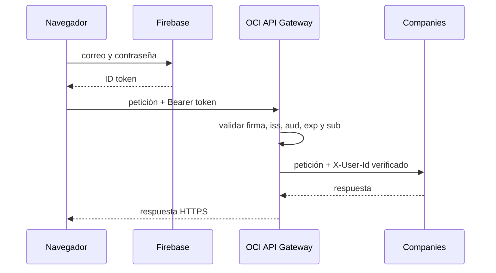
```mermaid
sequenceDiagram
    participant B as Navegador
    participant F as Firebase
    participant G as OCI API Gateway
    participant C as Companies

    B->>F: correo y contraseña
    F-->>B: ID token
    B->>G: petición + Bearer token
    G->>G: validar firma, iss, aud, exp y sub
    G->>C: petición + X-User-Id verificado
    C-->>G: respuesta
    G-->>B: respuesta HTTPS
```

<a id="f4-44"></a>

## F4-4.4. Inyectar la URL del gateway en el frontend

### Actualizar la configuración del frontend

La imagen del frontend no se recompila. Se modifica su configuración de ejecución:

```bash
source runtime-resolved.oke.env

sed -i \
  "s|^VITE_API_URL=.*|VITE_API_URL=${API_BASE_URL}|" \
  frontend-config.oke.env

grep '^VITE_API_URL=' frontend-config.oke.env
```

La salida debe coincidir con:

```text
VITE_API_URL=https://<GATEWAY_HOSTNAME>/ecored/api
```

### Aplicar el ConfigMap y reiniciar el frontend

```bash
kubectl create configmap frontend-config \
  --namespace ecored \
  --from-env-file=frontend-config.oke.env \
  --dry-run=client \
  -o yaml | kubectl apply -f -

kubectl rollout restart deployment/ecored-frontend \
  -n ecored

kubectl rollout status deployment/ecored-frontend \
  -n ecored \
  --timeout=5m
```

Compruebe los Pods:

```bash
kubectl get deployment,pods \
  -n ecored \
  -l app=ecored-frontend \
  -o wide
```

El Deployment debe mostrar `2/2` réplicas disponibles.

### Verificar `runtime-config.js`

El entrypoint de Nginx genera nuevamente `runtime-config.js` cuando inicia cada Pod. Compruebe el archivo servido públicamente:

```bash
curl -fsS \
  "http://${FRONTEND_LB_IP}/runtime-config.js"
```

Verifique específicamente la URL:

```bash
curl -fsS \
  "http://${FRONTEND_LB_IP}/runtime-config.js" | \
  grep -F "$API_BASE_URL"
```

El comando debe mostrar una línea que contenga la URL HTTPS de API Gateway.

Abra finalmente:

```text
http://<FRONTEND_LB_IP>
```

Compruebe en el navegador:

1. la interfaz se carga;
2. Firebase permite iniciar sesión desde el dominio autorizado;
3. DevTools → Network muestra llamadas a `https://<GATEWAY_HOSTNAME>/ecored/api/...`;
4. el navegador nunca llama directamente a las IP privadas de Companies o Materials.

### Diagnóstico rápido de la Fase 4

| Resultado | Causa probable | Verificación |
|---|---|---|
| `401 Unauthorized` sin token | Comportamiento correcto | API Gateway está protegiendo la ruta. |
| `500` durante autenticación | No se pudieron consultar las claves JWKS | Revise egress TCP 443, la ruta a Internet y el Project ID de Firebase. |
| `502` o `504` | Gateway no alcanza el backend privado | Revise las reglas 8001/8002, las IP renderizadas y la salud de los Load Balancers. |
| Error CORS en el navegador | El origen no coincide | Compare `http://<FRONTEND_LB_IP>` con `allowedOrigins`. |
| Firebase rechaza el dominio | El frontend no está autorizado | Registre únicamente la IP o dominio, sin protocolo, puerto ni ruta. |
| `runtime-config.js` conserva `pending.invalid` | El ConfigMap o los Pods no se actualizaron | Revise el archivo, vuelva a aplicar el ConfigMap y repita el rollout. |

### Lista de control de la Fase 4

- [ ] Companies y Materials tienen IP privadas.
- [ ] El frontend tiene IP pública.
- [ ] Companies volvió a `2/2` después de actualizar su ConfigMap.
- [ ] El dominio público del frontend está autorizado en Firebase.
- [ ] `ecored-api-gateway-nsg` está `AVAILABLE`.
- [ ] El NSG tiene exactamente cuatro reglas correctas.
- [ ] OCI API Gateway está `ACTIVE`.
- [ ] El NSG está asociado con OCI API Gateway.
- [ ] El deployment `ecored-api-v1` está `ACTIVE`.
- [ ] La llamada sin token devuelve `401`.
- [ ] La prueba CORS devuelve el origen del frontend.
- [ ] `runtime-config.js` contiene `API_BASE_URL`.
- [ ] El frontend volvió a `2/2` después del rollout.

> **12 factores — III y V.** La misma imagen del frontend recibe la URL del ambiente mediante configuración externa durante la ejecución. Cambiar el ConfigMap no requiere reconstruir la imagen.

### Referencias oficiales específicas

- [Creación de OCI API Gateway](https://docs.oracle.com/en-us/iaas/Content/APIGateway/Tasks/apigatewaycreatinggateway.htm)
- [Actualización de OCI API Gateway](https://docs.oracle.com/en-us/iaas/Content/APIGateway/Tasks/apigatewayupdating.htm)
- [Creación de deployments](https://docs.oracle.com/en-us/iaas/Content/APIGateway/Tasks/apigatewaycreatingdeployment.htm)
- [Autenticación de tokens con Remote JWKS](https://docs.oracle.com/en-us/iaas/Content/APIGateway/Tasks/apigatewayusingjwttokens-usinjson.htm)
- [CORS en API Gateway](https://docs.oracle.com/en-us/iaas/Content/APIGateway/Tasks/apigatewayaddingcorssupport.htm)
- [Transformación de encabezados](https://docs.oracle.com/en-us/iaas/Content/APIGateway/Tasks/apigatewaymodifyingresponsesrequests-transformexamples.htm)

[↑ Volver al índice](#indice)


---

<a id="fase-5"></a>

# Fase 5. Probar desde el navegador

<a id="f5-51"></a>

## F5-5.1. Validar frontend, Firebase y API Gateway

Abra:

```text
http://<FRONTEND_LB_IP>
```

Compruebe en el navegador:

1. la interfaz se carga desde el Load Balancer público;
2. el inicio de sesión Firebase funciona;
3. `http://<FRONTEND_LB_IP>/runtime-config.js` contiene la URL HTTPS del gateway;
4. DevTools → Network muestra llamadas a `https://<GATEWAY_HOSTNAME>/ecored/api/...`;
5. el navegador no conoce ni utiliza las IP privadas de los microservicios.

<a id="f5-52"></a>

## F5-5.2. Probar Empresas y Materiales

En **Empresas**, cree y consulte un registro:

```text
POST /ecored/api/companies → 201
GET  /ecored/api/companies → 200
```

Después seleccione la empresa y cree un material:

```text
POST /ecored/api/materials → 201
GET  /ecored/api/materials → 200
```

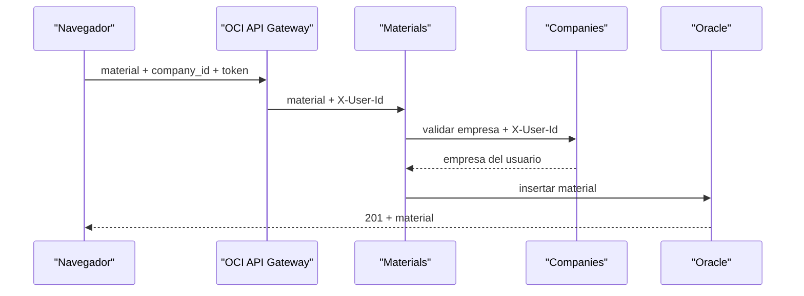
```mermaid
sequenceDiagram
    participant B as "Navegador"
    participant G as "OCI API Gateway"
    participant M as "Materials"
    participant C as "Companies"
    participant O as "Oracle"

    B->>G: material + company_id + token
    G->>M: material + X-User-Id
    M->>C: validar empresa + X-User-Id
    C-->>M: empresa del usuario
    M->>O: insertar material
    O-->>B: 201 + material
```

<a id="f5-53"></a>

## F5-5.3. Verificar aislamiento y acceso privado

1. Inicie sesión con un segundo usuario Firebase.
2. Compruebe que no puede ver los registros del primer usuario.
3. Intente abrir desde Internet las direcciones asignadas a Companies y Materials.

Los microservicios no deben ser accesibles públicamente. El único punto público para las API es OCI API Gateway.

Lista funcional:

- [ ] Login Firebase correcto.
- [ ] Ruta sin token rechazada con `401`.
- [ ] Empresa creada y consultada.
- [ ] Material creado y consultado.
- [ ] Datos separados por usuario.
- [ ] Companies y Materials permanecen privados.

[↑ Volver al índice](#indice)

---

<a id="fase-6"></a>

# Fase 6. Probar resiliencia, balanceo y telemetría

<a id="f6-61"></a>

## F6-6.1. Verificar el balanceador y sus destinos

Un balanceador no se considera verificado únicamente porque aparezca en estado `Active`. La comprobación debe confirmar tres capas:

| Capa | Comprobación | Resultado esperado |
|---|---|---|
| OCI Load Balancer | listener y backend set | estado general `OK`; |
| Service de Kubernetes | selección de endpoints | dos Pods `Ready` por aplicación; |
| Aplicación | solicitudes reales | respuestas HTTP `200`. |

Cargue los valores ya guardados en archivos:

```bash
source config/oci.oke.env
source config/runtime-resolved.oke.env
```

Compruebe los tres Services:

```bash
kubectl get services -n ecored -o wide

kubectl describe service ecored-frontend -n ecored
kubectl describe service ecored-companies -n ecored
kubectl describe service ecored-materials -n ecored
```

Verifique que:

- los tres Services sean de tipo `LoadBalancer`;
- `ecored-frontend` tenga una IP pública;
- `ecored-companies` y `ecored-materials` tengan IP privadas;
- `EXTERNAL-IP` no permanezca en `<pending>`;
- los puertos publicados sean `80`, `8001` y `8002`, respectivamente;
- la sección `Events` no contenga errores de aprovisionamiento.

Ahora liste los endpoints que Kubernetes considera aptos para recibir tráfico:

```bash
for SERVICE in ecored-frontend ecored-companies ecored-materials; do
  printf '\n=== %s ===\n' "$SERVICE"
  kubectl get endpointslice -n ecored \
    -l kubernetes.io/service-name="$SERVICE" \
    -o json | jq -r '
      .items[].endpoints[] |
      [.targetRef.name, .addresses[0], (.conditions.ready | tostring)] |
      @tsv'
done
```

Cada aplicación debe mostrar dos Pods diferentes y el valor `true`. Un Pod que no esté `Ready` se retira de los endpoints y no debe recibir solicitudes nuevas.

### Verificar la salud en OCI

En la consola de OCI abra:

```text
Networking → Load Balancers → balanceador → Backend sets → Backend health
```

Para cada uno de los tres balanceadores confirme:

- estado del balanceador: `Active`;
- listener en el puerto esperado;
- estado general del backend set: `OK`;
- todos los backends disponibles en estado `OK`.

La misma comprobación puede automatizarse desde Cloud Shell. El siguiente bloque localiza cada Load Balancer por su IP y consulta todos sus backend sets:

```bash
for SERVICE in ecored-frontend ecored-companies ecored-materials; do
  LB_IP=$(kubectl get service "$SERVICE" -n ecored \
    -o jsonpath='{.status.loadBalancer.ingress[0].ip}')

  LB_OCID=$(oci lb load-balancer list \
    --compartment-id "$COMPARTMENT_OCID" \
    --all | jq -r --arg ip "$LB_IP" '
      .data[] |
      select(any(."ip-addresses"[]?; ."ip-address" == $ip)) |
      .id' | head -n 1)

  if [ -z "$LB_OCID" ]; then
    printf '%s (%s): no se encontró el Load Balancer\n' "$SERVICE" "$LB_IP"
    continue
  fi

  oci lb backend-set list \
    --load-balancer-id "$LB_OCID" | jq -r '.data[].name' |
  while read -r BACKEND_SET; do
    HEALTH=$(oci lb backend-set-health get \
      --load-balancer-id "$LB_OCID" \
      --backend-set-name "$BACKEND_SET" \
      --query 'data.status' \
      --raw-output)

    printf '%s | IP %s | backend set %s | %s\n' \
      "$SERVICE" "$LB_IP" "$BACKEND_SET" "$HEALTH"
  done
done
```

Resultado esperado: cada línea finaliza en `OK`.

> **Importante.** En OKE, OCI Load Balancer puede mostrar los nodos trabajadores como backends. Después, el Service de Kubernetes distribuye el tráfico entre los Pods listados en `EndpointSlice`. Por eso deben comprobarse ambas capas.

> **12 factores — VII y VIII.** Los Services publican puertos explícitos y las réplicas permiten atender solicitudes concurrentes.

<a id="f6-62"></a>

## F6-6.2. Generar tráfico y comprobar la distribución

Copie el archivo temporal del token y coloque un ID token vigente obtenido durante la prueba del Taller 5:

```bash
cp config/firebase-id-token.env.example config/firebase-id-token.env
```

Edite `config/firebase-id-token.env` y cargue los valores sin imprimir el token:

```bash
source config/firebase-id-token.env
source config/runtime-resolved.oke.env
```

Genere 20 solicitudes nuevas contra el Load Balancer público del frontend:

```bash
for i in $(seq 1 20); do
  curl -sS -o /dev/null \
    -w "%{http_code}\n" \
    "http://${FRONTEND_LB_IP}/"
done | sort | uniq -c
```

Resultado esperado:

```text
20 200
```

Pruebe los dos Load Balancers privados a través de OCI API Gateway. El portátil no debe llamarlos directamente:

```bash
for ROUTE in companies materials; do
  printf '\n=== /%s ===\n' "$ROUTE"
  for i in $(seq 1 20); do
    curl -sS -o /dev/null \
      -w "%{http_code}\n" \
      -H "Authorization: Bearer ${ID_TOKEN}" \
      "${API_BASE_URL}/${ROUTE}"
  done | sort | uniq -c
done
```

Resultado esperado para cada ruta:

```text
20 200
```

Para observar qué Pods atienden las solicitudes, abra una segunda pestaña de Cloud Shell y deje los logs en seguimiento:

```bash
kubectl logs -n ecored \
  -l app=ecored-companies \
  --prefix=true \
  --tail=0 \
  --follow
```

Regrese a la primera pestaña y repita las 20 solicitudes a `/companies`. Si la aplicación registra cada solicitud HTTP, los prefijos deben mostrar actividad en los dos Pods:

```text
[pod/ecored-companies-xxxxxxxxxx-aaaaa] ... GET /api/companies ... 200
[pod/ecored-companies-xxxxxxxxxx-bbbbb] ... GET /api/companies ... 200
```

Detenga el seguimiento con `Ctrl+C`. No se exige una distribución exacta de diez solicitudes por Pod: las conexiones persistentes y la política de balanceo pueden producir cantidades diferentes. La evidencia válida consiste en observar ambos Pods disponibles y tráfico exitoso; cuando los logs HTTP estén desactivados, utilice como evidencia el `EndpointSlice`, la salud `OK` del backend set y la prueba de continuidad del paso siguiente.

> **12 factores — VIII. Concurrencia.** Las dos réplicas pueden recibir tráfico sin que el cliente conozca sus direcciones individuales.

<a id="f6-63"></a>

## F6-6.3. Probar continuidad y autorrecuperación

En la primera pestaña de Cloud Shell inicie una solicitud por segundo:

```bash
while true; do
  printf '%s ' "$(date '+%H:%M:%S')"
  curl -sS -o /dev/null \
    -w "HTTP %{http_code}\n" \
    -H "Authorization: Bearer ${ID_TOKEN}" \
    "${API_BASE_URL}/companies"
  sleep 1
done
```

En la segunda pestaña elimine un Pod de Companies:

```bash
OLD_COMPANIES_POD=$(kubectl get pods -n ecored \
  -l app=ecored-companies \
  -o jsonpath='{.items[0].metadata.name}')

kubectl delete pod "$OLD_COMPANIES_POD" -n ecored
kubectl get pods -n ecored -l app=ecored-companies -w
```

Interrumpa la observación con `Ctrl+C` cuando existan nuevamente dos Pods `Running` y `Ready`. Después confirme:

```bash
kubectl wait --for=condition=Ready pod \
  -l app=ecored-companies \
  -n ecored \
  --timeout=180s

kubectl get endpointslice -n ecored \
  -l kubernetes.io/service-name=ecored-companies \
  -o wide
```

En la primera pestaña, las solicitudes deben continuar respondiendo `200` mientras queda al menos una réplica lista. Detenga el ciclo con `Ctrl+C`.

Finalmente:

1. actualice el listado de Empresas desde el navegador;
2. compruebe que los registros anteriores siguen almacenados;
3. confirme nuevamente que el backend set de Companies regresa a `OK`;
4. verifique que Kubernetes creó un Pod con un nombre diferente al eliminado.

Esta prueba valida conjuntamente el balanceo, la exclusión de un Pod eliminado, el reemplazo automático y la conservación de datos en MongoDB. No es una prueba formal de rendimiento.

```bash
unset ID_TOKEN
rm config/firebase-id-token.env
```

> **12 factores — VIII y IX.** Las réplicas atienden en paralelo y Kubernetes reemplaza procesos desechables; el estado de negocio permanece en un servicio externo.

<a id="f6-64"></a>

## F6-6.4. Consultar logs, eventos y métricas

```bash
kubectl logs -n ecored -l app=ecored-companies --prefix --tail=50
kubectl logs -n ecored -l app=ecored-materials --prefix --tail=50
kubectl logs -n ecored -l app=ecored-frontend --prefix --tail=50
kubectl get events -n ecored --sort-by='.lastTimestamp'
```

En **Observability & Management → Monitoring → Metrics Explorer**, consulte:

| Recurso | Namespace | Qué observar |
|---|---|---|
| API Gateway | `oci_apigateway` | solicitudes, 4xx/5xx, latencia y errores de backend; |
| Load Balancer | `oci_lbaas` | conexiones, tráfico y estado de backends; |
| OKE | `oci_oke` | estado y utilización del clúster y nodos. |

Si Metrics Server está disponible:

```bash
kubectl top nodes
kubectl top pods -n ecored
```

Habilite el log del deployment en:

```text
API Gateway → ecored-api-gateway → Deployments
→ ecored-api-v1 → Logs → Enable log
```

Genere una solicitud válida y otra sin token; búsquelas en **Logging → Search**. No registre ni publique el encabezado `Authorization`.

> **12 factores — XI. Logs.** Las aplicaciones escriben eventos en `stdout` y `stderr`; Kubernetes y OCI se encargan de recolectarlos y consultarlos.

[↑ Volver al índice](#indice)

---

<a id="factores"></a>

## Relación con los 12 factores

| Factor | Aplicación en el taller |
|---|---|
| I. Código base | Cada servicio conserva un código base y varias versiones desplegables. |
| II. Dependencias | Las imágenes contienen dependencias reproducibles. |
| III. Configuración | Archivos `.env`, ConfigMaps, Secrets y políticas del gateway permanecen fuera de las imágenes. |
| IV. Backing services | MongoDB, Oracle y Firebase se consumen como servicios externos. |
| V. Construcción, publicación y ejecución | Docker Hub → OCIR → OKE, sin recompilar. |
| VI. Procesos | Los Pods no almacenan el estado de negocio. |
| VII. Vinculación de puertos | Companies, Materials y Nginx publican puertos explícitos. |
| VIII. Concurrencia | Cada Deployment utiliza dos réplicas. |
| IX. Desechabilidad | Probes, reemplazo de Pods y actualizaciones graduales. |
| X. Paridad | Se ejecutan las mismas imágenes probadas con Docker. |
| XI. Logs | Los contenedores escriben en salida estándar. |
| XII. Procesos administrativos | Diagnósticos temporales desde Cloud Shell. |

<a id="evidencias"></a>

## Evidencias y criterios de aceptación

Entregue solamente evidencias exitosas:

1. Tres imágenes disponibles en OCIR.
2. Tres Deployments con `2/2` réplicas.
3. frontend público y microservicios privados.
4. OCI API Gateway y `ecored-api-v1` en estado `Active`.
5. solicitud sin token rechazada con `401`.
6. login Firebase y `runtime-config.js` apuntando al gateway.
7. empresa y material creados mediante el gateway.
8. aislamiento entre dos usuarios.
9. dos endpoints `Ready` por aplicación y backend sets en estado `OK`.
10. respuestas exitosas durante la prueba de tráfico y evidencia de distribución entre réplicas.
11. reemplazo automático de un Pod sin interrupción prolongada ni pérdida de datos.
12. logs y métricas de OCI con el tráfico generado.

No entregue `.env`, Secrets, Wallets, tokens, contraseñas, OCID completos, correos personales ni cadenas de conexión.

Criterios:

- [ ] Las imágenes se descargan desde OCIR mediante `ocir-secret`.
- [ ] Ninguna credencial está en una imagen o manifiesto versionado.
- [ ] Companies y Materials tienen Load Balancers privados.
- [ ] El frontend tiene un Load Balancer público.
- [ ] OCI API Gateway valida Firebase mediante Remote JWKS.
- [ ] `X-User-Id` se sobrescribe con el claim `sub`.
- [ ] Materials valida la empresa mediante el Service de Companies.
- [ ] Las aplicaciones tienen probes, recursos, dos réplicas y PDB.
- [ ] La eliminación de un Pod activa reconciliación sin pérdida de datos.
- [ ] Logs y métricas permiten observar solicitudes y fallos básicos.

<a id="limpieza"></a>

## Limpieza opcional

No ejecute esta sección antes de que el docente valide las evidencias.

```bash
kubectl delete -f k8s/ecored-oke.yaml
kubectl delete configmap companies-config materials-config frontend-config -n ecored
kubectl delete secret companies-secrets materials-secrets -n ecored
```

```bash
source config/runtime-resolved.oke.env

oci api-gateway deployment delete --deployment-id "$DEPLOYMENT_OCID" --force
oci api-gateway gateway delete --gateway-id "$GATEWAY_OCID" --force
```

Conserve el clúster, la VCN, las subredes, `ocir-secret` y las imágenes de OCIR para los siguientes talleres.

<a id="referencias"></a>

## Referencias oficiales

- [OCI API Gateway](https://docs.oracle.com/en-us/iaas/Content/APIGateway/Concepts/apigatewayoverview.htm)
- [Creación de deployments en OCI API Gateway](https://docs.oracle.com/en-us/iaas/Content/APIGateway/Tasks/apigatewaycreatingdeployment.htm)
- [Métricas de OCI API Gateway](https://docs.oracle.com/en-us/iaas/Content/APIGateway/Reference/apigatewaymetrics.htm)
- [OCI Load Balancers para Services de Kubernetes](https://docs.oracle.com/en-us/iaas/Content/ContEng/Tasks/contengcreatingloadbalancer.htm)
- [Anotaciones de Load Balancers](https://docs.oracle.com/en-us/iaas/Content/ContEng/Tasks/contengcreatingloadbalancer_topic-Summaryofannotations.htm)
- [Administración de reglas de seguridad mediante NSG en OKE](https://docs.oracle.com/en-us/iaas/Content/ContEng/Tasks/contengconfiguringloadbalancersnetworkloadbalancers-subtopic.htm)
- [Reglas de acceso de Oracle Autonomous Database](https://docs.oracle.com/en/cloud/paas/autonomous-database/serverless/adbsb/access-control-rules-autonomous.html)
- [OCI CLI: VNIC asociadas a un NSG](https://docs.oracle.com/en-us/iaas/tools/oci-cli/latest/oci_cli_docs/cmdref/network/nsg/vnics/list.html)
- [OCI CLI: agregar reglas a un NSG](https://docs.oracle.com/en-us/iaas/tools/oci-cli/latest/oci_cli_docs/cmdref/network/nsg/rules/add.html)
- [OCI CLI: consultar la salud de un backend set](https://docs.oracle.com/en-us/iaas/tools/oci-cli/latest/oci_cli_docs/cmdref/lb/backend-set-health/get.html)
- [Kubernetes EndpointSlices](https://kubernetes.io/docs/concepts/services-networking/endpoint-slices/)
- [Métricas de OCI Load Balancer](https://docs.oracle.com/en-us/iaas/Content/Balance/Reference/loadbalancermetrics.htm)
- [Oracle Kubernetes Engine](https://docs.oracle.com/en-us/iaas/Content/ContEng/home.htm)
- [Kubernetes Deployments](https://kubernetes.io/docs/concepts/workloads/controllers/deployment/)
- [Kubernetes Services](https://kubernetes.io/docs/concepts/services-networking/service/)
- [Kubernetes probes](https://kubernetes.io/docs/concepts/configuration/liveness-readiness-startup-probes/)
- [The Twelve-Factor App](https://12factor.net/)

[↑ Volver al índice](#indice)

[← Taller 5: Microservicios y API Gateway local](https://github.com/adanbeltran/ecored-oci-cloud-native/blob/main/taller05/05-Taller-CreacionMicroservicios-ApiGateway.md)

---
