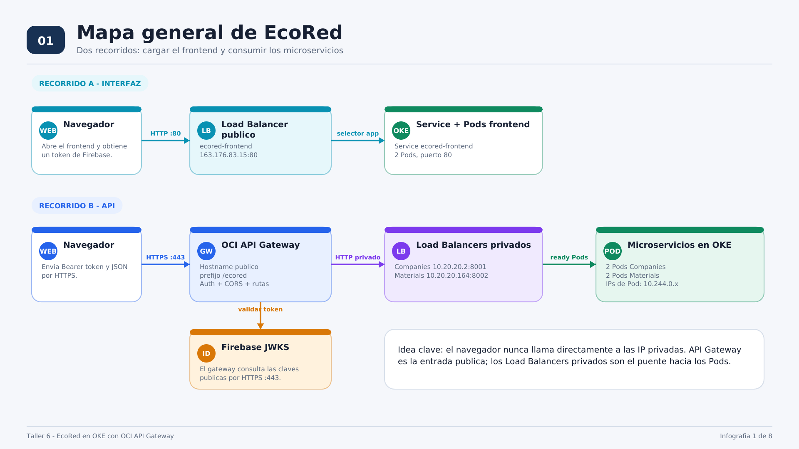
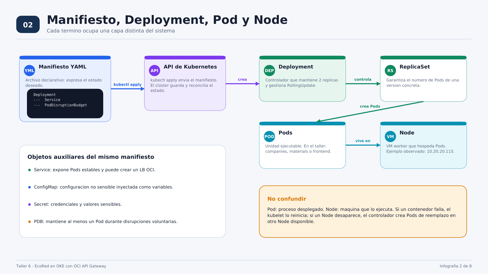
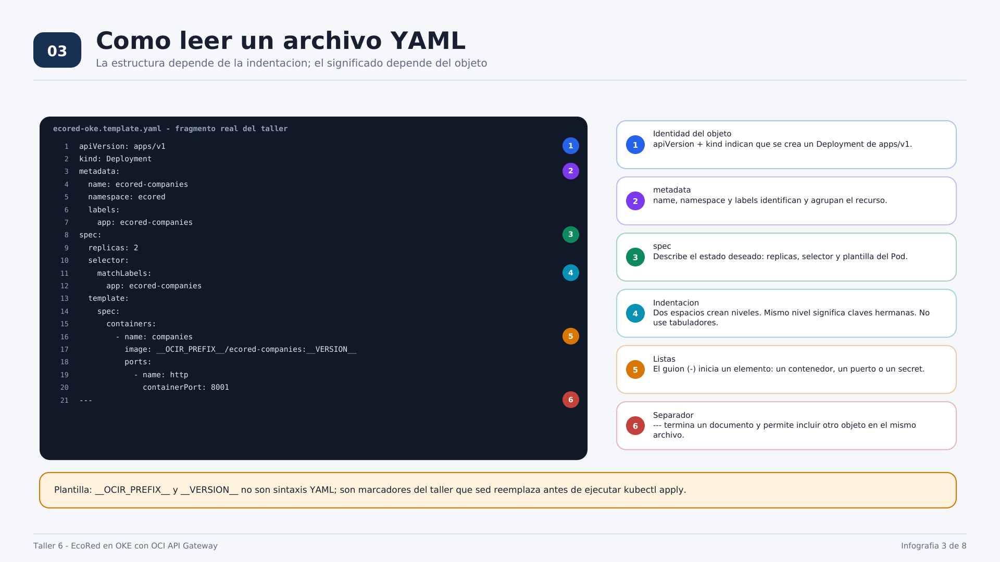
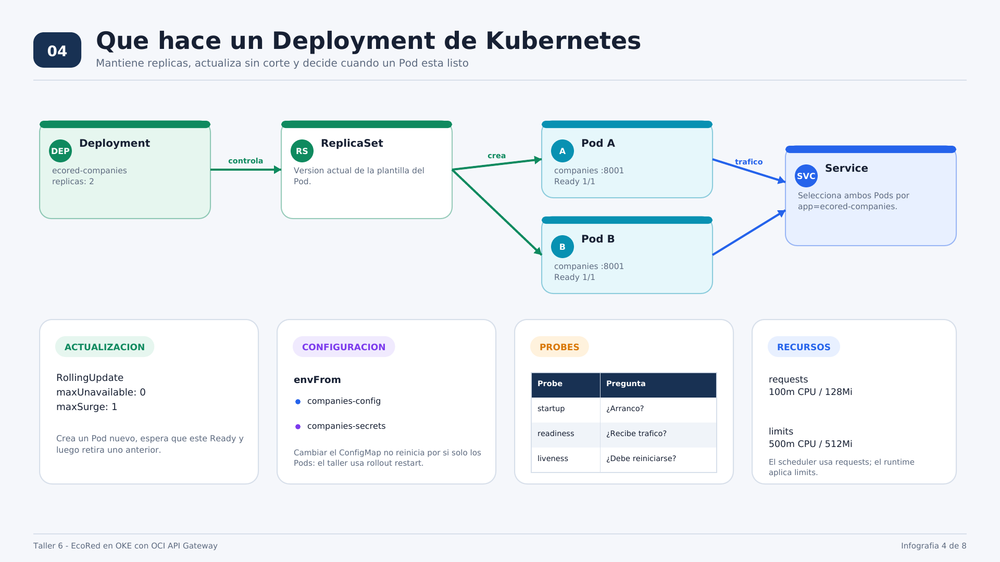
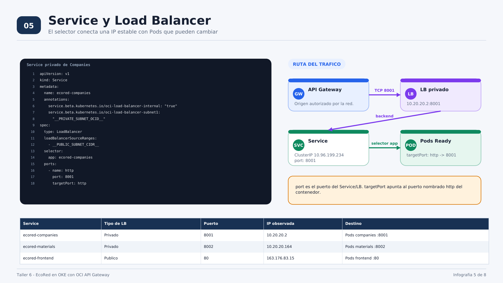
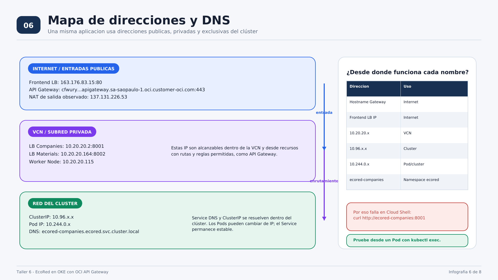
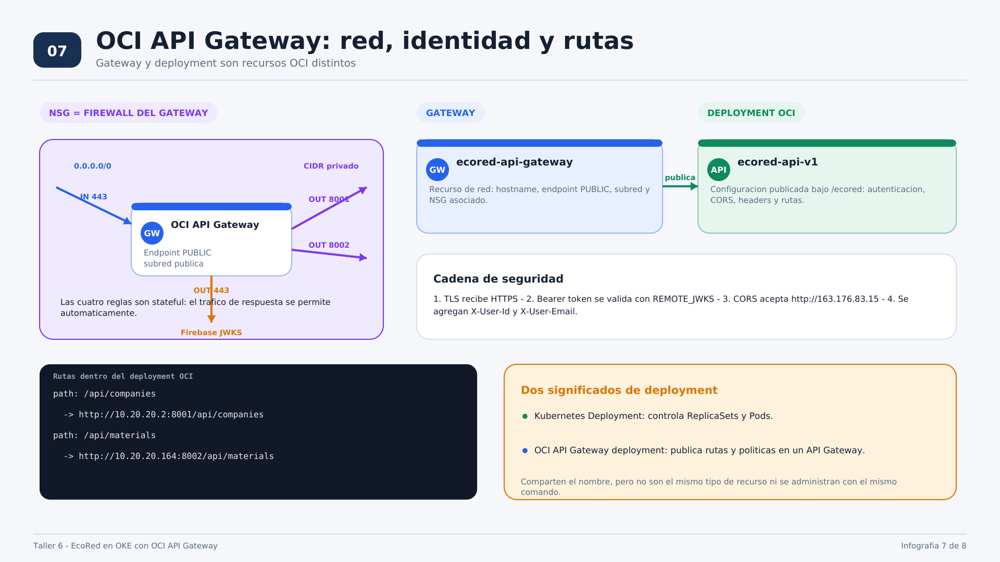
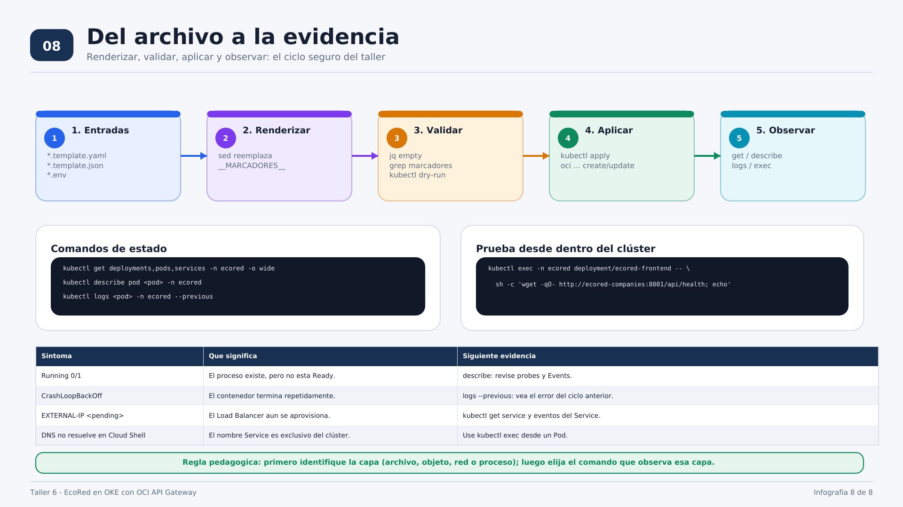

REGION - Availability Domain

![[Pasted image 20260928082838.png]]

![[Pasted image 20260928083200.png]]

![[Pasted image 20260928084016.png]]
![[Pasted image 20260928084232.png]]

![[Pasted image 20260928084946.png]]

![[Pasted image 20260928085038.png]]

![[Pasted image 20260928085251.png]]

![[Pasted image 20260928090153.png]]

![[Pasted image 20260928090639.png]]

![[Pasted image 20260928090819.png]]

![[Pasted image 20260928090911.png]]

![[Pasted image 20260928092136.png]]

![[Pasted image 20260928093001.png]]
![[Pasted image 20260928092921.png]]
Este material acompaña el Taller 6 y explica, con los nombres y valores observados durante su ejecución, cómo se relacionan Kubernetes, OCI Load Balancer, OCI API Gateway, los NSG y los microservicios.

> **Nota sobre los valores:** las IP mostradas son ejemplos reales de una ejecución del taller. Al recrear un Service o un Load Balancer, consulte nuevamente sus valores; no copie las IP como constantes permanentes.

## 1. Arquitectura completa


![[Pasted image 20260928085357.png]]



El navegador sigue dos recorridos:

1. Obtiene la interfaz desde el Load Balancer público de `ecored-frontend`.
2. Envía las operaciones de negocio a OCI API Gateway por HTTPS. El gateway valida el token de Firebase y enruta hacia los Load Balancers privados de Companies y Materials.

El navegador nunca necesita acceso directo a las IP privadas `10.20.20.2` y `10.20.20.164`.

## 2. Manifiesto, Deployment, Pod y Node



| Concepto | Función en el taller |
|---|---|
| Manifiesto | Archivo YAML declarativo que agrupa los objetos que se enviarán a Kubernetes. |
| Deployment | Controlador que conserva el número de réplicas y administra las actualizaciones. |
| ReplicaSet | Conserva la cantidad de Pods de una versión de la plantilla. |
| Pod | Unidad ejecutable que contiene el contenedor del microservicio. |
| Node | Máquina worker de OKE donde se ejecutan los Pods. |
| Service | Dirección estable y selector que dirige tráfico hacia Pods Ready. |
| ConfigMap | Configuración no sensible inyectada en los contenedores. |
| Secret | Valores sensibles inyectados en los contenedores. |
| PDB | Limita las disrupciones voluntarias para conservar disponibilidad. |

## 3. Sintaxis de YAML con el manifiesto del taller



### Reglas sintácticas esenciales

- `clave: valor` crea una entrada de un mapa.
- La indentación crea jerarquía. Utilice espacios y no tabuladores.
- Un guion `-` inicia un elemento de una lista.
- `#` inicia un comentario hasta el final de la línea.
- `---` separa dos documentos YAML dentro del mismo archivo.
- Los marcadores `__OCIR_PREFIX__` y `__VERSION__` pertenecen a la plantilla del taller; no son sintaxis YAML.
- En las anotaciones, `"true"` se conserva como texto. En `replicas: 2`, `2` es un número.

La estructura común de un objeto de Kubernetes es:

```yaml
apiVersion: apps/v1
kind: Deployment
metadata:
  name: ecored-companies
  namespace: ecored
spec:
  # Estado deseado del objeto
```

La relación de etiquetas debe ser coherente:

```yaml
spec:
  selector:
    matchLabels:
      app: ecored-companies
  template:
    metadata:
      labels:
        app: ecored-companies
```

El `selector.matchLabels` del Deployment debe coincidir con `template.metadata.labels`. El selector del Service debe utilizar la misma etiqueta para encontrar esos Pods.

## 4. Deployment de Kubernetes



Fragmento concreto del taller:

```yaml
spec:
  replicas: 2
  strategy:
    type: RollingUpdate
    rollingUpdate:
      maxUnavailable: 0
      maxSurge: 1
```

Esto permite crear temporalmente un Pod adicional, esperar que esté Ready y retirar después un Pod de la versión anterior.

Las tres probes responden preguntas diferentes:

- `startupProbe`: ¿la aplicación terminó de arrancar?
- `readinessProbe`: ¿este Pod debe recibir tráfico?
- `livenessProbe`: ¿el proceso está bloqueado y debe reiniciarse?

`Running` no significa necesariamente `Ready`. Un Pod puede mostrar `Running 0/1` cuando el proceso existe pero la probe de readiness todavía falla.

## 5. Service y OCI Load Balancer



El Service de Companies utiliza:

```yaml
spec:
  type: LoadBalancer
  selector:
    app: ecored-companies
  ports:
    - name: http
      port: 8001
      targetPort: http
```

- `type: LoadBalancer` solicita al proveedor OCI un Load Balancer.
- `port: 8001` es el puerto expuesto por el Service y el Load Balancer.
- `targetPort: http` referencia el puerto nombrado `http` en el contenedor.
- `selector.app` determina qué Pods forman el backend.
- `containerPort` documenta el puerto del contenedor; no crea por sí solo un firewall ni publica la aplicación.

## 6. Direcciones públicas, privadas y del clúster



Ejemplos observados:

| Capa | Ejemplo | Alcance |
|---|---|---|
| Entrada pública | `163.176.83.15:80` | Internet hacia el frontend. |
| Entrada pública | hostname de OCI API Gateway `:443` | Internet hacia las APIs. |
| Load Balancer privado | `10.20.20.2:8001` | VCN hacia Companies. |
| Load Balancer privado | `10.20.20.164:8002` | VCN hacia Materials. |
| Node | `10.20.20.115` | VCN; máquina worker. |
| ClusterIP | `10.96.x.x` | Solo red del clúster. |
| Pod IP | `10.244.0.x` | Red de Pods; puede cambiar. |
| Service DNS | `ecored-companies.ecored.svc.cluster.local` | DNS interno de Kubernetes. |

Por eso esta prueba falla desde Cloud Shell:

```bash
curl http://ecored-companies:8001/api/health
```

El nombre `ecored-companies` se resuelve dentro del clúster. La prueba correcta se ejecuta desde un Pod:

```bash
kubectl exec -n ecored deployment/ecored-frontend -- \
  sh -c 'wget -qO- http://ecored-companies:8001/api/health; echo'
```

## 7. OCI API Gateway, NSG y deployment de API



El NSG de API Gateway autoriza cuatro flujos stateful:

| Dirección | Origen o destino | Puerto | Función |
|---|---|---:|---|
| Ingress | `0.0.0.0/0` | TCP 443 | Recibir HTTPS. |
| Egress | CIDR privado | TCP 8001 | Llegar a Companies. |
| Egress | CIDR privado | TCP 8002 | Llegar a Materials. |
| Egress | `0.0.0.0/0` | TCP 443 | Consultar las claves JWKS de Firebase. |

En esta parte del taller existen dos recursos OCI:

- **Gateway `ecored-api-gateway`:** endpoint de red público, hostname, subred y NSG.
- **Deployment `ecored-api-v1`:** autenticación, CORS, transformaciones de headers y rutas publicadas bajo `/ecored`.

Además, el término Deployment tiene dos significados distintos:

- **Kubernetes Deployment:** controla ReplicaSets y Pods mediante YAML y `kubectl`.
- **OCI API Gateway deployment:** publica rutas y políticas mediante una especificación JSON y OCI CLI.

La especificación JSON del taller conecta, por ejemplo:

```text
/ecored/api/companies -> http://10.20.20.2:8001/api/companies
/ecored/api/materials -> http://10.20.20.164:8002/api/materials
```

## 8. Ciclo de trabajo y diagnóstico



El ciclo recomendado es:

1. Reunir plantillas y archivos `.env`.
2. Renderizar los marcadores con `sed`.
3. Validar la sintaxis y confirmar que no queden marcadores.
4. Aplicar el estado deseado.
5. Observar cada capa con el comando correspondiente.

Comandos mínimos:

```bash
kubectl get deployments,pods,services -n ecored -o wide
kubectl describe pod <NOMBRE_POD> -n ecored
kubectl logs <NOMBRE_POD> -n ecored --previous
```

### Lectura rápida de estados

| Estado o síntoma | Interpretación | Evidencia siguiente |
|---|---|---|
| `Running 0/1` | El contenedor se ejecuta, pero el Pod no está Ready. | `kubectl describe pod`; revisar probes y Events. |
| `CrashLoopBackOff` | El contenedor termina y Kubernetes repite el arranque con espera creciente. | `kubectl logs --previous`. |
| `EXTERNAL-IP <pending>` | OCI todavía aprovisiona el Load Balancer. | Revisar el Service y sus Events. |
| DNS del Service no resuelve en Cloud Shell | El nombre pertenece al DNS interno de Kubernetes. | Ejecutar la prueba desde un Pod. |

## Glosario de cierre

| Término | Definición breve |
|---|---|
| Estado deseado | Configuración declarada en el manifiesto. |
| Reconciliación | Trabajo continuo de Kubernetes para acercar el estado real al deseado. |
| Backend | Destino real que recibe tráfico desde un Service, Load Balancer o API Gateway. |
| Selector | Consulta por etiquetas que vincula un Service o controlador con Pods. |
| Ready | Condición que habilita al Pod para recibir tráfico. |
| Stateful NSG rule | Regla cuyo tráfico de respuesta se permite automáticamente. |
| CORS | Política del navegador que controla qué origen puede llamar a la API. |
| JWKS | Conjunto de claves públicas usado para verificar la firma de tokens. |

